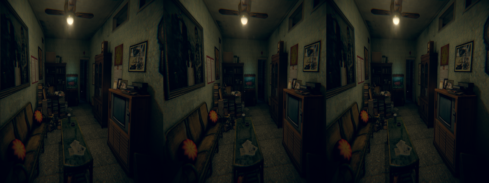
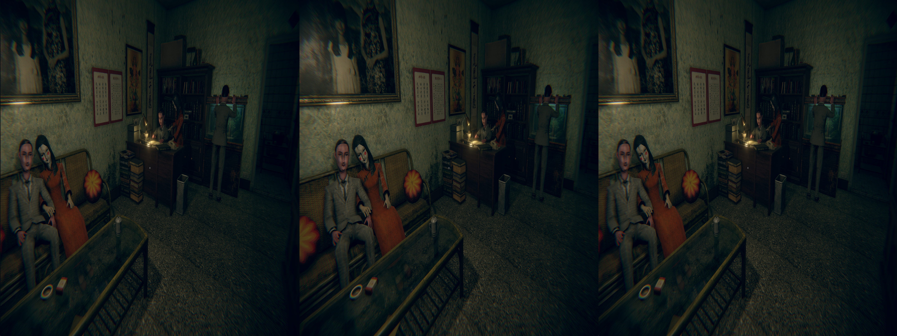
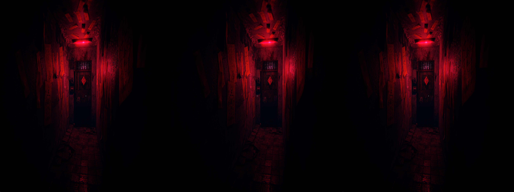

 # _Devotion_ - geo-11 Stereoscopic 3D Fix

- [Changelog](#changelog)
- [Existing Fix](#existing-fix)
- [General](#general)
- [Instructions](#instructions)
- [Fixed Items and Issues](#fixed-items-and-issues)
- [Credits](#credits)
- [Thanks](#thanks)
- [LICENSE](#license)


<p align="center">
    <a href="screenshots/screenshot1.png"></a>
</p>
<p align="center">
    <a href="screenshots/screenshot2.png"></a>
</p>
<p align="center">
    <a href="screenshots/screenshot3.png"></a>
</p>

## Changelog

- 1.0
  - Initial release

## Existing Fix

An existing fix for _Devotion_ is on the [HelixMod blog](https://helixmod.blogspot.com/2019/02/devotion-dx11.html) by DHR (I had missed this up until I was ready to push this up for `1.0`). While I didn't extensively test it compared to this, it lists issues with lights that I have not come across, so I'm assuming that improvements from the updated 2019 version of the universal fix solved them, or I just didn't notice (they are noted as minor afterall). The toggle the exists for adjusting the convergence I don't think does enough for certain situations. Obviously, you can quite easily adjust those yourself if you wanted with this fix, but it's setup here already.

This isn't to say that the old fix is bad/not worth using, rather what I'm publishing here exists as an alternative. The existing fix will also boot with geo-11 after replacing the [required files and adjusting the corresponding settings](https://helixmod.blogspot.com/2022/06/announcing-new-geo-11-3d-driver.html). If you want to update the existing fix with the toggles I've defined here, you can copy them directly into the `d3dx.ini`:

<details>
<summary>Toggle Configuration</summary>

```ini
[KeyDepthPresets]
Key = 1
Key = XB_LEFT_THUMB
back = shift 1
type = cycle
separation = 100, 15
transition = 500
transition_type = cosine

[KeyCutscenes]
Key = E
Key = XB_DPAD_LEFT
type = toggle
convergence = 1
separation = 1
transition = 500
transition_type = cosine
release_transition = 500
release_transition_type = cosine
```

</details>

The HUD adjustment, however, would require updating the shader for it, and including the update. It should likely be the same, but I did not investigate. In the fix provided in this Github, it's the vertex shader `7dadcf3c4eac4cd4`.

(Also, as listed in the [Thanks](#thanks) section, DHR made some great fixes, and the universal fix has been a godsend in getting games to work with some minimal adjustments!)

## General

 [Store Link](https://shop.redcandlegames.com/app/devotion)

Fix was created for the following build number of the game's executable:

- `2020.2.1.3544`

Fix was tested with the following version(s) of geo-11:

- `v0.7.10`

If either of these items change due to updates, this fix may no longer work.  Any updates to this fix will be posted to [the repo](https://github.com/BigRobotBil/3d-releases/blob/main/Fixes/geo-11/Devotion/) it was downloaded from.

This fix was tested in the following environments and performed as expected in relation to the display type:

- Samsung Odyssey G9 G90XF
- LG 55UH8500
- Sony KDL-50W800C
- Hisense PX3-PRO
- New Nintendo 3DS

An Nvidia GPU was used to test/develop this fix.  Other brands are untested.

## Instructions

- geo-11 `v0.7.10` is included in this archive

Download the `7z` archive [included in this folder](./geo11_devotion_1.0.7z).

Navigate to the game's executable `Devotion.exe`:

`<path to your install directory>\Devotion\`

Place all files within this archive in the same directory.  Meaning in the same folder as the game's main executable, you should now have `d3dx.ini`, `nvapi64.dll`, `ShaderFixes\`, etc.

Adjust settings in-game or within the `d3dxdm.ini` to your liking, which includes the output method. By default, it is set to side-by-side output (`sbs`).

> [!NOTE]
> geo-11's `0.7.7` release (and up) includes native support for Simulated Reality monitors, like the Samsung Odyssey and Acer Spaital Labs. Use `simulated_reality` as the configuration option in the `d3dxdm.ini`. If this does not work, [3DGameBridge](https://github.com/JoeyAnthony/3DGameBridgeProjects) or [SRLoom](https://github.com/effcol/SR-Loom) can be used as alternatives for engaging the weave required for Simulated Reality monitors.

### Control Setup

The following key/controller bindings are active:
- Cycle through depth presets (`100`, `15`)
  - Header: `KeyDepthPresets`
  - `1` (in the number row)
  - `Left Stick Button`/`L3`
- Cutscene Depth Toggle (pressing again will revert back to existing configuration)
  - This will set `depth`/`convergence` to `1`/`1`
  - Header: `KeyCutscene`
  - `Q`
  - `Dpad Left`
    - This button is also used for specific gameplay sections where the joystick is also useable, so while it wouldn't conflict with the main controls, it _technically_ does
- Toggle HUD/All 2D Elements pushed in
  - Should only be used when playing at low convergence (`1` should be fine)
  - Header: `KeyHUDDepthToggle`
  - `2` (in number row)
  - `Dpad Right`
    - This button is also used for specific gameplay sections where the joystick is also useable, so while it wouldn't conflict with the main controls, it _technically_ does

Key bindings can be adjusted by editing the relevant sections in the `d3dx.ini` file.

> [!NOTE]
> Please reference <a href="https://learn.microsoft.com/en-us/windows/win32/inputdev/virtual-key-codes">the list of Virtual Keycodes</a> for precise mapping

## Fixed Items and Issues

Fixes the following:
- Practically everything (Universal Fix)

Remaining Issues:
- This is a first person game, and hands will appear very close to the screen. There isn't a discernable way around this other than keeping a low depth/convergence factor (if I am wrong, however, please let me know)
  - For cutscenes, it is recommended to use the cutscene depth toggle to lessen the strain on your eyes
  - Going above `2` for convergence I found to be unbearable
- Subtitles can be hard to read at points
  - Use the cutscene depth toggle to lessen the strain on your eyes
  - This is particularly bad during the section with the storybook

## Credits

- Uses the 2019 Unity universal fix to fix common issues with the game (shadows, halos, etc). The bulk of the fix is in this regex
  - The original release post/thread can be found [here](https://helixmod.blogspot.com/2018/09/unity-universal-fix.html)
- Toggles for things by Zeek
- [`adjust_from_depth_buffer`](https://github.com/bo3b/3Dmigoto/wiki/Auto-Crosshair)

## Thanks
- This fix would not exist without the Universal Unity fix! Everything that is working is due to this. Specifically, this is using the 2019 version of the fix
  - DHR, 4everawake
- Members of the HelixMod community that have made fixes over the years that I could see how other fixes worked

## LICENSE

- For any fixes/patterns/whatever that I have created directly within this archive, do whatever you want.  Please reference the [Beerware license](https://fedoraproject.org/wiki/Licensing/Beerware) (but with me instead) for more information
    - If you learn something, that's all that matters.  If you want to give me credit for something, that's `pretty neat`
- For any fixes/patterns included from other individuals, please reference their release information for how they should be attributed and/or reused

----Zeek/BigRobotBil