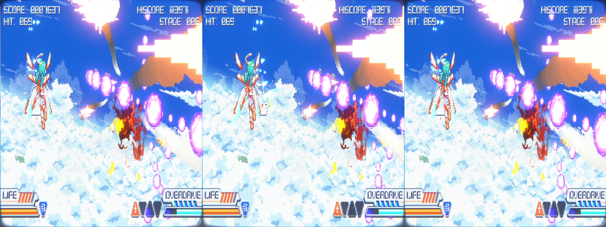
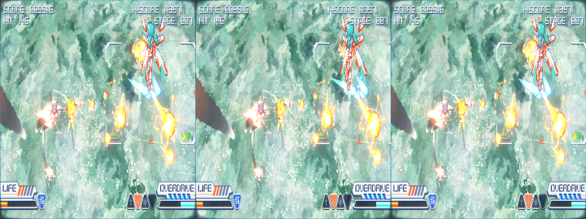
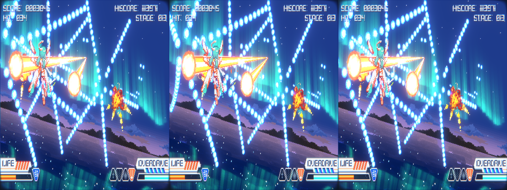

 # _Mirage Feathers_ - geo-11 Stereoscopic 3D Fix

 _If you want to see the journey it took to get to this point, please [start here](../../../tutorials/mirage-feathers/README.md)_

- [Changelog](#changelog)
- [General](#general)
- [Instructions](#instructions)
- [Fixed Items and Issues](#fixed-items-and-issues)
- [Credits](#credits)
- [Thanks](#thanks)
- [LICENSE](#license)


<p align="center">
    <a href="screenshots/screenshot1.png"></a>
</p>
<p align="center">
    <a href="screenshots/screenshot2.png"></a>
</p>
<p align="center">
    <a href="screenshots/screenshot3.png"></a>
</p>

## Changelog

- 1.0
  - Initial release

## General

 [Store Link](https://store.steampowered.com/app/2719060/Mirage_Feathers/)

Fix was created for the following build number of the game's executable:

- `2019.4.34.6987694`

Fix was tested with the following version(s) of geo-11:

- `v0.7.7`

If either of these items change due to updates, this fix may no longer work.  Any updates to this fix will be posted to [the repo](https://github.com/BigRobotBil/3d-releases/blob/main/Fixes/geo-11/Mirage-Feathers/) it was downloaded from.

This fix was tested in the following environments and performed as expected in relation to the display type:

- Samsung Odyssey G9 G90XF
- LG 55UH8500
- Hisense PX3-PRO
- New Nintendo 3DS

An Nvidia 5070 Ti was used to test/develop this fix.  Other brands/models are untested.

## Instructions

- geo-11 `v0.7.7` is included in this archive

Download the `7z` archive [included in this folder](./geo11_mirage_feathers_1.0.7z).

Navigate to the game's executable `Mirage Feathers.exe`:

`...\Mirage Feathers\`

Place all files within this archive in the same directory.  Meaning in the same folder as the game's main executable, you should now have `d3dx.ini`, `nvapi64.dll`, `ShaderFixes\`, etc.

Adjust settings in-game or within the `d3dxdm.ini` to your liking, which includes the output method. By default, it is set to side-by-side output (`sbs`).

Note: geo-11's `0.7.7` release includes native support for Simulated Reality monitors, like the Samsung Odyssey and Acer Spaital Labs. Use `simulated_reality` as the configuration option in the `d3dxdm.ini`. If this does not work, [3DGameBridge](https://github.com/JoeyAnthony/3DGameBridgeProjects) or [SRLoom](https://github.com/effcol/SR-Loom) can be used as alternatives for engaging the weave required for Simulated Reality monitors.

### Control Setup

The following key/controller bindings are active:
- Cycle through two depth presets (`40` and `60`)
  - Header: `KeyDepthPresets`
  - `1` (in the number row)
  - `Left Stick Button`/`L3`
- Toggle HUD/All 2D Elements pushed in
  - Header: `KeyHUDDepthToggle`
  - `2` (in number row)
  - `Right Stick Button`/`R3`

Key bindings can be adjusted by editing the relevant sections in the `d3dx.ini` file.

> [!NOTE]
> Please reference <a href="https://learn.microsoft.com/en-us/windows/win32/inputdev/virtual-key-codes">the list of Virtual Keycodes</a> for precise mapping

## Fixed Items and Issues

_Mirage Feathers_ works during gameplay without issue. All issues pertain to 2D elements needing to be adjusted.

Fixes the following:
- Removes 3D during cutscenes \*
- Removes 3D during initial take off \*\*

Remaining issues:
- Boss healthbar can be somewhat distracting in 3D. However, it's not _too_ out of place
  - Toggle described in [controls section](#control-setup) can be used based on preference, however

\* If you would like to disable this, within `d3dx.ini`, remove the following block under `ShaderOverride_2DElements1`:

```ini
if (ps-t0 == 20)
  preset = No3D
endif
```

\*\* If you would like to disable this, within `d3dx.ini`, remove the following block under `ShaderOverride_2DElements2`:

```ini
if (ps-t0 == 30)
  preset = No3D
endif
```

## Credits

- Adjustments for all fixes created by Zeek
- [`adjust_from_depth_buffer`](https://github.com/bo3b/3Dmigoto/wiki/Auto-Crosshair)

## Thanks

- Masterotaku for answering my questions once again
- Members of the HelixMod community that have made fixes over the years.  Even without that much direct documentation (and myself knowing nothing about shaders at all), it really wasn't too difficult to start putting pieces together after going through created fixes

## LICENSE

- For any fixes/patterns/whatever that I have created directly within this archive, do whatever you want.  If you learn something, that's all that matters.  If you want to give me credit for something, that's `pretty neat`
- For any fixes/patterns included from other individuals, please reference their release information for how they should be attributed and/or reused

----Zeek/BigRobotBil