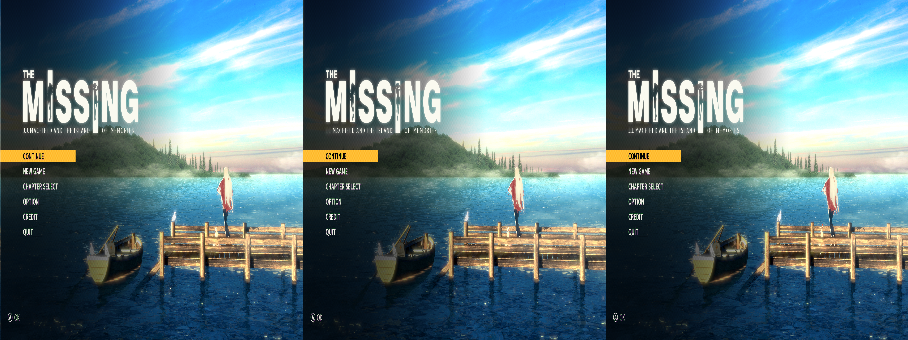
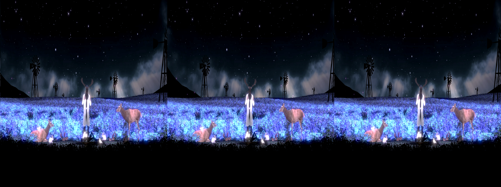
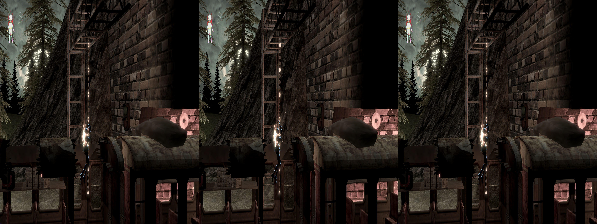

 # _The MISSING: J.J. Macfield and the Island of Memories_ - geo-11 Stereoscopic 3D Fix

- [Changelog](#changelog)
- [General](#general)
- [Instructions](#instructions)
- [Fixed Items and Issues](#fixed-items-and-issues)
- [Credits](#credits)
- [Thanks](#thanks)
- [LICENSE](#license)

    

    

    

## Changelog

- 1.0
  - Initial release

## General

 [Store Link](https://store.steampowered.com/app/842910/The_MISSING_JJ_Macfield_and_the_Island_of_Memories/)

Fix was created for the following build number of the game's executable:

- `2017.2.1.2570336`

Fix was tested with the following version(s) of geo-11:

- `v0.7.10`

If either of these items change due to updates, this fix may no longer work.  Any updates to this fix will be posted to [the repo](https://github.com/BigRobotBil/3d-releases/blob/main/Fixes/geo-11/Missing-JJ/) it was downloaded from.

This fix was tested in the following environments and performed as expected in relation to the display type:

- Samsung Odyssey G9 G90XF
- LG 55UH8500
- Sony KDL-50W800C
- Hisense PX3-PRO
- New Nintendo 3DS

An Nvidia GPU was used to test/develop this fix.  Other brands are untested.

## Instructions

- geo-11 `v0.7.10` is included in this archive

Download the `7z` archive [included in this folder](./geo11_missing_jj_1.0.7z).

Navigate to the game's executable `TheMISSING.exe`:

`<path to your Steam library>\steamapps\common\The Missing\`

Place all files within this archive in the same directory.  Meaning in the same folder as the game's main executable, you should now have `d3dx.ini`, `nvapi64.dll`, `ShaderFixes\`, etc.

Adjust settings in-game or within the `d3dxdm.ini` to your liking, which includes the output method. By default, it is set to side-by-side output (`sbs`).

> [!NOTE]
> geo-11's `0.7.7` release (and up) includes native support for Simulated Reality monitors, like the Samsung Odyssey and Acer Spaital Labs. Use `simulated_reality` as the configuration option in the `d3dxdm.ini`. If this does not work, [3DGameBridge](https://github.com/JoeyAnthony/3DGameBridgeProjects) or [SRLoom](https://github.com/effcol/SR-Loom) can be used as alternatives for engaging the weave required for Simulated Reality monitors.

### Control Setup

 > [!WARNING]
 > If using a controller, it may need to be reconnected once the title screen loads

The following key/controller bindings are active:
- Cycle through depth presets (`25`, `50`, `100`)
  - Header: `KeyDepthPresets`
  - `1` (in the number row)
  - `Left Shoulder Button`/`LB`/`L`/`L1`
- Cycle through convergence presets (`15`, `50`)
  - Header: `KeyConvergencePresets`
  - `2` (in the number row)
  - `Right Shoulder Button`/`RB`/`R`/`R1`
- Toggle HUD/All 2D Elements pushed in
  - Should only be used when playing at low convergence (`15` should be fine)
  - Header: `KeyHUDDepthToggle`
  - `3` (in number row)
  - `Right Stick Button`/`R3`
- Cutscene Depth Toggle (pressing again will revert back to existing configuration)
  - This will set `depth`/`convergence` to `25`/`15`
  - Header: `KeyCutscene`
  - `T`
  - `Left Trigger`/`LB`/`ZL`/`L2`
- Outline Toggle
  - Header: `KeyOutlineToggle`
  - '4' (in number row)
  - `Left Stick Button`/`L3`

Key bindings can be adjusted by editing the relevant sections in the `d3dx.ini` file.

> [!NOTE]
> Please reference <a href="https://learn.microsoft.com/en-us/windows/win32/inputdev/virtual-key-codes">the list of Virtual Keycodes</a> for precise mapping

## Fixed Items and Issues

Fixes the following:
- Practically everything (Universal Fix)

Remaining issues:
- Some objects have a "shadow" that is really just a duplicate of the object. It can be seen when some environmental effects are active, but it's relatively minor
  - The most prominant example in game is pushing a box and seeing an outline that shouldn't be there in the dust clouds
- When increasing depth, if the player is in an area that has a 2D background texture and/or FMV, it may get pushed too far out at high values, resulting in negative space on the sides of the screen
  - Playing at a depth of `25` avoids this. Anything higher will introduce this issue
- When increasing depth/convergence, the outline around JJ (and a few other choice objects/characters) can get malformed and hard to look at
  - Use the provided toggle key (default: `L3` or `4`) to turn it on or off
- Cutscenes will not automatically adjust depth/convergence
  - Use the provided toggle key (default `Left Trigger` or `T`) to quickly adjust. Hitting the button again will restore previously configured 3D settings

 > [!WARNING]
 > "Some janky thing happened while playing the game!"
 > 
 > This is your first SWERY65 game, isn't it?
 >
 > Remember that the Luigi's Mansion-like interact button is for interacting with objects, and sometimes that also means interacting with things you thought would just react to the current state of your character, and the game may break [when running above 60FPS](https://www.pcgamingwiki.com/wiki/The_Missing:_J.J._Macfield_and_the_Island_of_Memories#Video)

## Credits

- Uses the 2019 Unity universal fix to fix common issues with the game (shadows, halos, etc). The bulk of the fix is in this regex
  - The original release can be found [here](https://helixmod.blogspot.com/2018/09/unity-universal-fix.html)
- Toggles for things by Zeek
- [`adjust_from_depth_buffer`](https://github.com/bo3b/3Dmigoto/wiki/Auto-Crosshair)

## Thanks
- This fix would not exist without the Universal Unity fix! Everything that is working is due to this, and I've only introduced some meager patches to finalize some lingering problems
  - DHR, 4everawake
- Members of the HelixMod community that have made fixes over the years.  Even without that much direct documentation (and myself knowing nothing about shaders at all), it really wasn't too difficult to start putting pieces together after going through created fixes

## LICENSE

- For any fixes/patterns/whatever that I have created directly within this archive, do whatever you want.  Please reference the [Beerware license](https://fedoraproject.org/wiki/Licensing/Beerware) (but with me instead) for more information
    - If you learn something, that's all that matters.  If you want to give me credit for something, that's `pretty neat`
- For any fixes/patterns included from other individuals, please reference their release information for how they should be attributed and/or reused

----Zeek/BigRobotBil