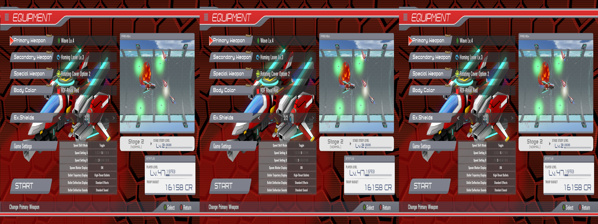
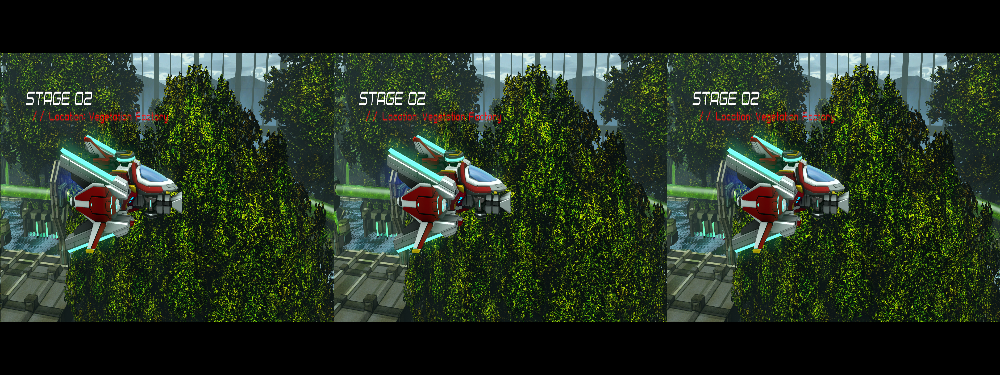
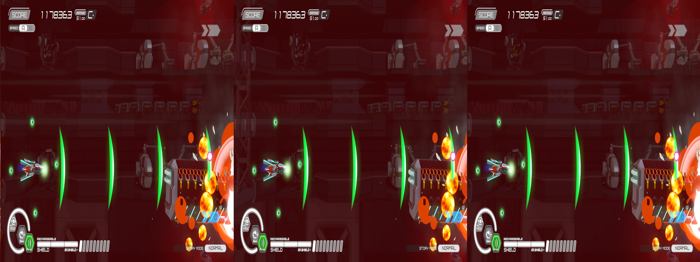

 # _Natsuki Chronicles_ - geo-11 Stereoscopic 3D Fix

- [Changelog](#changelog)
- [General](#general)
- [Instructions](#instructions)
- [Fixed Items and Issues](#fixed-items-and-issues)
- [Credits](#credits)
- [Thanks](#thanks)
- [LICENSE](#license)

    

    

    

## Changelog

- 1.0
  - Initial release

## General

 [Store Link](https://store.steampowered.com/app/1175190/Natsuki_Chronicles/)

Fix was created for the following build number of the game's executable:

- _Not listed in exe's properties_

Fix was tested with the following version(s) of geo-11:

- `v0.7.10`

If either of these items change due to updates, this fix may no longer work.  Any updates to this fix will be posted to [the repo](https://github.com/BigRobotBil/3d-releases/blob/main/Fixes/geo-11/Natsuki-Chronicles/) it was downloaded from.

This fix was tested in the following environments and performed as expected in relation to the display type:

- Samsung Odyssey G9 G90XF
- LG 55UH8500
- Sony KDL-50W800C
- Hisense PX3-PRO
- New Nintendo 3DS

An Nvidia GPU was used to test/develop this fix.  Other brands are untested.

## Instructions

- geo-11 `v0.7.10` is included in this archive

Download the `7z` archive [included in this folder](./geo11_natsuki_chronicles_1.0.7z).

Navigate to the game's executable `Natsuki_Desktop_Steam.exe`:

`<path to your Steam library>\steamapps\common\NatsukiChronicles\x64\Release_Steam`

Place all files within this archive in the same directory.  Meaning in the same folder as the game's main executable, you should now have `d3dx.ini`, `nvapi64.dll`, `ShaderFixes\`, etc.

Adjust settings in-game or within the `d3dxdm.ini` to your liking, which includes the output method. By default, it is set to side-by-side output (`sbs`).

> [!NOTE]
> geo-11's `0.7.7` release (and up) includes native support for Simulated Reality monitors, like the Samsung Odyssey and Acer Spaital Labs. Use `simulated_reality` as the configuration option in the `d3dxdm.ini`. If this does not work, [3DGameBridge](https://github.com/JoeyAnthony/3DGameBridgeProjects) or [SRLoom](https://github.com/effcol/SR-Loom) can be used as alternatives for engaging the weave required for Simulated Reality monitors.

### Control Setup

The following key/controller bindings are active:
- Cutscene Depth/Convergence Toggle
  - Header: `KeyCutsceneTriggerTonedDown3D`
  - This will change the separation/convergence to to `25`/`25`
  - `1` (in number row)
  - `Back`

Key bindings can be adjusted by editing the relevant sections in the `d3dx.ini` file.

> [!NOTE]
> Please reference <a href="https://learn.microsoft.com/en-us/windows/win32/inputdev/virtual-key-codes">the list of Virtual Keycodes</a> for precise mapping

## Fixed Items and Issues

- Game largely works without issue with geo-11 and no updates
- Certain screens have auto-adjustment for toning down the 3D to make it less intense
  - However, cutscenes, unfortunately, are largely manual. Use the toggle defined in the [Control Setup](#control-setup) for these moments

Remaining issues:
- The texture used for detecting the menus and briefing sections is also used in the training sections. Thus, the training sections are locked to reduced 3D
- Some objects are close to the sides of the screen, resulting in some things that are hard to look at. If 3D is reduced, it's not terrible
- There are pipes for water in the second level, that _appear_ to be not stereoized correctly, but they are minor and not noticable unless you look
  - Now that I pointed it out, you're going to look

## Credits

- Toggles for things by Zeek

## Thanks

- Members of the HelixMod community that have made fixes over the years.  Even without that much direct documentation (and myself knowing nothing about shaders at all), it really wasn't too difficult to start putting pieces together after going through created fixes

## LICENSE

- For any fixes/patterns/whatever that I have created directly within this archive, do whatever you want.  Please reference the [Beerware license](https://fedoraproject.org/wiki/Licensing/Beerware) (but with me instead) for more information
    - If you learn something, that's all that matters.  If you want to give me credit for something, that's `pretty neat`
- For any fixes/patterns included from other individuals, please reference their release information for how they should be attributed and/or reused

----Zeek/BigRobotBil