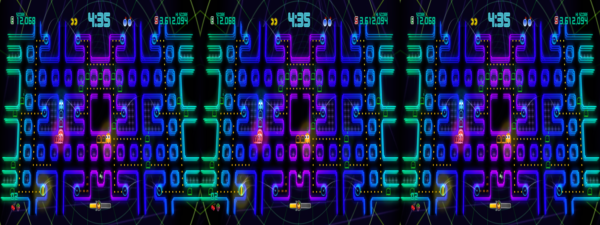
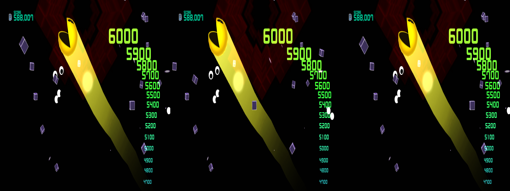
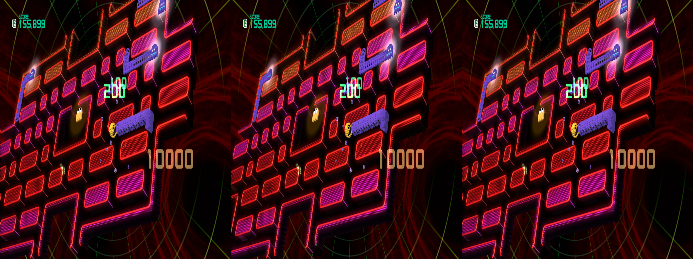

 # _Pac-Man CE2_ - geo-11 Stereoscopic 3D Fix

 _If you want to see the journey it took to get to this point, please [start here](../../../tutorials/pac-man-ce2/README.md)_

- [Changelog](#changelog)
- [General](#general)
- [Instructions](#instructions)
- [Fixed Items and Issues](#fixed-items-and-issues)
- [Credits](#credits)
- [Thanks](#thanks)
- [LICENSE](#license)

    

    

    

## Changelog

- 1.0
  - Initial release

## General

 [Store Link](https://store.steampowered.com/app/441380/PACMAN_CHAMPIONSHIP_EDITION_2/)

Fix was created for the following build number of the game's executable:

- `5.3.4.8630773`

Fix was tested with the following version(s) of geo-11:

- `v0.7.10`

If either of these items change due to updates, this fix may no longer work.  Any updates to this fix will be posted to [the repo](https://github.com/BigRobotBil/3d-releases/blob/main/Fixes/geo-11/Pac-Man-CE2/) it was downloaded from.

This fix was tested in the following environments and performed as expected in relation to the display type:

- Samsung Odyssey G9 G90XF
- LG 55UH8500
- Hisense PX3-PRO
- New Nintendo 3DS

An Nvidia 5070 Ti was used to test/develop this fix.  Other brands/models are untested.

## Instructions

- geo-11 `v0.7.10` is included in this archive

Download the `7z` archive [included in this folder](./geo11_pac_man_ce2_1.0.7z).

Navigate to the game's executable `PCE2.exe`:

`<path to your Steam library>\steamapps\common\FLUID\`

Place all files within this archive in the same directory.  Meaning in the same folder as the game's main executable, you should now have `d3dx.ini`, `nvapi64.dll`, `ShaderFixes\`, etc.

Adjust settings in-game or within the `d3dxdm.ini` to your liking, which includes the output method. By default, it is set to side-by-side output (`sbs`).

> [!NOTE]
> geo-11's `0.7.7` release (and up) includes native support for Simulated Reality monitors, like the Samsung Odyssey and Acer Spaital Labs. Use `simulated_reality` as the configuration option in the `d3dxdm.ini`. If this does not work, [3DGameBridge](https://github.com/JoeyAnthony/3DGameBridgeProjects) or [SRLoom](https://github.com/effcol/SR-Loom) can be used as alternatives for engaging the weave required for Simulated Reality monitors.

### Control Setup

_If you are using a controller, please scroll down to the **WARNING**_

The following key/controller bindings are active:
- Cycle through depth and convergence presets (`50`, `100`, `150`, `200`)
  - Due to how depth/convergence are automatically adjusted, you must be unpaused in-game to see the cycle occur
  - Header: `KeyPresets`
  - `1` (in the number row)
  - `Left Stick Button`/`L3`
- Toggle HUD/All 2D Elements pushed in
  - Should only be used when playing at low depth/convergence
  - Header: `KeyHUDDepthToggle`
  - `2` (in number row)
  - `Right Stick Button`/`R3`
- Kill 3D
  - Header: `KeyKill3D`
  - `F`
  - `Back`
  - This is a hold based toggle. The effect will last until you let go of the button

Key bindings can be adjusted by editing the relevant sections in the `d3dx.ini` file.

> [!NOTE]
> Please reference <a href="https://learn.microsoft.com/en-us/windows/win32/inputdev/virtual-key-codes">the list of Virtual Keycodes</a> for precise mapping

> [!WARNING]
> If using a controller, you MUST remap the control buttons mentioned above in Steam Input to _not_ be the Steam Input `GAME ACTION` items, rather the direct controller buttons (or, if you changed it like the example above, it must match that). If you do not, the buttons will not function properly. This is due to Steam Input not identifying directly as the XInput buttons being used. For example, you must assign `L3` to the `L3` of your controller, _and not_ the Steam Input item

<a href="screenshots/ControllerExample1.png">Example controller configuration for stick assignments</a>

## Fixed Items and Issues

_Pac-Man CE2_ works during gameplay without issue. All issues pertain to dynamically adjusting the depth/convergence during gameplay

Fixes the following:
- Removes 3D during menus
- Tones down the 3D during ghost hunting segments

Remaining issues:
- Maze transitions are still at full depth/seperation, and can be hard to look at (the `Kill 3D` toggle is meant for this; if you use a controller that has back triggers, it can be useful being assigned there for easier manipulation)
- Some of the transitions for 3D ramping down and back up can happen in quick succession due to the conditionals being used to target them
  - I couldn't really find anything better, unfortunately

If you want to adjust how much the 3D is changed during ghost hunting segments, you can edit the `PresetTonedDown3D` header in the `d3dx.ini` with whatever values you'd prefer during that section.

Similarly, if you want to adjust the toggling for `Kill 3D` to adjust the separation/convergence, you can edit that under the `KeyKill3D` header in the `d3dx.ini`.

## Credits

- Adjustments for all fixes created by Zeek
- [`adjust_from_depth_buffer`](https://github.com/bo3b/3Dmigoto/wiki/Auto-Crosshair)

## Thanks

- Members of the HelixMod community that have made fixes over the years.  Even without that much direct documentation (and myself knowing nothing about shaders at all), it really wasn't too difficult to start putting pieces together after going through created fixes

## LICENSE

- For any fixes/patterns/whatever that I have created directly within this archive, do whatever you want.  Please reference the [Beerware license](https://fedoraproject.org/wiki/Licensing/Beerware) (but with me instead) for more information
    - If you learn something, that's all that matters.  If you want to give me credit for something, that's `pretty neat`
- For any fixes/patterns included from other individuals, please reference their release information for how they should be attributed and/or reused

----Zeek/BigRobotBil