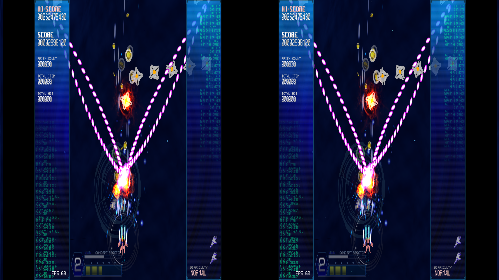
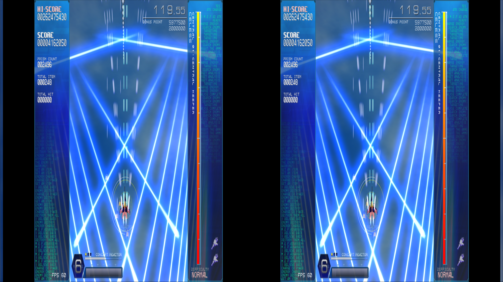
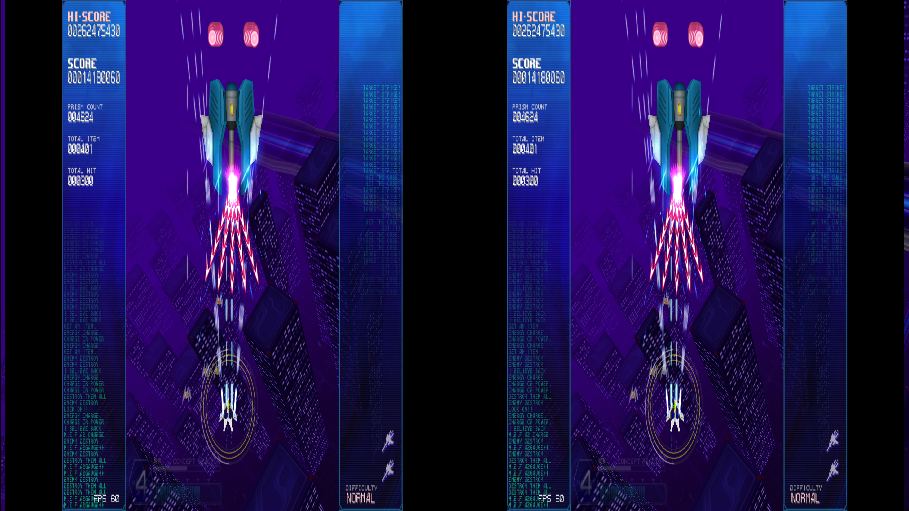
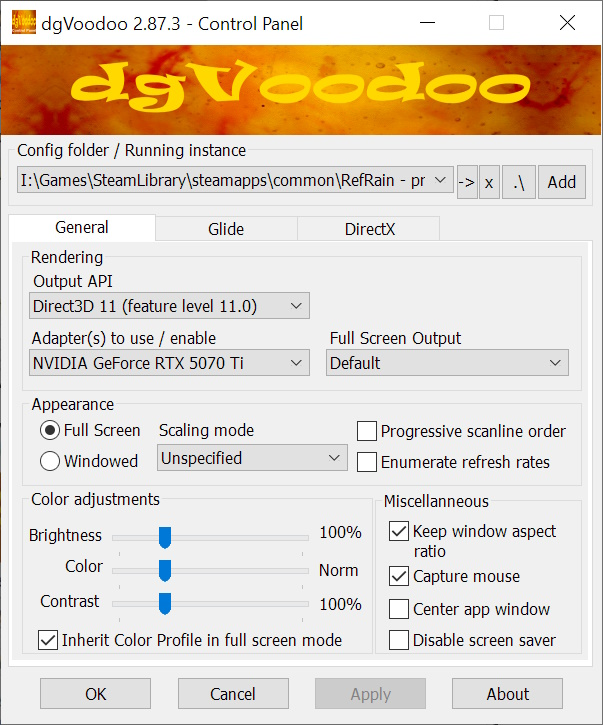
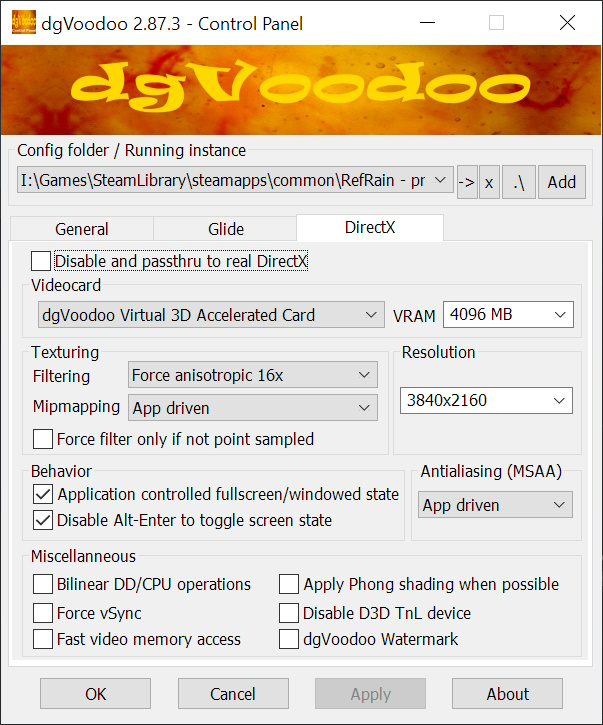

 # _RefRain - prism memories_ - geo-11 Stereoscopic 3D Fix

- [Changelog](#changelog)
- [General](#general)
- [Instructions](#instructions)
- [Fixed Items and Issues](#fixed-items-and-issues)
- [Credits](#credits)
- [Thanks](#thanks)
- [LICENSE](#license)

    

    

    

<i>Despite screenshots only taken up to the second level, a full run as Miria was completed before posting. I wasn't going to play the whole game in stereo like this</i>

## Changelog

- 1.0
  - Initial release

## General

 [Store Link](https://store.steampowered.com/app/435970/RefRain__prism_memories/)

Fix was created for the following build number of the game's executable:

- `1.0.3.7`

Fix was tested with the following version(s) of geo-11:

- `v0.7.10`

Fix was tested with the following version(s) of dgVoodoo:

- `2.87.3`

If either of these items change due to updates, this fix may no longer work.  Any updates to this fix will be posted to [the repo](https://github.com/BigRobotBil/3d-releases/blob/main/Fixes/geo-11/RefRain/) it was downloaded from.

This fix was tested in the following environments and performed as expected in relation to the display type:

- Samsung Odyssey G9 G90XF
- LG 55UH8500
- Sony KDL-50W800C
- Hisense PX3-PRO
- New Nintendo 3DS

An Nvidia GPU was used to test/develop this fix.  Other brands are untested.

## Instructions

- geo-11 `v0.7.10` is included in this archive

Download the `7z` archive [included in this folder](./geo11_refrain_1.0.7z).

Navigate to the game's executable `RefRain.exe`:

`<path to your Steam library>\steamapps\common\RefRain - prism memories -`

Place all files within this archive in the same directory.  Meaning in the same folder as the game's main executable, you should now have `d3dx.ini`, `nvapi64.dll`, `ShaderFixes\`, etc.

Adjust settings in-game or within the `d3dxdm.ini` to your liking, which includes the output method. By default, it is set to side-by-side output (`sbs`).

> [!NOTE]
> geo-11's `0.7.7` release (and up) includes native support for Simulated Reality monitors, like the Samsung Odyssey and Acer Spaital Labs. Use `simulated_reality` as the configuration option in the `d3dxdm.ini`. If this does not work, [3DGameBridge](https://github.com/JoeyAnthony/3DGameBridgeProjects) or [SRLoom](https://github.com/effcol/SR-Loom) can be used as alternatives for engaging the weave required for Simulated Reality monitors.

- dgvoodoo is required, and not provided in the archive

Download dgvoodoo `2.87.3` from its official Github release:

[Download](https://github.com/dege-diosg/dgVoodoo2/releases/tag/v2.87.3)

Extract the archive for `dgVoodoo2_87_3.zip`, and take the following file:

- `MS\x86\D3D9.dll`

Place it within the same directory as the game's executable `RefRain.exe`. Configure dgVoodoo with your relevant settings (resolution). Here is what I used:

    

### Control Setup

The following key/controller bindings are active:
- Push the HUD into the screen
  - Should only be used on low depth/convergence
  - Header: `KeyHUDToggle`
  - `1` (in the number row)
  - `Right Shoulder Button`/`R3`
- Cycle through depth/convergence presets (`20/10`, `100/50`)
  - Header: `KeyPresetCycle`
  - `2` (in the number row)
  - `Right Stick Button`/`R3`

Key bindings can be adjusted by editing the relevant sections in the `d3dx.ini` file.

> [!NOTE]
> Please reference <a href="https://learn.microsoft.com/en-us/windows/win32/inputdev/virtual-key-codes">the list of Virtual Keycodes</a> for precise mapping

## Fixed Items and Issues

Fixes the following:
- Pushes all 2D elements in when toggled on. Game is functional otherwise

Remaining issues:
- Sides of the screen become "exposed" when pushing all 2D elements in
- The marker for the hitbox is misaligned when depth/convergence is above barely anything. I was able to complete a full run without this really being an issue, however, namely using the low/default depth/convergence preset that is included

## Credits

- Toggles for things by Zeek
- [`adjust_from_depth_buffer`](https://github.com/bo3b/3Dmigoto/wiki/Auto-Crosshair)

## Thanks

- Members of the HelixMod community that have made fixes over the years.  Even without that much direct documentation (and myself knowing nothing about shaders at all), it really wasn't too difficult to start putting pieces together after going through created fixes
- Masterotaku for mentioning the method to get stereoization to occur for generally older games when 3DMigoto/geo-11 doesn't stereoize things
  - This game does not render in stereo out of the box

## LICENSE

- For any fixes/patterns/whatever that I have created directly within this archive, do whatever you want.  Please reference the [Beerware license](https://fedoraproject.org/wiki/Licensing/Beerware) (but with me instead) for more information
    - If you learn something, that's all that matters.  If you want to give me credit for something, that's `pretty neat`
- For any fixes/patterns included from other individuals, please reference their release information for how they should be attributed and/or reused

----Zeek/BigRobotBil