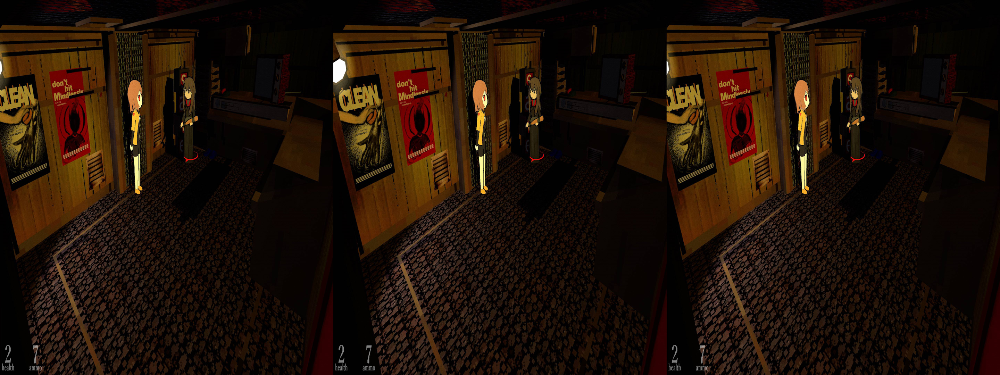
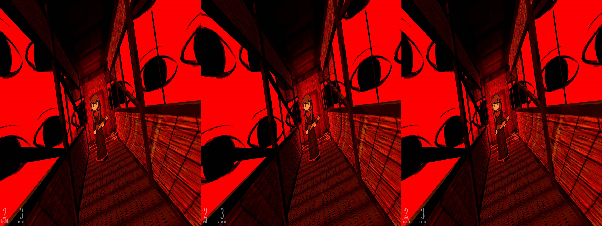
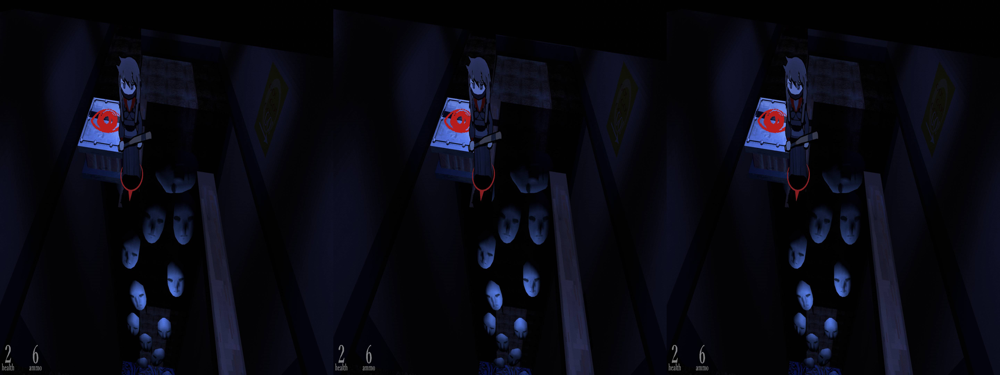
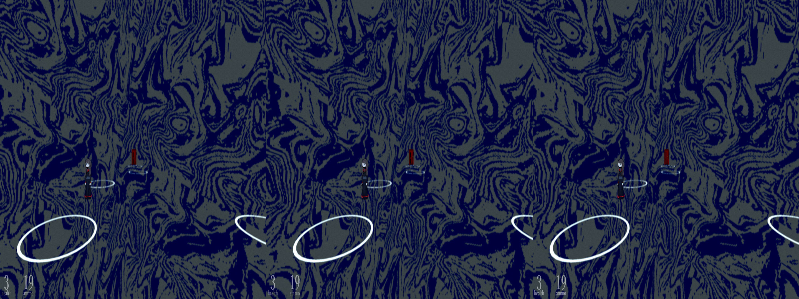

 # _Studio System: Guardian Angel_ - geo-11 Stereoscopic 3D Fix

- [Changelog](#changelog)
- [General](#general)
- [Instructions](#instructions)
- [Fixed Items and Issues](#fixed-items-and-issues)
- [Credits](#credits)
- [Thanks](#thanks)
- [LICENSE](#license)


<p align="center">
    <a href="screenshots/screen1.png"></a>
</p>
<p align="center">
    <a href="screenshots/screen4.png"></a>
</p>
<p align="center">
    <a href="screenshots/screen5.png"></a>
</p>
<p align="center">
    <a href="screenshots/screen12.png"></a>
</p>

## Changelog

<i>For older releases, please see the [legacy section](./legacy/README.md)</i>

- 1.0
  - Initial release
- 1.1
  - Fixed crosshair
  - Updated to geo-11 0.7.7

## General

 [Store Link](https://store.steampowered.com/app/2194790/Studio_System__Guardian_Angel/)

Fix was created for the following build number of the game's executable:

- `2018.4.18.6421734`

Fix was tested with the following version(s) of geo-11:

- `v0.7.7`

If either of these items change due to updates, this fix may no longer work.  Any updates to this fix will be posted to [the repo](https://github.com/BigRobotBil/3d-releases/blob/main/Fixes/geo-11/StudioSystem-GuardianAngel/) it was downloaded from.

This fix was tested in the following environments and performed as expected in relation to the display type:

- Samsung Odyssey G9 G90XF
- LG 55UH8500
- Hisense PX3-PRO
- New Nintendo 3DS

An Nvidia GPU was used to test/develop this fix.  Other brands are untested.

## Instructions

- geo-11 `v0.7.7` is included in this archive

Download the `7z` archive [included in this folder](./geo11_studiosystem_guardianangel_1.1.7z).

Navigate to the game's executable `studio-system.exe`:

`...\Studio System Guardian Angel\`

Place all files within this archive in the same directory.  Meaning in the same folder as the game's main executable, you should now have `d3dx.ini`, `nvapi64.dll`, `ShaderFixes\`, etc.

Adjust settings in-game or within the `d3dxdm.ini` to your liking, which includes the output method. By default, it is set to side-by-side output (`sbs`).

Note: geo-11's `0.7.7` release includes native support for Simulated Reality monitors, like the Samsung Odyssey and Acer Spaital Labs. Use `simulated_reality` as the configuration option in the `d3dxdm.ini`. If this does not work, [3DGameBridge](https://github.com/JoeyAnthony/3DGameBridgeProjects) or [SRLoom](https://github.com/effcol/SR-Loom) can be used as alternatives for Simulated Reality monitors.

### Control Setup

_If you are using a controller, please scroll down to the **WARNING**_

If you rebind the aiming key, you must update the `d3dx.ini` to match with it. Search for the following section within the `d3dx.ini`:

```ini
[KeyCrossHair]
Key = VK_RBUTTON
```

Change the `Key` value from `VK_RBUTTON` to whichever key you have mapped the action to.

> [!NOTE]
> Please reference <a href="https://learn.microsoft.com/en-us/windows/win32/inputdev/virtual-key-codes">the list of Virtual Keycodes</a> for precise mapping

 For example, if you have remapped it to the `T` key, this block would change to:

```ini
[KeyCrossHair]
Key = T
```

Leave all other values as they are. If they are changed, and you do not know what you are doing, you will break compatiblity with the crosshair being corrected during gameplay.

> [!WARNING]
> If using a controller, you MUST remap the aim button to the right mouse button in Steam Input (or, if you changed it like the example above, it must match that). If you do not, the crosshair will not function properly. This is due to Steam Input not identifying as `XB_LEFT_TRIGGER` (the default binding) when pressed


## Fixed Items and Issues

Fixes the following:
- Shadows
- Halos
- Pointer arrow underneath Becky that aids in determining your orientation
- Crosshair

Remaining issues:
- 2D objects that take up more than the center of the screen during gameplay may converge poorly compared to the background
  - I only noticed this during a specific ending that had a 2D texture extend to the bottom of the screen with a text overlay.  It's very minor, and only noticeable if you decide to not read the text that is on the screen. I don't deem this important enough to fix for this release
- If the aim button is pressed during a menu/dialog/cutscene, there is a risk that items in the center of the screen may be distorted. This is a compromise with how the crosshair fix was accomplished. During gameplay, the aim button has no use outside of aiming

## Credits

- Uses DHR's 2017 Unity Regular Expression file to fix common issues with the game (shadows, halos, etc). The bulk of the fix is in this regex
  - The original release can be found [here](https://helixmod.blogspot.com/2018/09/unity-universal-fix.html)
- Shader for the arrow beneath Becky and the crosshair were fixed by Zeek

## Thanks
- Members of the HelixMod community that have made fixes over the years.  Even without that much direct documentation (and myself knowing nothing about shaders at all), it really wasn't too difficult to start putting pieces together after going through created fixes
  - And thank you to those that answered my questions!
- While DHR's regex was the primary method for fixing many issues with the game, I still learned quite a lot seeing how they worked. But, thank you DHR for putting this together, even years later it's incredibly useful.  I likely would have taken far longer to fix this game if it wasn't for this!
- Thank you masterotaku and cicicleta for pointing me in the right direction with fixing the crosshair (and also all the fixes you both have made over the years!)

If you want to experience my time trying to understand how to fix the crosshair, you can view that [here](../../../tutorials/studio-system/figuringthingsout_crosshair.md).

## LICENSE

- For any fixes/patterns/whatever that I have created directly within this archive, do whatever you want.  If you learn something, that's all that matters.  If you want to give me credit for something, that's `pretty neat`
- For any fixes/patterns included from other individuals, please reference their release information for how they should be attributed and/or reused

----Zeek/BigRobotBil