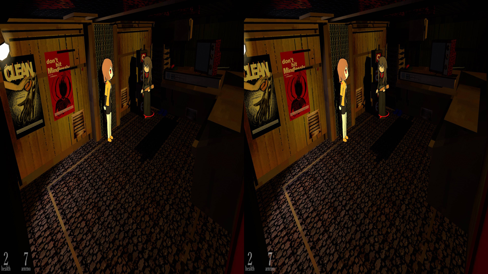
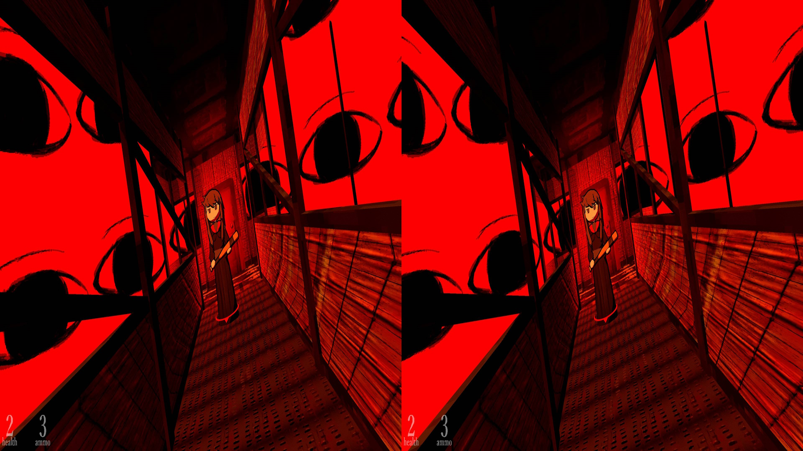
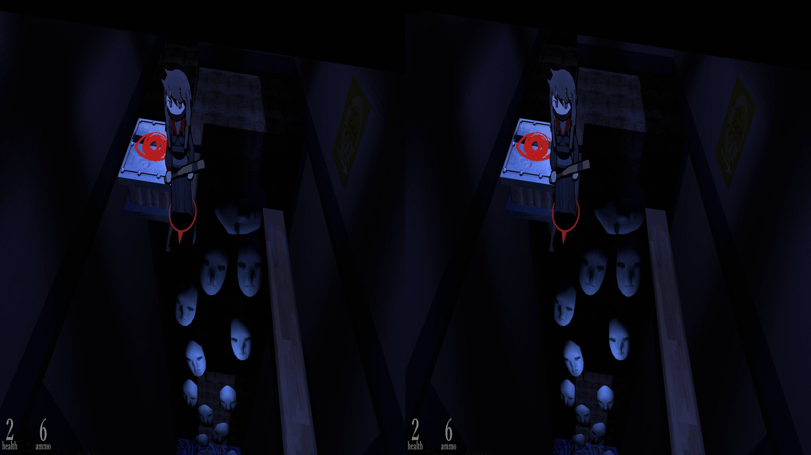
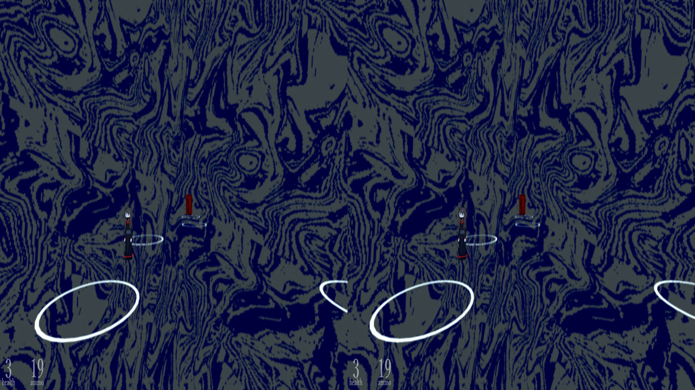

 # _Studio System: Guardian Angel_ - geo-11 Stereoscopic 3D Fix

- [Instructions](#instructions)
- [Fixed Items and Issues](#fixed-items-and-issues)
- [Credits](#credits)
- [Thanks](#thanks)
- [LICENSE](#license)

    

    

    

    

 [Store Link](https://store.steampowered.com/app/2194790/Studio_System__Guardian_Angel/)

Fix was created for the following build number of the game's executable:

- `2018.4.18.6421734`

Fix was tested with the following version(s) of geo-11:

- `v0.6.164`
- `v0.6.198`

If either of these items change due to updates, this fix may no longer work.  Any updates to this fix will be posted to [the repo](https://github.com/BigRobotBil/3d-releases/blob/main/Fixes/geo-11/StudioSystem-GuardianAngel/) it was downloaded from.

This fix was tested in the following environments and performed as expected in relation to the display type:

- Samsung Odyssey G9 G90XF
- Sony KDL-50W800C
- New Nintendo 3DS

An Nvidia GPU was used to test/develop this fix.  Other brands are untested.

## Instructions

- geo-11 `v0.6.198` is included in this archive

Navigate to the game's executable `studio-system.exe`:

`...\Studio System Guardian Angel\`

Place all files within this archive in the same directory.  Meaning in the same folder as the game's main executable, you should now have `d3dx.ini`, `nvapi64.dll`, `ShaderFixes\`, etc.

Adjust settings in-game or within the `d3dxdm.ini` to your liking.

## Fixed Items and Issues

Fixes the following:
- Shadows
- Halos
- Pointer Arrow

Remaining issues:
- Cursor is not at screen depth, resulting in poor aiming
- - After adapting to it, however, it isn't too bad
- 2D objects that take up more than the center of the screen during gameplay may converge poorly compared to the background
- - I only noticed this during a specific ending that had a 2D texture extend to the bottom of the screen with a text overlay.  It's very minor, and only noticeable if you decide to not read the text that is on the screen

Due to the cursor issue, I can't recommend this game at a `3D Ready` level.  However, I only found it to be an actual hinderance only a few times: namely if you're franticaly attempting to shoot.  If this is your first time playing _Studio System: Guardian Angel_, I'd recommend getting a feel for the crosshair in 2D first before trying it in 3D; it'll take a bit to adjust.

## Credits

- Uses DHR's 2017 Unity Regular Expression file to fix common issues with the game
- - The original release can be found [here](https://helixmod.blogspot.com/2018/09/unity-universal-fix.html)
- Shader for the arrow beneath Becky was fixed by Zeek

## Thanks
- Members of the HelixMod community that have made fixes over the years.  Even without that much direct documentation (and myself knowing nothing about shaders at all), it really wasn't too difficult to start putting pieces together after going through created fixes
- - And thank you to those that answered my questions!
- While DHR's regex was the primary method for fixing many issues with the game, I still learned quite a lot seeing how they worked.  The universal Unity fixes are extremely valuable and are a great starting point; I likely would have taken far longer to fix this game if it wasn't for them!

## LICENSE

- For any fixes/patterns/whatever that I have created directly within this archive, do whatever you want.  If you learn something, that's all that matters.  If you want to give me credit for something, that's `pretty neat`
- For any fixes/patterns included from other individuals, please reference their release information for how they should be attributed and/or reuse

----Zeek/BigRobotBil