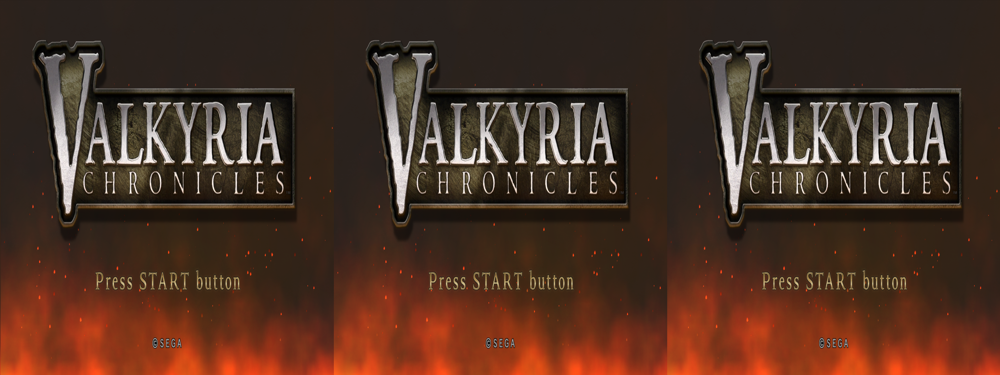
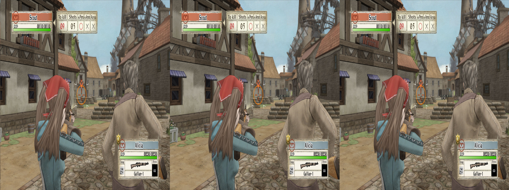
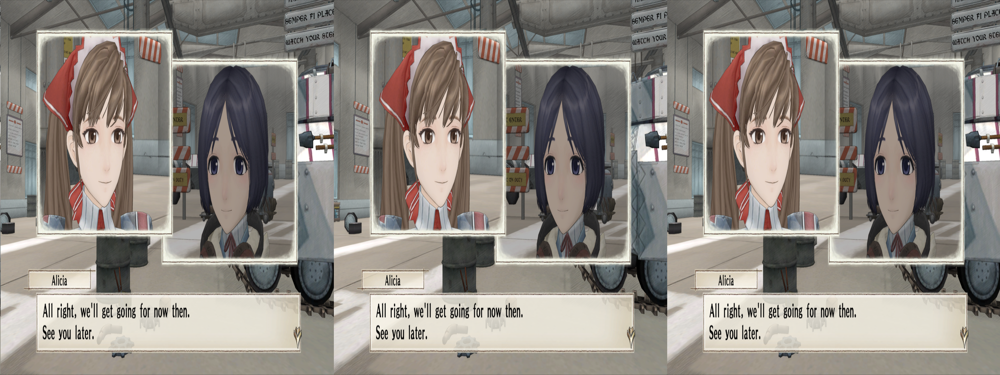
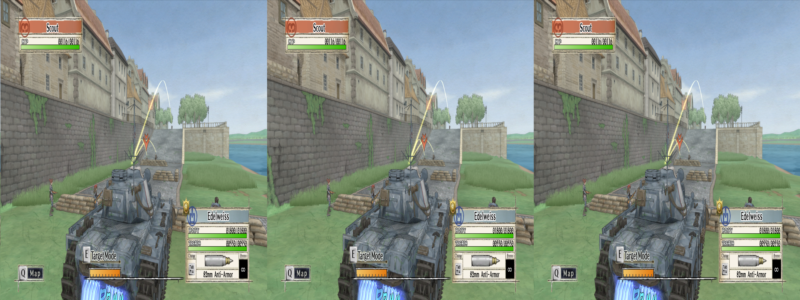
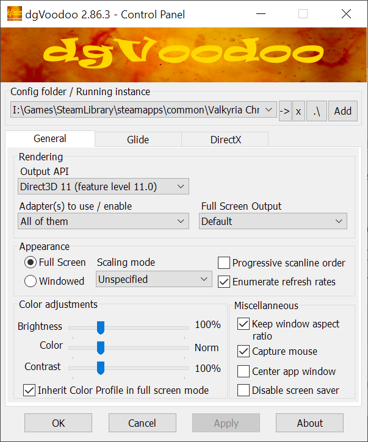
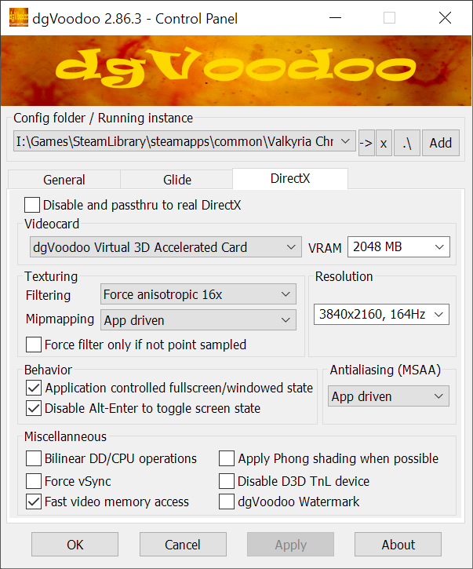

 # _Valkyria Chronicles_ - geo-11 Stereoscopic 3D Fix

 > [!WARNING]
 > This fix is not optimal. It should only be used if you understand the issues detailed in the [Issues](#issues) section. I also need to actually play more of the game to determine if there's any remaining problems that aren't found outside of the initial section

_If you want to see the journey it took to get to this point, please [start here](../../../tutorials/valkyria-chronicles-1/README.md)_

- [Changelog](#changelog)
- [General](#general)
- [Instructions](#instructions)
  - [Hotkeys](#hotkeys)
- [Fixed Items](#fixed-items)
- [Issues](#issues)
- [Credits](#credits)
- [Thanks](#thanks)
- [LICENSE](#license)


<p align="center">
    <a href="screenshots/titlescreen.png"></a>
</p>
<p align="center">
    <a href="screenshots/ingame_onfoot.png"></a>
</p>
<p align="center">
    <a href="screenshots/ingame_dialog.png"></a>
</p>
<p align="center">
    <a href="screenshots/ingame_tank.png"></a>
</p>

## Changelog

- 1.0
  - Initial release

## General

[Store Link](https://store.steampowered.com/app/294860/Valkyria_Chronicles/)

> [!NOTE]
> This fix is only compatible with the Steam release!  The Windows Store version is untested, and may require additional work

Fix was created for the following build number of the game's executable:

- `1.0.0.1`

Fix was tested with the following version(s) of geo-11:

- `v0.7.7`

Fix was tested and developed with the following version(s) of dgvoodoo:

- `2.86.5`

If any of these items change due to updates, this fix may no longer work.  Any updates to this fix will be posted to [the repo](https://github.com/BigRobotBil/3d-releases/blob/main/Fixes/geo-11/Valkyria-Chronicles/) it was downloaded from.

This fix was tested in the following environments and performed as expected in relation to the display type:

- Samsung Odyssey G9 G90XF
- LG 55UH8500
- Hisense PX3-PRO
- New Nintendo 3DS

An Nvidia 2080Ti and 5070Ti GPU were used to test/develop this fix.  Other brands are untested.

## Instructions

> [!CAUTION]
> Ensure you have setup all options in the game before applying the fix! The configuration tool (Launcher.exe) may not boot when geo-11 is applied
> If this is the case, you can delete `d3d11.dll` and `nvapi.dll` from the directory, configure needed settings, quit the configuration tool, and then copy those files again from the fix archive

> [!CAUTION]
> Running the included `Uninstall.bat` will remove dgvoodoo's D3D9.dll!

- geo-11 `v0.7.7` is included in this archive

Navigate to the game's executable `Valkyria.exe`:

`steamapps\common\Valkyria Chronicles`

Place all files within this archive in the same directory.  Meaning in the same folder as the game's main executable, you should now have `d3dx.ini`, `nvapi64.dll`, `ShaderFixes\`, etc.

Adjust settings in-game or within the `d3dxdm.ini` to your liking, which includes the output method. By default, it is set to side-by-side output (`sbs`).

Note: geo-11's `0.7.7` release includes native support for Simulated Reality monitors, like the Samsung Odyssey and Acer Spaital Labs. Use `simulated_reality` as the configuration option in the `d3dxdm.ini`. If this does not work, [3DGameBridge](https://github.com/JoeyAnthony/3DGameBridgeProjects) or [SRLoom](https://github.com/effcol/SR-Loom) can be used as alternatives for Simulated Reality monitors.

- dgvoodoo is required, and not provided in the archive

Download dgvoodoo 2.86.5 from its official Github Release:

[Download](https://github.com/dege-diosg/dgVoodoo2/releases/tag/v2.86.5) [Mirror](https://github.com/masterotaku/dgVoodoo-binaries/blob/main/dgVoodoo2_86_5.zip)

Extract the archive for `dgVoodoo2_86_5.zip`, and take the following file:

- `MS\x86\D3D9.dll`

Place it within the same directory as the game's executable `Valkyria.exe`.  Configure dgvoodoo with the following settings:

<p align="center">
    <a href="../../../tutorials/valkyria-chronicles-1/figuringscreens/dgvoodoosettings_1.png"></a><a href="../../../tutorials/valkyria-chronicles-1/figuringscreens/dgvoodoosettings_2.png"></a>
</p>

### Hotkeys
- `1`
  - Pressing `1` on the keyboard's number row (_not numpad_) will toggle the window frame around the screen on and off.  It is defaulted to off when booting up
- `2` / `Back/Select` (Controller)
  - This will toggle the depth adjustment for the various HUD textures in the middle of the screen. During gameplay, other textures may appear in this place that _will_ be distorted
  - See [this](../../../tutorials/valkyria-chronicles-1/figuringthingsout_abox.md) for why

If you wish to revert the window frame functionality (turn the window border on by default), open `d3dx.ini` and find the following section:

```ini
;Window Border toggle. 0=disabled, 1=enabled
z1=0
```

and change `z1=0` to `z1=1`

## Fixed

Fixes the following:
- Shadows
- Reflections

Not quite fixed:
- Contains possible adjustments for the HUD

## Issues

Remaining issues:
- Unit selection screen lacks proper depth
  - If staring at this for a long time, I'd recommend disabling 3D via the hotkey combo `Ctrl + T`
- HUD icons may appear distorted during gameplay
  - See [this](../../../tutorials/valkyria-chronicles-1/figuringthingsout_abox.md) for why
  - The crosshairs for the tank are distorted on the horizontal
  - [You can manipulate this to your liking, if the included range isn't good for you](./../../../tutorials/valkyria-chronicles-1/bus_insurance.md#adjust-depth)
- The first time a 3D scene of some kind is loaded, those initial 3D models will still be in 2D, but their textures will render in stereo
    - When the next set of 3D objects loads (more models, etc), models will properly stereoize
    - This appears to be temporary
- Pencil effect is not pushed into depth/disabled
  - I don't find it distracting, but others may
  - I was unable to identify the responsible shader to make it a proper toggle anyway

## Credits
- Shadows and texture overrides by Zeek, using old fixes by the community (particularly masterotaku's) as a blueprint on how to fix them
- Masterotaku's fix for the water shader/reflections
- FluffyQuack for providing tools for texture replacements and having their code be open source
- [`adjust_from_depth_buffer`](https://github.com/bo3b/3Dmigoto/wiki/Auto-Crosshair)

## Thanks
- [eqzitara's original fix, which showed what was ultimately possible over ten years ago](https://helixmod.blogspot.com/2016/03/valkyria-chronicles.html)
- masterotaku and cicicleta for helping me extensively
  - And everyone else in the community listening to me hit my head against the wall
- Everyone in the 3D community for keeping the dream alive over the years.  All the fixes created are extremely helpful in understanding how this process works, and I wouldn't have been able to put this all together if it wasn't for that

## LICENSE

- For any fixes/patterns/whatever that I have created directly within this archive, do whatever you want.  Please reference the [Beerware license](https://fedoraproject.org/wiki/Licensing/Beerware) (but with me instead) for more information
    - If you learn something, that's all that matters.  If you want to give me credit for something, that's `pretty neat`
- For any fixes/patterns included from other individuals, please reference their release information for how they should be attributed and/or reused

----Zeek/BigRobotBil