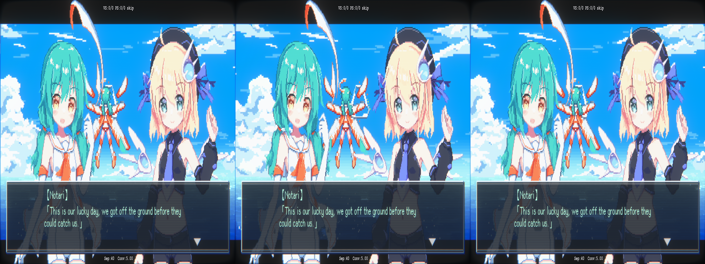
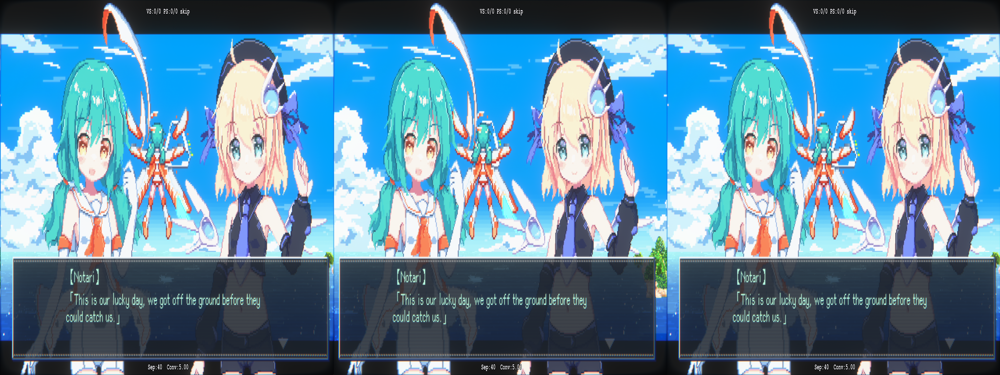
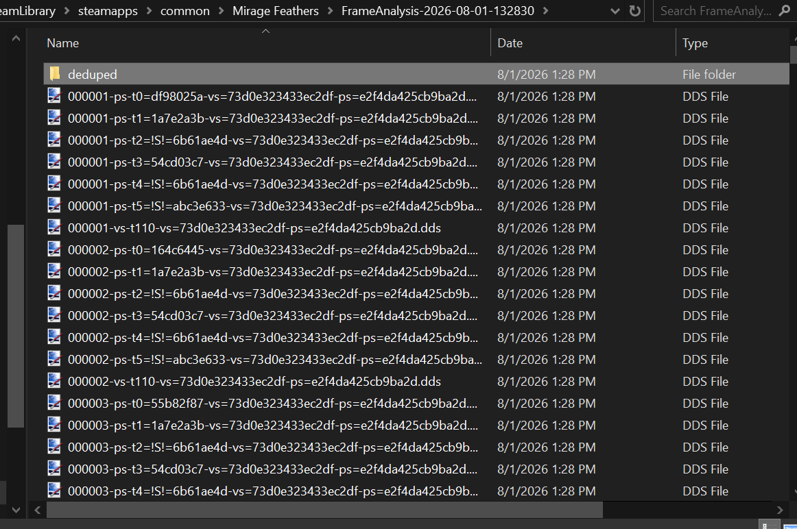

# Conditional Texture

We can conditionally triggering shader adjustments if there's a presence of another specific shader or texture. This can be used for something like if we're only in a cutscene, or if we're in a menu, and so on. That way we don't have to deal with a ton of conditionals to get various parts of the game running. That is, of course, _if_ the game has a simple constant that's only used in specific situations.

<p align="center">
    <a href="figuringscreens_conditionaltexture/fig_condtext_cutscenesbad.png"></a>
    <p align="center"><i>This image won't hurt your eyes while things are stationary, but in motion, it ain't great</i></p>
</p>

Using what was learned from the _Studio System_ [crosshair fix](../studio-system/figuringthingsout_crosshair.md), we can do the same here for the cutscenes when they show up during gameplay:

<p align="center">
    <a href="figuringscreens_conditionaltexture/fig_condtext_cutscenesbad_depthpush.png"></a>
    <p align="center"><i>I accidentally generated this one from an already cross-eye friendly image, so, er, whelp. The correct view is opposite from normal</i></p>
</p>

What we need to is only conditionally do this _if_ a cutscene is active. We don't want to map a toggle key to this if we don't have to. Dumping a texture and using that is a method to do this for us.

_However, if you toggle the option to disable cutscenes completely, well, you'll never encounter this issue._

> [!NOTE]
> Before continuing, I'd like to thank masterotaku for helping me again

_For what the fix ended up doing in the end, you can skip to the [final section](#video-games-are-toys-for-children)_

## Dumping the Frame

The first thing we need to do is have the game go to an in-game cutscene. There's a few that occur without the background being the actual game, and those generally appear fine. Starting a new game and/or replaying the first stage should get us to a cutscene shortly after take-off:

<p align="center">
    <a href="figuringscreens_conditionaltexture/fig_condtext_cutscenesbad.png"></a>
</p>

When shader hunting, we can determine that the following four shaders are responsible:

- `af8c3eb5b621448e`
  - The main one that is in charge of many of the 2D elements on screen
  - It draws the character portraits and the dialog box
- `477d4ff7a6b2e042`
  - misc 2D things on the screen
- `30cc3a24d1d4a6ed`
  - The outlines/accents around a character, I think to give them more of a dithered effect
- `4ebe7449dc81321e`
  - Text that appears in a dialog box

Playing through the game before, all cutscenes have a dialog box on them, so we can use that as our constant that a cutscene is happening. Other games may have other specific triggers (like a specific shader that only shows up, or a combination of different textures, and so on), but likely this game is rather simple so we can bank on the dialog box always being our flag that we've entered a cutscene state.

Since we want to target the dialog box, we need to do a dump of the current frame to get its texture hash. In our `d3dx.ini`:


```ini
; Enable dumping the ShaderUsage.txt. We'll need it later
dump_usage=1
; Dumping options. See the readme right about this line for other options
analyse_options = dump_tex mono dds
```

> [!WARNING]
> This is likely overkill, and will dump out _a lot_. Be wary when you're doing a much larger game. You may want to instead target a specific shader, or shaders, when doing a dump instead to isolate more. Since _Mirage Feathers_ is rather "light" on resources, this isn't going to kill my hard drive space. Dumping in jpeg format is probably the better option regardless, however many textures in _Mirage Feathers_ use transparency, so it'd be harder to identify at a glance if all the dumped textures lacked their alpha channel.

## Finding the Texture

Pressing `F8` (the default hotkey defined a few lines up in the `d3dx.ini`), we'll get a folder with the current state:

<p align="center">
    <a href="figuringscreens_conditionaltexture/FrameAnalysis_Dump.png"></a>
</p>

Now, life sucks for me since my install of Paint.NET doesn't want to show thumbnail previews. So I have to open these all at once and identify the dialog box texture:

<p align="center">
    <a href="figuringscreens_conditionaltexture/000049-ps-t0=75ad0735-vs=af8c3eb5b621448e-ps=5aa5a715c29b4a9c.png"></a>
    <p align="center"><i>Wouldn't it be hilarious if this wasn't a texture and my grand plan wasn't going to work out?</i></p>
</p>

We have it here, thankfully. Checking the file, we can see it has the dimensions of `364 x 60`. If we open the `ShaderUsage.txt` that also dumped:

```xml
<Register orig_hash=75ad0735 type=Texture2D width=364 height=60 mips=1 array=1 format="R8G8B8A8_UNORM" msaa=1 msaa_quality=0 usage="DEFAULT" bind_flags="shader_resource" cpu_access_flags=0 misc_flags=0></Register>
```

There's _also thankfully_ only one entry for a texture that has these exact dimensions.

> [!NOTE]
> I'm not really sure if there's a better way to correlate this date between the deduped folder and the parent that has a billion things in, but that is how I've been going about it

If we look in the parent folder of the deduped, we can find a file with this hash on the front:

- `000049-ps-t0=75ad0735-vs=af8c3eb5b621448e-ps=5aa5a715c29b4a9c.dds`

Much like the horror I went through in [_Valkyria Chronicles_](../valkyria-chronicles-1/figuringthingsout_textureatlas.md#shaderusage-usage), we can piece together the following information about the texture from the filename

- `ps-t0` - The register this texture is under
- `75ad0735` - The texture's hash
- `vs=af8c3eb5b621448e` - The vertex shader that reads in the texture
- `ps=5aa5a715c29b4a9c` - The pixel shader the reads in the texture

`af8c3eb5b621448e` was one of the shaders we identified earlier when hunting, so we know we're on the right track.

## Setup

Now we need to setup conditionally applying logic if the texture is active. Back in the `d3dx.ini`:

```ini
;Dialog box that's exclusive to cutscenes
[TextureOverride_DialogBox]
Hash=75ad0735
filter_index=20
```

We're going to assign the `filter_index` for our dialog box texture an arbitary number. `20` could really be `50` or something else. I've just chosen `20` since I know for a fact nothing is using it, and it's a high number, so there's less of a chance of conflict with something pre-existing. So what this is saying is that anytime this texture shows up, it's going to be assigned the value of `20` for its register.

```ini
[Constants]
;Cutscene bool
z20=0
```

We need to define a global variable that will denote if we're in a cutscene or not. We can pass this variable to other shaders, so that when it's set to true (`1`), they can have proper conditional logic to execute.

```ini
; set cutscene bool
[PresetCutscene]
z20=1
```
Next, we create a preset to reference. This is simple here, but we could be more expensive and, say, set the convergence to `0` via:

```ini
[PresetCutscene]
z20=1
convergence=0
```

Or something of the sort. But, we don't need to really do that here.

```ini
[ShaderOverride_2DElements1]
Hash=af8c3eb5b621448e
ResourceDepthBuffer = oD unless_null
vs-t110 = ResourceDepthBuffer
if (ps-t0 == 20)
  preset = Cutscene
endif
```

This is the shader that is responsible for drawing the dialog box, so we need to conditionally set something here (other shaders will never encounter this texture, so doing something in them will do nothing).

- `if (ps-t0==20)`
  - This checks to see if our filter index of `20` is current in there. If the dialog box is present, this will eval to true, and run whatever's in our `Cutscene` preset
- The other information here is for passing along the required data for the [`adjust_from_depth_buffer`](https://github.com/bo3b/3Dmigoto/wiki/Auto-Crosshair) function

The complete setup of changes for the `d3dx.ini` is as follows:

```ini
[Constants]
;Cutscene bool
z20=0

; set cutscene bool
[PresetCutscene]
z20=1

[ResourceDepthBuffer]
max_copies_per_frame = 1

[ShaderOverride_2DElements1]
Hash=af8c3eb5b621448e
ResourceDepthBuffer = oD unless_null
vs-t110 = ResourceDepthBuffer
if (ps-t0 == 20)
  preset = Cutscene
endif

[ShaderOverride_2DElements2]
Hash=30cc3a24d1d4a6ed
ResourceDepthBuffer = oD unless_null
vs-t110 = ResourceDepthBuffer

[ShaderOverride_2DElements3]
Hash=4ebe7449dc81321e
ResourceDepthBuffer = oD unless_null
vs-t110 = ResourceDepthBuffer

;Dialog box that's exclusive to cutscenes
[TextureOverride_DialogBox]
Hash=75ad0735
filter_index=20
```

## Shader Adjustments

Now in one of the shaders (we'll use `af8c3eb5b621448e` as an example):

```hlsl
// global var declarations removed for brevity
void main(
  float4 v0 : POSITION0,
  float4 v1 : COLOR0,
  float2 v2 : TEXCOORD0,
  out float4 o0 : SV_POSITION0,
  out float4 o1 : COLOR0,
  out float4 o2 : TEXCOORD0,
  out float4 o3 : TEXCOORD1,
  out float4 o4 : TEXCOORD2)
{
  float4 r0,r1;
  uint4 bitmask, uiDest;
  float4 fDest;

  r0.xyzw = cb2[1].xyzw * v0.yyyy;
  r0.xyzw = cb2[0].xyzw * v0.xxxx + r0.xyzw;
  r0.xyzw = cb2[2].xyzw * v0.zzzz + r0.xyzw;
  r0.xyzw = cb2[3].xyzw + r0.xyzw;
  r1.xyzw = cb3[18].xyzw * r0.yyyy;
  r1.xyzw = cb3[17].xyzw * r0.xxxx + r1.xyzw;
  r1.xyzw = cb3[19].xyzw * r0.zzzz + r1.xyzw;
  r0.xyzw = cb3[20].xyzw * r0.wwww + r1.xyzw;
  o0.xyzw = r0.xyzw;
  o1.xyzw = cb0[2].xyzw * v1.xyzw;
  o2.xy = v2.xy * cb0[5].xy + cb0[5].zw;
  o3.xyzw = v0.xyzw;
  r0.xy = cb3[6].xy * cb1[6].yy;
  r0.xy = cb3[5].xy * cb1[6].xx + r0.xy;
  r0.xy = r0.ww / abs(r0.xy);
  r0.xy = cb0[6].xy * float2(0.25,0.25) + abs(r0.xy);
  o4.zw = float2(0.25,0.25) / r0.xy;
  r0.xyzw = max(float4(-2e+10,-2e+10,-2e+10,-2e+10), cb0[4].xyzw);
  r0.xyzw = min(float4(2e+10,2e+10,2e+10,2e+10), r0.xyzw);
  r0.xy = v0.xy * float2(2,2) + -r0.xy;
  o4.xy = r0.xy + -r0.zw;
  
  return;
}
```

We need to add a conditional for the `z20` variable we've created:

```hlsl
void main(
  float4 v0 : POSITION0,
  float4 v1 : COLOR0,
  float2 v2 : TEXCOORD0,
  out float4 o0 : SV_POSITION0,
  out float4 o1 : COLOR0,
  out float4 o2 : TEXCOORD0,
  out float4 o3 : TEXCOORD1,
  out float4 o4 : TEXCOORD2)
{
  float4 r0,r1;
  uint4 bitmask, uiDest;
  float4 fDest;
  
  float4 cutsceneDetected = IniParams.Load(int2(20,0));

  r0.xyzw = cb2[1].xyzw * v0.yyyy;
  r0.xyzw = cb2[0].xyzw * v0.xxxx + r0.xyzw;
  r0.xyzw = cb2[2].xyzw * v0.zzzz + r0.xyzw;
  r0.xyzw = cb2[3].xyzw + r0.xyzw;
  r1.xyzw = cb3[18].xyzw * r0.yyyy;
  r1.xyzw = cb3[17].xyzw * r0.xxxx + r1.xyzw;
  r1.xyzw = cb3[19].xyzw * r0.zzzz + r1.xyzw;
  r0.xyzw = cb3[20].xyzw * r0.wwww + r1.xyzw;
  o0.xyzw = r0.xyzw;

  if (cutsceneDetected.z == 1) {
    o0.x += adjust_from_depth_buffer(0,0,255);
  }

  // <snipped for brevity>

  return;
}
```

In the other three shaders, we'll do the same general thing.

> [!TIP]
> In practice, adjusting the value of `o0.x` was done right after `o0` got whatever final values the already defined shader gave it. However, depending on the game, this may of course be different (or you may need to target a different variable).

## End Result

Now if we go in game, whenever a cutscene shows up, we should see all the 2D related elements get pushed into the screen, and revert back when it's over.

There's some other ways we could have gone about this, like changing the separation/convergence to `0`**\***, or trying to adjust the depth of what's going on in the background. But I though this worked well enough.

## video games are toys for children

\* _And here we are again_

_If you're following along, it's recommended to go read [Dynamic Depth](./figuringthingsout_dynamicdepth.md) first. This was written after both this markdown and the other were completed_

After play testing the fix, the main issue that kept jutting out to me was the "snap" that the UI would take after a cutscene finished. The `adjust_from_depth_buffer` setup doesn't really have a smooth transition. Once a cutscene is over, and the text box is finally unloaded, it's hard to _not_ notice the UI suddenly snap back into place.

Thus, it may be time to take a different approach, particularly with the methods used in the circular dependency I'm creating with referencing the [Dynamic Depth](./figuringthingsout_dynamicdepth.md) setup. But, well, this is all part of software development.

_c'est la vie_

So let's revector to the things learned in the other markdown file, and apply it here. We can still salvage this work to make my favorite thing in the world, [_a toggle_](../valkyria-chronicles-1/figuringthingsout_abox.md#additional-toggle), so all is not lost (as pushing the depth in for the UI during gameplay can have its benefits for those that want it. All the shaders we've adjusted pertain strictly to the 2D elements on screen; characters/enemies/scenery don't seem to be controlled by them, but I haven't gone through an entire game with the toggle active).

The hard work, however, is already done with both the efforts here and the stuff in the other markdown. We just need to adjust the `d3dx.ini`:

```ini
[ShaderOverride_2DElements1]
Hash=af8c3eb5b621448e
ResourceDepthBuffer = oD unless_null
vs-t110 = ResourceDepthBuffer
x10 = ps-t0
if (ps-t0 == 20)
  preset = No3D
endif
```

Now, when a cutscene occurs, 3D will be killed, and then brought back after it's over. It does take a little bit for the text box to unload in memory, it seems, but it's better this way, at least from what I could tell. Given that the text box takes so long to unload, it's probable that other textures during a cutscene experience the same thing.

Then to finish up, we can make a good 'ol `oh shi--` toggle for the 2D elements overall, if a user wants to push stuff in for the heck of it:

```ini
[KeyHUDDepthToggle]
Key = 2
Key = XB_RIGHT_THUMB
type = cycle
z20 = 0, 1
```

And we can reuse the effort of the `z20` boolean we made in the first place:

```hlsl
  // just of course name it better so we know what it's being used for
  float4 hudToggle = IniParams.Load(int2(20,0));

  if (hudToggle.z == 1) {
    o0.x += adjust_from_depth_buffer(0,0,255);
  }
```

After all that, our `d3dx.ini` changes look like this:

```ini
[Constants]
z20=0

[KeyDepthPresets]
Key = 1
Key = XB_LEFT_THUMB
back = shift 1
type = cycle
separation = 40, 60

[KeyHUDDepthToggle]
Key = 2
Key = XB_RIGHT_THUMB
type = cycle
z20 = 0, 1

; since this is now used between cutscenes and takeoff, a better name was warranted
[PresetNo3D]
convergence = 0
separation = 0
transition = 200
transition_type = cosine
release_transition = 500
release_transition_type = cosine

[ResourceDepthBuffer]
max_copies_per_frame = 1

[ShaderOverride_2DElements1]
Hash=af8c3eb5b621448e
ResourceDepthBuffer = oD unless_null
vs-t110 = ResourceDepthBuffer
x10 = ps-t0
if (ps-t0 == 20)
  preset = No3D
endif

[ShaderOverride_2DElements2]
Hash=30cc3a24d1d4a6ed
ResourceDepthBuffer = oD unless_null
vs-t110 = ResourceDepthBuffer
if (ps-t0 == 30)
  preset = No3D
endif

[ShaderOverride_2DElements3]
Hash=4ebe7449dc81321e
ResourceDepthBuffer = oD unless_null
vs-t110 = ResourceDepthBuffer

; Dialog box that's exclusive to cutscenes
[TextureOverride_DialogBox]
Hash=75ad0735
filter_index=20

; Runway texture that's exclusive to the starting area
[TextureOverride_Runway]
Hash=5bf043f5
filter_index=30
```