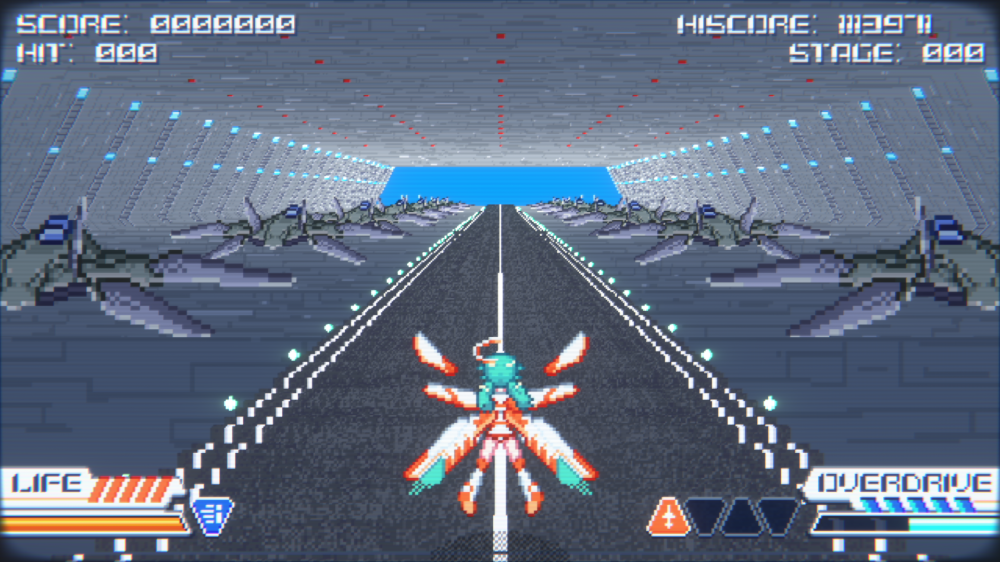
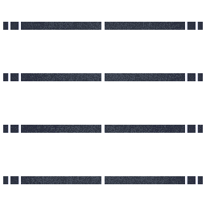

# Dynamically Adjusting the Depth

When a game is started for the first time, the main character jets off from a runway. However, because of how close this is to the screen for all objects, I personally find it to be a bit harsh on the eyes. We can fix this by doing some similar conditional logic in the [Conditional Texture](figuringthingsout_conditionaltexture.md) setup.

## What Can We Use

<p align="center">
    <a href="figuringscreens_dynamicdepth/fig_dyndepth_runwayinitial.png"></a>
    <p align="center"><i>Imagine switching to mono to take a single screenshot</i></p>
</p>

In the scene when the take off happens, we have the following things as reference points:
- The player character
- Some planes
- The wall
- The ground
- Some flashing lights

We likely don't want to use the planes for the following reasons:
- During an _actual_ new game, they take off with you, so they'll remain on screen for a bit
- There's a chance they're reused for enemies
  - I mean, when I'm playing this game I can't for the life of me really see the enemies before they blow up, so I could be wrong

We can't use the player charcter, since of course they're always there. The walls may be reused in places? So that leaves us with the runway textures and the flashing lights.

When I dumped this frame, I couldn't decipher which object was the lights, but I was able to find the runway texture:

<p align="center">
    <a href="figuringscreens_dynamicdepth/000010-ps-t0=5bf043f5-vs=30cc3a24d1d4a6ed-ps=41791cd036500899.png"></a>
    <p align="center"><i>Thankfully, we don't have to make an atlas out of this</i></p>
</p>

- `000010-ps-t0=5bf043f5-vs=30cc3a24d1d4a6ed-ps=41791cd036500899`
  - Register: `ps-t0`
  - Hash: `5bf043f5`
  - Corresponding Vertex Shader: `30cc3a24d1d4a6ed`
  - Corresponding Pixel Shader: `41791cd036500899`

And, being that I'm from the future while writing this (and doing a full playthrough of the story mode _again, oh darn_), I can confirm that this texture is unique to this part of the game. So, we're in the clear to use it as a flag.

## Setup

In our `d3dx.ini`:

```ini
[TextureOverride_Runway]
Hash=5bf043f5
filter_index=30
```

Let's make a preset to ramp down the 3D, as well as bring it back up:

```ini
[PresetTakeoff]
; set everything to 0
convergence = 0
separation = 0
; how long the transition should take (in milliseconds)
transition = 200
; I saw other fixes using cosine. But, if you ask me the different during gameplay, I sure couldn't tell when I tested between linear and cosine
transition_type = cosine
; When this preset is done, ramp 3D backup to what it used to be
release_transition = 500
release_transition_type = cosine
```

We can play with the values for the transition period more, but I found these to be decent enough after some back and forth.

Next, we can mark this texture with a specific filter index, and whenever that shows up, we'll know that we're in the take off section of starting a game. From the texture dump information we know that the corresponding vertex shader to use is `30cc3a24d1d4a6ed`:

```ini
[ShaderOverride_2DElements2]
Hash=30cc3a24d1d4a6ed
ResourceDepthBuffer = oD unless_null
vs-t110 = ResourceDepthBuffer
if (ps-t0 == 30)
  preset = Takeoff
endif
```
(The other information there is specific to what was needed for the [cutscene fix](./figuringthingsout_conditionaltexture.md))

We don't need to actually do anything _in_ the shader for this. Since _this_ shader is the one responsible for drawing that runway texture, we just need to use that information to cause a global change to the 3D levels.

If you have `hunting` turned on, when a take off scene loads, you'll see 3D ramp down to the values we provided. Then, soon after leaving the runway, the values will go back up.

> [!TIP]
> It's important that we added the `transition` values, else this ramp down/up would be instant, and would be rather jarring while playing

For completeness, this is the entire setup in the `d3dx.ini` for this aspect (the overall complete `d3dx.ini` setup can be viewed in the [fix archive](../../Fixes/geo-11/Mirage-Feathers/)):

```ini
[PresetNo3D]
convergence = 0
separation = 0
transition = 200
transition_type = cosine
release_transition = 500
release_transition_type = cosine

[ShaderOverride_2DElements2]
Hash=30cc3a24d1d4a6ed
ResourceDepthBuffer = oD unless_null
vs-t110 = ResourceDepthBuffer
if (ps-t0 == 30)
  preset = PresetNo3D
endif

[TextureOverride_Runway]
Hash=5bf043f5
filter_index=30
```