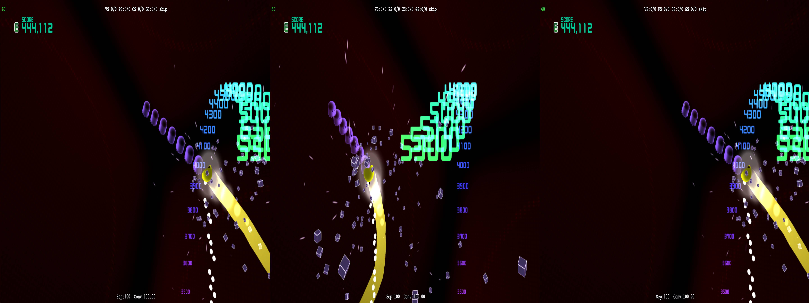
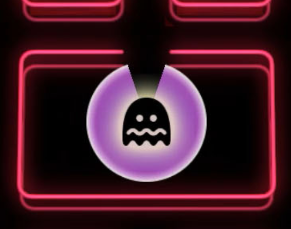
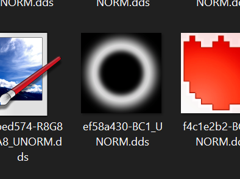

# Conditional Texture

Much like _Mirage Feathers_, the game `just works` for 3D. None of the graphics are _wrong_, rather the graphics can just be unpleasent at times. We can mitagate this by doing some similar checks for specific textures at points, and modifying the convergence/separation values to more tolerable levels. Else, we risk our eyes going completely inwards or outwards.

The first major hurdle is when Pac-Man eats ghosts. This sequence is probably _the_ sequence of the game that you'd want in 3D, but if we leave things as they are, the effect is going to be just too strong:

<p align="center">
    <a href="figuringscreens_conditionaltexture/fig_condtext_toostrong.jpg"></a>
    <p align="center"><i>Don't stress your eyes too much trying to comprehend this</i></p>
</p>

If we do a frame dump by setting the following in our `d3dx.ini`:

```ini
; Enable dumping the ShaderUsage.txt. We'll need it later
dump_usage=1
; Dumping options. See the readme right about this line for other options
analyse_options = dump_tex mono dds
```

> [!WARNING]
> This is likely overkill, and will dump out _a lot_. Be wary when you're doing a much larger game. You may want to instead target a specific shader, or shaders, when doing a dump instead to isolate more. Since _Pac-Man CE2_ is rather "light" on resources, this isn't going to kill my hard drive space. Dumping in jpeg format is probably the better option regardless, however many textures in _Pac-Man CE2_ use transparency, so it'd be harder to identify at a glance if all the dumped textures lacked their alpha channel. And yes, I copied and pasted this from my _Mirage Feathers_ section

We can target the following moments in the game:
- When we are not in ghost hunting mode
- When we are in ghost hunting mode

Between those two, we can find if there's any new textures loaded _specifically_ for hunting.

You would think the following image of the ghost:

<p align="center">
    <a href="figuringscreens_conditionaltexture/fig_condtext_scaredghosttexture.png"></a>
</p>

would be our immediate go-to, but it's seemingly always loaded at all times during gameplay (based on the multiple dumps I've done), so we can't rely on that. However, there is the "halo" effect around the ghost that we can use:

<p align="center">
    <a href="figuringscreens_conditionaltexture/fig_condtext_donut.png"></a>
</p>

If we match this up to a texture override with a specific filter index:

```ini
; it looked like a donut, man
[TextureOverride_DonutGhostHunting]
Hash=18e357d4
filter_index=24
```

And then create a shader override:

```ini
[ShaderOverride_GeneralGameplay]
Hash=10686a99a5112e3c
if (ps-t0 == 24)
  preset = TonedDown3D
endif
```

We can make a preset:

```ini
[PresetTonedDown3D]
convergence = 50
separation = 50
transition = 500
transition_type = cosine
release_transition = 500
release_transition_type = cosine
```

We can also do the same for the menus/pause screen, and just kill the 3D there since it isn't really needed:

```ini
; we could combine these, but, eh
[PresetMenus]
convergence = 0
separation = 0
transition = 500
transition_type = cosine
release_delay = 500
release_transition = 500
release_transition_type = cosine

[PresetResults]
convergence = 0
separation = 0
transition = 500
transition_type = cosine
release_delay = 500
release_transition = 500
release_transition_type = cosine

; i love a good toggle
[ShaderOverride_2DElements1]
Hash=9d1082755bb8ace6
; for the results screen
if (ps-t0 == 20)
  preset = PresetMenus
endif
; all other menus
if (ps-t0 == 23)
  preset = PresetMenus
endif

[TextureOverride_Results]
Hash=4a354d84
filter_index=20

;Any kind of menu texture
[TextureOverride_Menu]
Hash=52099b9f
filter_index=23
```

> [!NOTE]
> When on various screens, the individual sections unload and reload in quick succession. 3D will ramp down and back up rapidly, which isn't great.