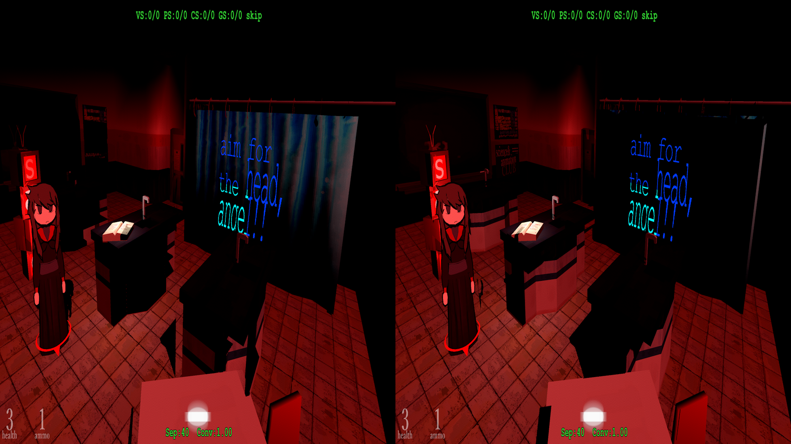
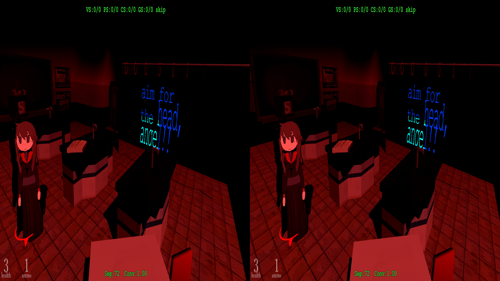
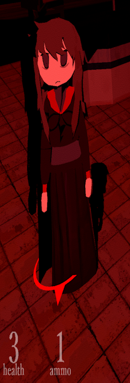
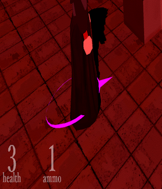
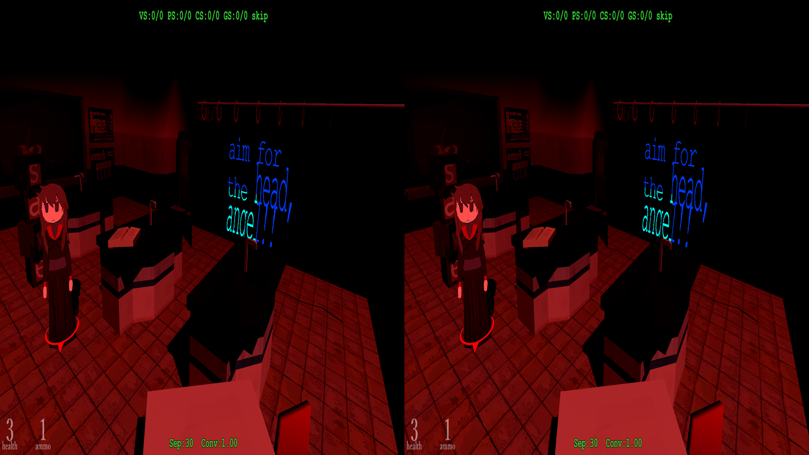
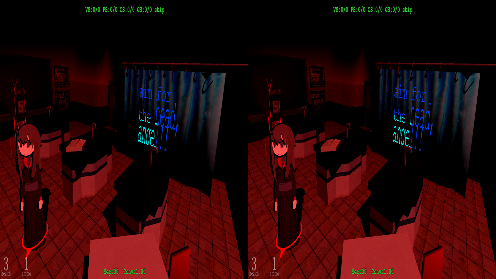

# Using Studio System as a test bed for trying to understand how fixes actually work.

This isn't so much of a tutorial, but more of a rambling as I go through trying to piece together how a fix works.  There's meant to be more screenshots, but I didn't grab as many as I thought I did while going through the first time around, and replicating mistakes is more troublesome than I thought.

Though, maybe someone will find this helpful in some sense.  I plan do to these every time I try to fix a game.

Things in here may not be accurate, and should probably be updated as I learn more.

---

I don't know how to fix games for 3D, but I want to learn.  There's a wealth of information buried in places, but most of those places are in weird states (mtbs3d) or just impossible to search/find anything on (Nvidia's official forums).  However, there is information in existing fixes and understanding how they operate.

For what it's worth, as of right now, I still don't understand much, but, well, you have to start somewhere.

Booting up Studio System, and getting to one of the first save points, the game looks like this:

<p align="center">
    <a href="figuringscreens/everythingisbad.png"></a>
</p>

Shadows are intersecting where they shouldn't, making the entire scene incredibly hard to look at.  Staring closer, there's more problems, like a notable outline of the main character (which extends to other objects in the room, having a halo effect).  Now, dumping shader code leaves us with stuff like this:

<details>
<summary>shader code</summary>

```
Texture2D<float4> t1 : register(t1);

Texture2D<float4> t0 : register(t0);

SamplerState s1_s : register(s1);

SamplerComparisonState s0_s : register(s0);

cbuffer cb2 : register(b2)
{
  float4 cb2[25];
}

cbuffer cb1 : register(b1)
{
  float4 cb1[22];
}

cbuffer cb0 : register(b0)
{
  float4 cb0[9];
}


// 3Dmigoto declarations
#define cmp -
Texture1D<float4> IniParams : register(t120);
Texture2D<float4> StereoParams : register(t125);

void main(
  float4 v0 : SV_POSITION0,
  float4 v1 : TEXCOORD0,
  float4 v2 : TEXCOORD1,
  float4 v3 : TEXCOORD2,
  float3 v4 : TEXCOORD3,
  out float4 o0 : SV_Target0)
{
  float4 r0,r1,r2,r3;
  uint4 bitmask, uiDest;
  float4 fDest;

  r0.xyzw = t0.Sample(s1_s, v1.xy).xyzw;
  r0.y = cb0[7].x * r0.x + cb0[7].y;
  r0.y = 1 / r0.y;
  r0.z = r0.x + -r0.y;
  r0.y = cb0[8].w * r0.z + r0.y;
  r0.x = 1 + -r0.x;
  r1.xyz = v4.xyz + -v3.xyz;
  r0.xzw = r0.xxx * r1.xyz + v3.xyz;
  r0.xzw = -v2.xyz * r0.yyy + r0.xzw;
  r1.xyz = v2.xyz * r0.yyy;
  r0.xyz = cb0[8].www * r0.xzw + r1.xyz;
  r1.xyzw = cmp(r0.zzzz >= cb2[6].xyzw);
  r1.xyzw = r1.xyzw ? float4(1,1,1,1) : 0;
  r2.xyzw = cmp(r0.zzzz < cb2[7].xyzw);
  r2.xyzw = r2.xyzw ? float4(1,1,1,1) : 0;
  r1.xyzw = r2.xyzw * r1.xyzw;
  r2.xyzw = cb1[19].xyzw * r0.yyyy;
  r2.xyzw = cb1[18].xyzw * r0.xxxx + r2.xyzw;
  r0.xyzw = cb1[20].xyzw * r0.zzzz + r2.xyzw;
  r0.xyzw = cb1[21].xyzw + r0.xyzw;
  r2.xyz = cb2[13].xyz * r0.yyy;
  r2.xyz = cb2[12].xyz * r0.xxx + r2.xyz;
  r2.xyz = cb2[14].xyz * r0.zzz + r2.xyz;
  r2.xyz = cb2[15].xyz * r0.www + r2.xyz;
  r2.xyz = r2.xyz * r1.yyy;
  r3.xyz = cb2[9].xyz * r0.yyy;
  r3.xyz = cb2[8].xyz * r0.xxx + r3.xyz;
  r3.xyz = cb2[10].xyz * r0.zzz + r3.xyz;
  r3.xyz = cb2[11].xyz * r0.www + r3.xyz;
  r2.xyz = r3.xyz * r1.xxx + r2.xyz;
  r3.xyz = cb2[17].xyz * r0.yyy;
  r3.xyz = cb2[16].xyz * r0.xxx + r3.xyz;
  r3.xyz = cb2[18].xyz * r0.zzz + r3.xyz;
  r3.xyz = cb2[19].xyz * r0.www + r3.xyz;
  r2.xyz = r3.xyz * r1.zzz + r2.xyz;
  r3.xyz = cb2[21].xyz * r0.yyy;
  r3.xyz = cb2[20].xyz * r0.xxx + r3.xyz;
  r0.xyz = cb2[22].xyz * r0.zzz + r3.xyz;
  r0.xyz = cb2[23].xyz * r0.www + r0.xyz;
  r0.xyz = r0.xyz * r1.www + r2.xyz;
  r0.w = dot(r1.xyzw, float4(1,1,1,1));
  r0.w = 1 + -r0.w;
  r0.z = r0.z + r0.w;
  r0.x = t1.SampleCmpLevelZero(s0_s, r0.xy, r0.z).x;
  r0.y = 1 + -cb2[24].x;
  o0.xyzw = r0.xxxx * r0.yyyy + cb2[24].xxxx;
  return;
}

```
</details>

The above code is HLSL, or [***H***igh ***L***evel ***S***hader ***L***anguage](https://en.wikipedia.org/wiki/High-Level_Shader_Language).  We're using geo11, so we're getting DirectX11-based shader code out of it.

Now, what the heck is all the above doing?

_I don't know_

but, what we do know is that if we use the `skip` function of geo11's shader debugging, all the shadows in the scene simply go away.  So, we know that shader is one we need to fix.  But, er, where to even begin?  There's definitely some math going on there, that's for sure.

If you glance at other fixes, you'll start seeing a pattern that mostly resembles this:

```
r0.x -= (r0.z - stereo.y) * stereo.x;
```

Some times it's written differently, with some different variables for `r0`, or using different properties on `r0` to derive something or other.

This can be described in [bo3b's documentation for the `Prime Directive`](https://wiki.bo3b.net/index.php?title=Canonical_Stereo_Code).

```
clipPos.x += EyeSign * Separation * ( clipPos.w – Convergence )
```

(the eye sign can be inferred by the final result of the assignment, where if we add or subtract)

Seperation is our `stereo.x`, and convergence is our `stereo.y`.  The other values correspond to our `r0` variable's properties.

But, of course, _what_ is `r0`.

Because I'm too timid to ask every question I have on the internet, I have unforunately asked Microsoft Copilot what on Earth it is.  Whether or not it can be trusted on its description is another thing.  But, for the time being, Copilot suggests that `t0` (which is `r0`'s original source value) is just one of the related textures to the actual object the engine is trying to draw.  In this case of course, we know it to be something related to shadows.  And the final output, `o0` which corresponds to `SV_Target0` is the end result of what pixels should get however much value we compute.

So, _assuming_ all of this is correct, and we can trust Copilot (please don't), what this shader could is trying to calculate is what pixels on the screen should get a shadow applied to them.  Like should some matrix of pixels on the screen be dark, and how dark should they be.  Even if Copilot is wrong in this explaination, it still mostly makes sense; we need to draw a shadow on the screen, and this does all the math to determine what pixels get an actual shadow applied.

---

As a tangent, I would highly recommend not ever actually using AI to do anything in this niche.  Clearly though, Copilot's model was already fed quite a lot of 3DMigto/geo11 related information from web crawling or someone feeding it, based on the questions I've asked and the patterns it can some times recognize.  But, like most problems it tries to solve, it's overly confident in always giving generally horrible solutions, or solutions that don't work.

And it's also why I'm here trying to figure things out still.  If the data centers that will go near my house can't figure this out, _what's the point_.

---

Going back to the stereo formula from earlier, we can try applying that in places, but the results seemingly are always terrible.  The goal of that formula, however, is best to approach as:

>The stereoization of the game broke in some place.  We have to adjust the horizontal to accomodate something with it.

That's why the formula is targeting the `x` portion of the original projection.  Shadows on the screen aren't lined up (they're off on the horizontal), and intersecting/showing where they shouldn't.

But, just trying the formula in a bunch of places isn't working as expected.  The shadows end up further away, taking up the whole space, or something awful.  However, someone did actually fix this already.

[Unity Universal Fixes](https://helixmod.blogspot.com/2018/09/unity-universal-fix.html)

These are a set of regex's that target the assembly code that normally accompanies the HLSL in the dump.  If we trace through to specifically DHR's 2017 Unity fix, this pattern is listed:

```
[ShaderRegexShadows1.Pattern]
mul r\d+\.xyzw, r\d+\.yyyy, cb1\[19\]\.xyzw\n
\s*mad r\d+\.xyzw, cb1\[18\]\.xyzw, (?P<pos_x>r\d+)\.(?P<swizzle_x>[xyzw])[xyzw]{3}, r\d+\.xyzw\n
\s*mad r\d+\.xyzw, cb1\[20\]\.xyzw, -(?P<pos_z>r\d+)\.(?P<swizzle_z>[xyzw])[xyzw]{3}, r\d+\.xyzw\n
\s*add r\d+\.xyzw, r\d+\.xyzw, cb1\[21\]\.xyzw\n
```

Which _does_ correspond to a section in the shadow shader we've been staring at:

```
mul r2.xyzw, r0.yyyy, cb1[19].xyzw
mad r2.xyzw, cb1[18].xyzw, r0.xxxx, r2.xyzw
mad r0.xyzw, cb1[20].xyzw, r0.zzzz, r2.xyzw
add r0.xyzw, r0.xyzw, cb1[21].xyzw
```

The regex specifies that the this will go _above_ this section of code, making the final product look like this:

```
...
and r2.xyzw, r2.xyzw, l(0x3f800000, 0x3f800000, 0x3f800000, 0x3f800000)
mul r1.xyzw, r1.xyzw, r2.xyzw

// DHR Unity shadows pattern 2
ld_indexable(texture2d)(float,float,float,float) r4.xyzw, l(0, 0, 0, 0), t125.xyzw
add r5.x, r0.z, -r4.y
mul r5.x, r4.x, r5.x
mul r5.x, r5.x, cb1[10].x
add r0.x, r0.x, -r5.x

// This starts the pattern we're matching to
mul r2.xyzw, r0.yyyy, cb1[19].xyzw
mad r2.xyzw, cb1[18].xyzw, r0.xxxx, r2.xyzw
mad r0.xyzw, cb1[20].xyzw, r0.zzzz, r2.xyzw
add r0.xyzw, r0.xyzw, cb1[21].xyzw
mul r2.xyz, r0.yyyy, cb2[13].xyzx
mad r2.xyz, cb2[12].xyzx, r0.xxxx, r2.xyzx
...
```

Loading up the game with this, the shadows are fixed!  <small>and my dreams are crushed that I'd fix this entirely myself</small>

- screenshot here

(and other things are fixed as well)

This code translates to this in HLSL:

```
float4 stereo = StereoParams.Load(0);
r0.x -= (r0.z - stereo.y) * stereo.x * cb1[10].x;
```

- Declare the stereo params (provided by 3DMigoto/geo11 by default)
- Subtract the stereo's convergence from the projection's depth (z)
- Multiply that by the stereo viewpoint's horizontal
- Multiply _that_ by a scaling factor, in this case `cb1[10]`'s `x` value

The real mystery is _what/how_ `cb1[10]` was determined to be the correct item to scale the shadows.

---

I was informed (thanks cicicleta!) that `cb1[10]` corresponds to the FOV of specific versions of the Unity engine.  There's apparently multiple ways to get this information, but it just so happens that _this_ version of the engine stores that information in that variable.

Studio System, according to its exe, uses `2018.4.18.6421734`.

---

This is where I am regarding this fix, given that it pulls stuff out from elsewhere.

My intial attempts at trying to fix this shader were filled with:

- well, the left side looks overall worse, this must be a left eye only issue
- - this involved doing if checks for the left eye sign being the current one for the shader, and manually adjusting that into the abyss and getting nowhere
- trying the general stereo formula in random places and praying
- - you can see what that ended up being above

However, in the end, in this fix, the need for this shadow is:
- doing the common stereo formula
- scaling the stereo formula with _something_

Looking at other fixes, you can start to see this overall pattern in places (apply the prime directive, and optional scale)

# Halos

The next item that is a pain to look at in this game is what's been identified as the halos in the Unity regex.  I haven't actually looked at the Halo regex, but I did dump the corresponding shaders so I knew which ones were ultimately affected.  The confusing thing, though, is that our shadows in the pixel shader are in fact fixed, but the distortion from the haloing effect makes it so that the shadows simply still look broken.  <small>thus making it more confusing in the long run if a portions of a fix are actually fixed, or just not fixed at all</small>

All of these shaders identified as halos are within the vertex shaders, not the pixel shaders.  So this means we're needing to fix geometry instead of what pixels need to be shaded in a shadow.

Looking at all the shaders that were identified:

7c60dda08b5002c0-vs_replace.txt
28e782f1bc368249-vs_replace.txt
60db27b13ac410f8-vs_replace.txt
2917d6a2498642c6-vs_replace.txt
4019dc8f087b7acd-vs_replace.txt
68329bdf149e968e-vs_replace.txt
be697b41c071daec-vs_replace.txt

They all have a suspicious pattern in them:

```
r2.xyzw = cb4[18].xyzw * r1.yyyy;
r2.xyzw = cb4[17].xyzw * r1.xxxx + r2.xyzw;
r2.xyzw = cb4[19].xyzw * r1.zzzz + r2.xyzw;
r1.xyzw = cb4[20].xyzw * r1.wwww + r2.xyzw;
o0.xyzw = r1.xyzw;
```

The surrounding calculations differ, but this is at least a clue what the regex is likely matching against (I could go look at it, but where's the fun in that).

So, we know that our geometry is messed up, so can we apply the normal stereo formula mentioned before?

```
r0.x -= stereo.x (r0.z/w - stereo.y)
```

We might need a scaling factor, but let's give is a try.  We'll target `2917d6a2498642c6`, since skipping that one at least makes everything else go away, so it's probably the most important one:

- screenshot targeting it goes here

Applying the stereo formula did nothing on a reload.  Though, suspiciously, only the left eye is really _off_ by any means.  But, I've been tricked into trying to just change one eye before, thinking that was the right path to go down.  However, ugh, it's time to cheat.  Let's see what the actual regex is doing.  It matches on this pattern:

```
[ShaderRegex_Halo1.Pattern]
mad r\d+\.xyzw, cb[01234]{1}\[\d+\]\.xyzw, [vr]{1}\d+\.xxxx, r\d+\.xyzw\n
\s*mad r\d+\.xyzw, cb[01234]{1}\[\d+\]\.xyzw, [vr]{1}\d+\.zzzz, r\d+\.xyzw\n
\s*mad r\d+\.xyzw, cb[01234]{1}\[\d+\]\.xyzw, [vr]{1}\d+\.wwww, r\d+\.xyzw\n
\s*mov o0\.xyzw, (?P<register>r\d+)\.xyzw\n
```

Which if you squint hard enough, _is_ the pattern identified above!  So, I at least got that right.

<details>
<summary>(in HLSL, it is this block)</summary>
```
r1.xyzw = cb3[17].xyzw * r0.xxxx + r1.xyzw;
r1.xyzw = cb3[19].xyzw * r0.zzzz + r1.xyzw;
r0.xyzw = cb3[20].xyzw * r0.wwww + r1.xyzw;
o0.xyzw = r0.xyzw;
```

The regex is looking for the pattern of three multiplication/additions in a row, followed by the output o0 getting, presumably, the final value of this block of calculations
</details>

It then adds the following below that block:

```
[ShaderRegex_Halo1.Pattern.Replace]
${0}
\n
// DHR ShaderRegex - Pattern Halo 1:\n
ld_indexable(texture2d)(float,float,float,float) ${stereo}.xyzw, l(0, 0, 0, 0), t125.xyzw\n
ne ${tmp1}.w, ${register}.w, l(1.0)\n
if_nz ${tmp1}.w\n
add ${tmp1}.x, ${register}.w, -${stereo}.y\n
mad ${register}.x, ${tmp1}.x, ${stereo}.x, ${register}.x\n
endif\n
\n
```

In the case of the specific shader we're editing:

```
ld_indexable(buffer)(float,float,float,float) r2.xyzw, l(0, 0, 0, 0), t125.xyzw
ne r3.w, r0.w, l(1.000000)
if_nz r3.w
  add r3.x, r0.w, -r2.y
  mad r0.x, r3.x, r2.x, r0.x
endif
```

Translated into HLSL:

```
if (r0.w != 1.0) {
  r0.x += (r0.w - stereo.y) * stereo.x;
}
```

That block mirrors the `Prime directive` setup from before!  The if check is a barrier regarding if the vertex point is already in the correct position or not (if `.w` is `1`, then our vertex point doesn't need stereo correction.  This means that the object is rendered as not part of the scene.  Think of like a HUD/score indictator.  It generally is _not_ an object in the scene that would need any sort of stereo correction by the shift)

---

> [!NOTE]
>In the below sections, I hightlight a block that doesn't conform to the actual regex from the Universal Unity fix.  I mistakenly had taken my dump of shaders from the ShaderFixesDM folder, which is a location that 3DMigoto dumps shaders that it compiles with some other things are runtime.  It's best to just ignore this in standard practice.  But, please keep this in mind when it's talked about below; I shouldn't have been using this shader dump to begin with.

---

Now, let's boot up the game and see what horrors await:

Well, it's exactly the same as before ...  Maybe we need to replace all the identified shaders to see some kind of meaningful difference?  Though, if you've been playing at home, you may have noticed this also got appended to the bottom of all the affected shaders:

```
add r5.x, -r6.y, r4.w
mul r5.y, r6.x, r6.w
mad r5.x, r5.x, r5.y, r4.x
ne r5.y, l(1.000000), r4.w
movc r4.x, r5.y, r5.x, r4.x
mov o0.xyzw, r4.xyzw
```

And, curiously, we no longer have `o0` getting value on the line right above where DHR's stereo fix went in:

```
...
mul r1.xyzw, r0.yyyy, cb3[18].xyzw
mad r1.xyzw, cb3[17].xyzw, r0.xxxx, r1.xyzw
mad r1.xyzw, cb3[19].xyzw, r0.zzzz, r1.xyzw
mad r0.xyzw, cb3[20].xyzw, r0.wwww, r1.xyzw
>>>mov r4.xyzw, r0.xyzw<<<
ld_indexable(buffer)(float,float,float,float) r2.xyzw, l(0, 0, 0, 0), t125.xyzw
ne r3.w, r0.w, l(1.000000)
if_nz r3.w
  add r3.x, r0.w, -r2.y
...
```

<small>I've been delibrately hiding evidence worse than an Ace Attorney case</small>

This change is not from any of the regex's within DHR's universal Unity fix.  According to the ever confident Copilot, this is coming from 3DMigoto/geo11 itself.

And, what this is doing is a sort of correction after detecting the regex from the Universal fix.  Since I am translating things into HLSL, it's not going to automatically detect this for me.  So, now I have to translate the above into HLSL and attempt to understand what it's even doing:

```hlsl
  // get the depth difference by seeing how far it is
  // from the stereo split
  float currDepth = tmpRes.w - stereo.y;
  // determine what the separation should be
  float seperation = stereo.x * stereo.w;
  // the actual x position output
  float newXPos = (currDepth * seperation) + tmpRes.x;
  // determine if new x position should be used
  if (tmpRes.w != 1.0) {
    tmpRes.x = newXPos; 
    // else just use the original
  }
  o0.xyzw = tmpRes.xyzw;
```

(the descriptions on what is going on was sourced, unfortunately, from Copilot.  It makes sense in my head, but if anyone is aware if this is completely wrong, than by all means let me know)

<details>
<summary>So, in the end, this is the fully modified HLSL shader after the regex is injected</summary>

```hlsl
cbuffer cb3 : register(b3)
{
  float4 cb3[21];
}

cbuffer cb2 : register(b2)
{
  float4 cb2[4];
}

cbuffer cb1 : register(b1)
{
  float4 cb1[14];
}

cbuffer cb0 : register(b0)
{
  float4 cb0[6];
}


// 3Dmigoto declarations
#define cmp -
Texture1D<float4> IniParams : register(t120);
Texture2D<float4> StereoParams : register(t125);


void main(
  float4 v0 : POSITION0,
  float4 v1 : TEXCOORD0,
  float3 v2 : TEXCOORD1,
  out float4 o0 : SV_POSITION0,
  out float4 o1 : TEXCOORD0,
  out float4 o2 : TEXCOORD1,
  out float4 o3 : TEXCOORD2,
  out float3 o4 : TEXCOORD3)
{
  float4 r0,r1;
  uint4 bitmask, uiDest;
  float4 fDest;

  float4 stereo = StereoParams.Load(0);

  r0.xyzw = cb2[1].xyzw * v0.yyyy;
  r0.xyzw = cb2[0].xyzw * v0.xxxx + r0.xyzw;
  r0.xyzw = cb2[2].xyzw * v0.zzzz + r0.xyzw;
  r0.xyzw = cb2[3].xyzw + r0.xyzw;
  r1.xyzw = cb3[18].xyzw * r0.yyyy;
  r1.xyzw = cb3[17].xyzw * r0.xxxx + r1.xyzw;
  r1.xyzw = cb3[19].xyzw * r0.zzzz + r1.xyzw;
  r0.xyzw = cb3[20].xyzw * r0.wwww + r1.xyzw;
  // Store result in temporary var for now
  float4 tmpRes;
  tmpRes.xyzw = r0.xyzw;

  // Check if r0.w isn't equal to 1
  if (r0.w != 1.0) {
    // if true, apply stereo correction
    r0.x += (r0.w - stereo.y) * stereo.x;
  }
  //
  r0.y = cb0[5].x * r0.y;
  r1.xzw = float3(0.5,0.5,0.5) * r0.xwy;
  r0.yzw = cb1[11].xyz * r0.yyy;
  r0.xyz = cb1[10].xyz * r0.xxx + r0.yzw;
  o1.zw = r1.xw + r1.zz;
  o1.xy = v1.xy;
  o2.xyz = v2.xyz;
  r1.xyz = -cb1[12].xyz + r0.xyz;
  r0.xyz = cb1[12].xyz + r0.xyz;
  r0.xyz = cb1[13].xyz + r0.xyz;
  r1.xyz = cb1[13].xyz + r1.xyz;
  r1.w = -r1.z;
  o3.xyz = r1.xyw;
  r0.w = -r0.z;
  o4.xyz = r0.xyw;

  // get the depth difference by seeing how far it is
  // from the stereo split
  float currDepth = tmpRes.w - stereo.y;
  // determine what the separation should be
  float seperation = stereo.x * stereo.w;
  // the actual x position output
  float newXPos = (currDepth * seperation) + tmpRes.x;
  // determine if new x position should be used
  if (tmpRes.w != 1.0) {
    tmpRes.x = newXPos; 
    // else just use the original
  }
  o0.xyzw = tmpRes.xyzw;

  return;
}
```
</details>

However, just replacing one of these (remember there's seven!) will not get rid of the haloing artifacts.  We have to do them all.

---

I'm assuming, maybe, these are related to each of the vertexes on an object?  So if we only fix one, there's likely a small change I overlooked.  I have no idea.

---

Regardless, the core shaders for the halo issue is fixed.  Things look pretty good!

<p align="center">
    <a href="figuringscreens/halosfixeddef.png"></a>
</p>

oh wait---

<p align="center">
    <a href="figuringscreens/halo2problem.png"></a>
</p>

# Halo2

There is a separate pattern to identify other halos (there's three total in the fix).  It appears as though the outline for the player character is handled by the regex for `ShaderRegex_Halo2`

Instead of delaying the inevitable, let's take a look at it immediately:

```
[ShaderRegex_Halo2.Pattern]
mad r\d+\.xyzw, cb[1234]{1}\[\d+\]\.xyzw, [vr]{1}\d+\.xxxx, r\d+\.xyzw\n
\s*mad r\d+\.xyzw, cb[1234]{1}\[\d+\]\.xyzw, [vr]{1}\d+\.zzzz, r\d+\.xyzw\n
\s*add r\d+\.xyzw, r\d+\.xyzw, cb[1234]{1}\[\d+\]\.xyzw\n
\s*mov o0\.xyzw, (?P<register>r\d+)\.xyzw\n

[ShaderRegex_Halo2.Pattern.Replace]
${0}
\n
// DHR ShaderRegex - Pattern Halo 2:\n
ld_indexable(texture2d)(float,float,float,float) ${stereo}.xyzw, l(0, 0, 0, 0), t125.xyzw\n
ne ${tmp1}.w, ${register}.w, l(1.0)\n
if_nz ${tmp1}.w\n
add ${tmp1}.x, ${register}.w, -${stereo}.y\n
mad ${register}.x, ${tmp1}.x, ${stereo}.x, ${register}.x\n
endif\n
\n
```

The replace syntax looks the same as the previous halo fix, which maps to:

```hlsl
if (r0.w != 1.0) {
  r0.x += (r0.w - stereo.y) * stereo.x;
}
```

Meaning if the item is not part of screen space, and is an actual object with 3D geometry, we need to apply the `Prime Directive`.  And that gets added to right below wherever that block of mad/mad/add/mov is that assigns to the final output value, `o0`.

If we dump the shader and take a look:

```
...
mad r2.xyzw, cb4[17].xyzw, r1.xxxx, r2.xyzw
mad r2.xyzw, cb4[19].xyzw, r1.zzzz, r2.xyzw
add r2.xyzw, r2.xyzw, cb4[20].xyzw
mov o0.xyzw, r2.xyzw
...
```

There's the part the regex will match.  _But wait, looking at the dumped version of the shader with the regex applied, we get that mystery block again at the bottom_:

```
add r9.x, -r10.y, r8.w
mul r9.y, r10.x, r10.w
mad r9.x, r9.x, r9.y, r8.x
ne r9.y, l(1.000000), r8.w
movc r8.x, r9.y, r9.x, r8.x
mov o0.xyzw, r8.xyzw
```

Which if we look at the previous halo fix's mystery block:

```
add r5.x, -r6.y, r4.w
mul r5.y, r6.x, r6.w
mad r5.x, r5.x, r5.y, r4.x
ne r5.y, l(1.000000), r4.w
movc r4.x, r5.y, r5.x, r4.x
mov o0.xyzw, r4.xyzw
```

Aside from some variable name differences, it's the same code again:

```hlsl
// get the depth difference by seeing how far it is
// from the stereo split
float currDepth = tmpRes.w - stereo.y;
// determine what the separation should be
float seperation = stereo.x * stereo.w;
// the actual x position output
float newXPos = (currDepth * seperation) + tmpRes.x;
// determine if new x position should be used
if (tmpRes.w != 1.0) {
  tmpRes.x = newXPos; 
  // else just use the original
}
o0.xyzw = tmpRes.xyzw;
```

and hey, it's fixed


oh wait---

<p align="center">
    <a href="figuringscreens/arrowclip.png"></a>
</p>

# The Pointer

In this game, there's an icon at the base of your character that helps orient what way you're going.  As, the game does _feature_ tank controls (and hey, I like tank controls).

The shader for this does not match any regex, so I'm on my own here.  But, there's at least a familar looking pattern:

```
r0.xyzw = cb2[1].xyzw * v0.yyyy;
r0.xyzw = cb2[0].xyzw * v0.xxxx + r0.xyzw;
r0.xyzw = cb2[2].xyzw * v0.zzzz + r0.xyzw;
r0.xyzw = cb2[3].xyzw + r0.xyzw;
r1.xyzw = cb3[18].xyzw * r0.yyyy;
r1.xyzw = cb3[17].xyzw * r0.xxxx + r1.xyzw;
r1.xyzw = cb3[19].xyzw * r0.zzzz + r1.xyzw;
r0.xyzw = cb3[20].xyzw * r0.wwww + r1.xyzw;
r1.x = r0.z / cb1[5].y;
o1.xyzw = r0.xyzw;
```

<details>
<summary>the complete shader</summary>

```hlsl
void main(
  float4 v0 : POSITION0,
  float2 v1 : TEXCOORD0,
  out float2 o0 : TEXCOORD0,
  out float p0 : TEXCOORD1,
  out float4 o1 : SV_POSITION0)
{
  float4 r0,r1;
  uint4 bitmask, uiDest;
  float4 fDest;

  r0.xyzw = cb2[1].xyzw * v0.yyyy;
  r0.xyzw = cb2[0].xyzw * v0.xxxx + r0.xyzw;
  r0.xyzw = cb2[2].xyzw * v0.zzzz + r0.xyzw;
  r0.xyzw = cb2[3].xyzw + r0.xyzw;
  r1.xyzw = cb3[18].xyzw * r0.yyyy;
  r1.xyzw = cb3[17].xyzw * r0.xxxx + r1.xyzw;
  r1.xyzw = cb3[19].xyzw * r0.zzzz + r1.xyzw;
  r0.xyzw = cb3[20].xyzw * r0.wwww + r1.xyzw;
  r1.x = r0.z / cb1[5].y;
  o1.xyzw = r0.xyzw;
  r0.x = 1 + -r1.x;
  r0.x = cb1[5].z * r0.x;
  r0.x = max(0, r0.x);
  r0.x = cb4[1].x * r0.x;
  r0.x = -r0.x * r0.x;
  p0.x = exp2(r0.x);
  o0.xy = v1.xy * cb0[2].xy + cb0[2].zw;
  return;
}
```

</details>

So, the previous halo patterns would match:

```
r1.xyzw = cb3[17].xyzw * r0.xxxx + r1.xyzw;
r1.xyzw = cb3[19].xyzw * r0.zzzz + r1.xyzw;
r0.xyzw = cb3[20].xyzw * r0.wwww + r1.xyzw;
o0.xyzw = r0.xyzw;
```

But, now we have:

```
r1.x = r0.z / cb1[5].y;
o1.xyzw = r0.xyzw;
```

At the end instead.  Knowing completely nothing about what is going on here, I can hopefully assume that applying _any_ sort of fix would happen after the matrix calculations that the previous regexes would apply to.  So, let's shove in something that resembles that `prime directive`:

```
r0.xyzw = cb2[2].xyzw * v0.zzzz + r0.xyzw;
r0.xyzw = cb2[3].xyzw + r0.xyzw;
r1.xyzw = cb3[18].xyzw * r0.yyyy;
r1.xyzw = cb3[17].xyzw * r0.xxxx + r1.xyzw;
r1.xyzw = cb3[19].xyzw * r0.zzzz + r1.xyzw;
r0.xyzw = cb3[20].xyzw * r0.wwww + r1.xyzw;

r0.x += (r0.w - stereo.y) * stereo.x * stereo.w;

r1.x = r0.z / cb1[5].y;
o1.xyzw = r0.xyzw;
r0.x = 1 + -r1.x;
r0.x = cb1[5].z * r0.x;
```

and look at that:

<p align="center">
    <a href="figuringscreens/arrow_fixed.png"></a>
</p>

It's fixed!

_However_

This doesn't correctly fix the arrow when the camera is further out.  Instead, we have to move the calculation out to right above `r1.xyzw = cb3[18].xyzw * r0.yyyy;`

```
  r0.xyzw = cb2[1].xyzw * v0.yyyy;
  r0.xyzw = cb2[0].xyzw * v0.xxxx + r0.xyzw;
  r0.xyzw = cb2[2].xyzw * v0.zzzz + r0.xyzw;
  r0.xyzw = cb2[3].xyzw + r0.xyzw;
  
  // Stereo fix
  r0.x += (r0.w - stereo.y) * stereo.x * stereo.w;
  
  r1.xyzw = cb3[18].xyzw * r0.yyyy;
  r1.xyzw = cb3[17].xyzw * r0.xxxx + r1.xyzw;
  r1.xyzw = cb3[19].xyzw * r0.zzzz + r1.xyzw;
  r0.xyzw = cb3[20].xyzw * r0.wwww + r1.xyzw;
  r1.x = r0.z / cb1[5].y;
```

With everything together:

<p align="center">
    <a href="figuringscreens/halosandshadows_fixed.png"></a>
</p>