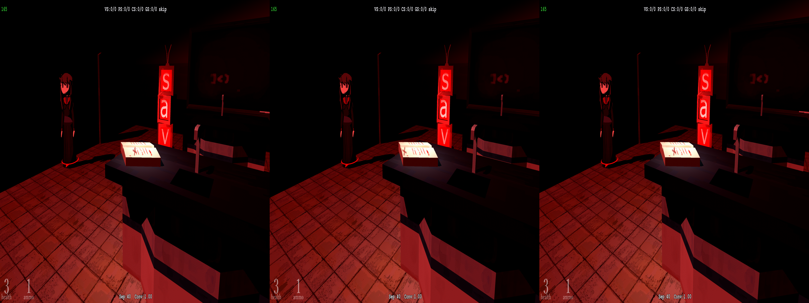
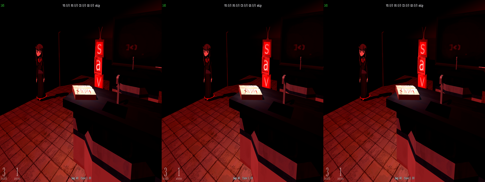
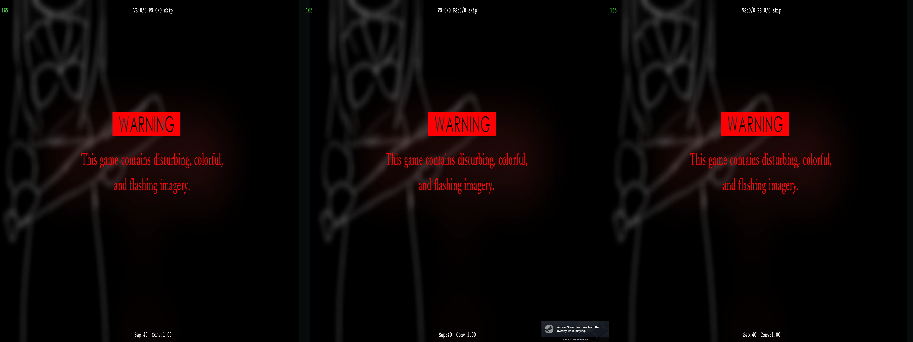
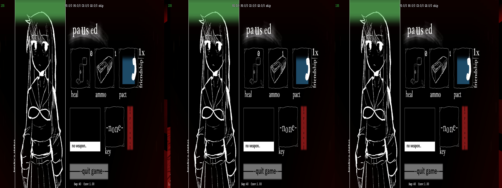
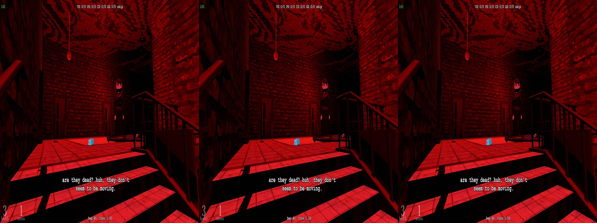
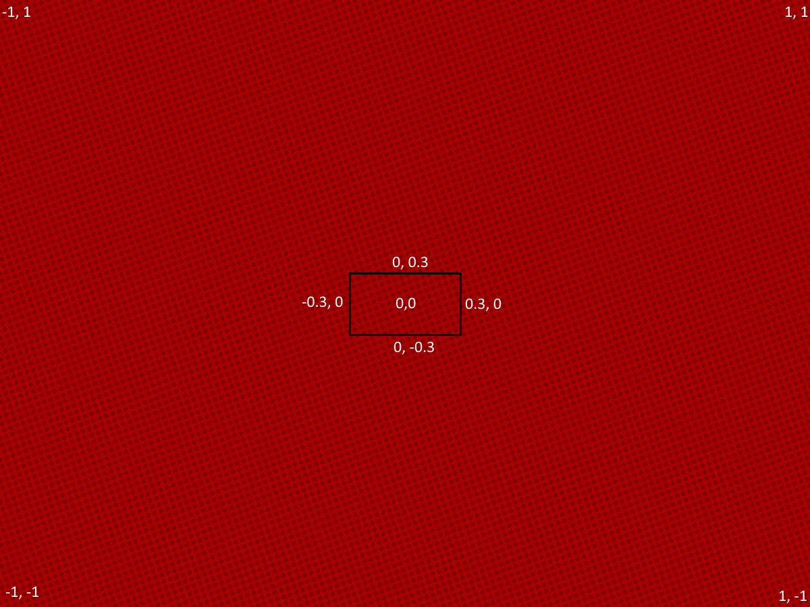
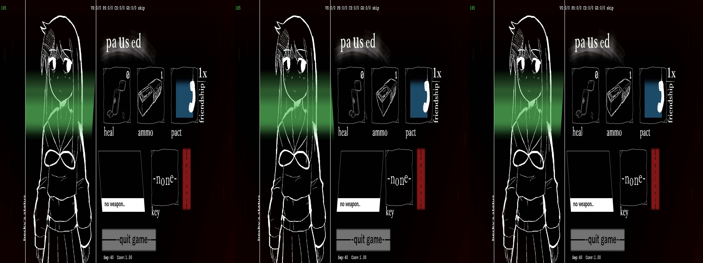
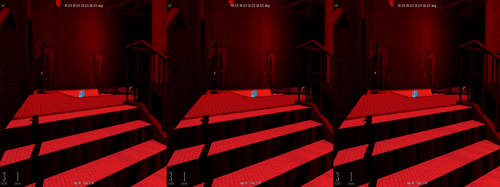
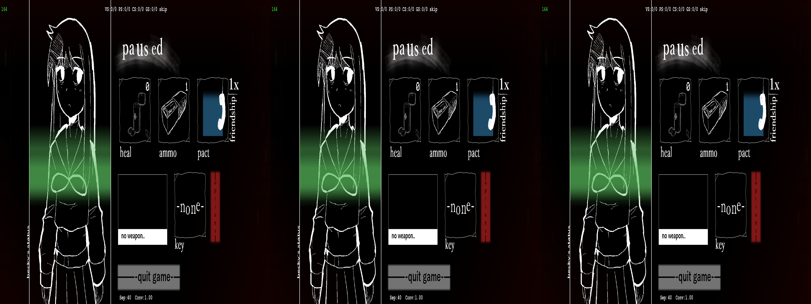
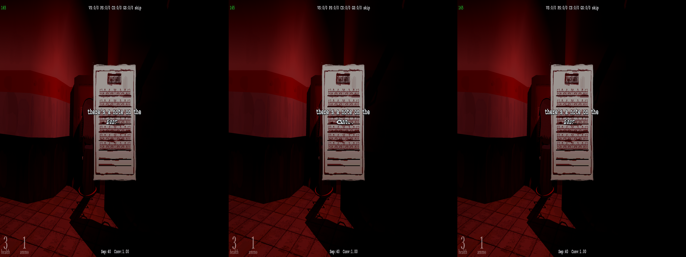

# Crosshair

_Studio System_ is a game that has the following control setup
- Tank controls
- Shooting things

Tank controls and a fixed camera are some survivor horror staples, but the shooting part is what makes this game different. From the "third eye," you can shoot enemies and collectables, and move specific objects. But, of course, in trying to stereoize this game, the crosshair is stuck at screen depth:

<p align="center">
    <a href="figuringscreens_crosshair/fig_screen_crosshairbad.png"></a>
</p>

In fact, I shipped the original version of this fix with that as a primary issue that I couldn't address. The shader that controls the crosshair also controls most of the other 2D elements on screen (the menus, text, etc), and applying formulas would just screw up the output. After looking at some other fixes, and seeing a link to this tutorial:

https://github.com/bo3b/3Dmigoto/wiki/Auto-Crosshair

I pieced together that I could try and use this to actually fix the crosshair to be pushed into the screen correctly:

<p align="center">
    <a href="figuringscreens_crosshair/fig_screen_crosshairgood.png"></a>
</p>

And that did it!

---

> [!NOTE]
> Before continuing, I'd like to thank cicicleta and masterotaku for helping me again. From both messages and looking at the fixes you've both made, everything's been helpful to understanding how all this works.

---

This is the shader that controls most of the 2D elements on screen:

<details>
<summary>058da213eb3a4939-vs_replace</summary>

```hlsl
// 2D elements (ui, crosshair)
// ---- Created with geo-11 v0.7.7 on Sun Jun 28 15:35:27 2026
cbuffer cb2 : register(b2)
{
  float4 cb2[21];
}

cbuffer cb1 : register(b1)
{
  float4 cb1[4];
}

cbuffer cb0 : register(b0)
{
  float4 cb0[6];
}


// 3Dmigoto declarations
#define cmp -
Texture1D<float4> IniParams : register(t120);
Texture2D<float4> StereoParams : register(t125);

void main(
  float4 v0 : POSITION0,
  float4 v1 : COLOR0,
  float2 v2 : TEXCOORD0,
  out float4 o0 : SV_POSITION0,
  out float4 o1 : COLOR0,
  out float4 o2 : TEXCOORD0,
  out float4 o3 : TEXCOORD1)
{
  float4 r0,r1;
  uint4 bitmask, uiDest;
  float4 fDest;

  r0.xyzw = cb1[1].xyzw * v0.yyyy;
  r0.xyzw = cb1[0].xyzw * v0.xxxx + r0.xyzw;
  r0.xyzw = cb1[2].xyzw * v0.zzzz + r0.xyzw;
  r0.xyzw = cb1[3].xyzw + r0.xyzw;
  r1.xyzw = cb2[18].xyzw * r0.yyyy;
  r1.xyzw = cb2[17].xyzw * r0.xxxx + r1.xyzw;
  r1.xyzw = cb2[19].xyzw * r0.zzzz + r1.xyzw;
  o0.xyzw = cb2[20].xyzw * r0.wwww + r1.xyzw;
  o1.xyzw = cb0[2].xyzw * v1.xyzw;
  o2.xy = v2.xy * cb0[5].xy + cb0[5].zw;
  o3.xyzw = v0.xyzw;
  return;
}
```

</details>


If we attempt to modify `o0`'s output at all, we'll likely corrupt other parts of the 2D elements on screen. But, instead, let's focus on the tutorial linked earlier and how we can use it to push the crosshair in so it doesn't break our eyes:

```ini
[ResourceDepthBuffer]
max_copies_per_frame=1

[ShaderOverrideCrosshair]
Hash = ...
; Since we are limiting the number of copies, use the 'unless_null' keyword to
; make sure we don't end up with a blank buffer if some draw call doesn't have
; a depth buffer bound:
ResourceDepthBuffer = oD unless_null
vs-t110 = ResourceDepthBuffer
```

This is the code we want to add to our `d3dx.ini` configuration file. What this is doing is giving us access to the depth buffer, so we can use that to actually push things into the screen how we want. As like the tutorial is mentioning, our vertex shader doesn't really have a concept of depth, so we have to give it to it.

So on our end:

```ini
[ShaderOverride_Crosshair]
Hash=058da213eb3a4939
ResourceDepthBuffer = oD unless_null
vs-t110 = ResourceDepthBuffer
```

We just need to give it the hash for the vertex shader mentioned above. Now, we have access to the depth buffer, tied into the `t110` register.

Steps 3 and 4 effectively just want us to copy and paste the given code, so let's update the shader:

<details>
<summary>updated 058da213eb3a4939</summary>

```hlsl
// 2D elements (ui, crosshair)
// ---- Created with geo-11 v0.7.7 on Sun Jun 28 15:35:27 2026
cbuffer cb2 : register(b2)
{
  float4 cb2[21];
}

cbuffer cb1 : register(b1)
{
  float4 cb1[4];
}

cbuffer cb0 : register(b0)
{
  float4 cb0[6];
}


// 3Dmigoto declarations
#define cmp -
Texture1D<float4> IniParams : register(t120);
Texture2D<float4> StereoParams : register(t125);
Texture2D<float> DepthBuffer : register(t110);

static const float near = 0.00001;
static const float far = 1;

float world_z_from_depth_buffer(float x, float y)
{
    uint width, height;
    float z;

    DepthBuffer.GetDimensions(width, height);

    x = min(max((x / 2 + 0.5) * width, 0), width - 1);
    y = min(max((-y / 2 + 0.5) * height, 0), height - 1);
    z = DepthBuffer.Load(int3(x, y, 0)).x;
    if (z == 1)
        return 0;

  return (far*near/((1-z)*near) + (far*z));
}

float adjust_from_depth_buffer(float x, float y, float numsamples)
{
    float4 stereo = StereoParams.Load(0);
    // if separation is not present (depth is 0), abort
    if (stereo.x==0) {return 0;}
    float separation = stereo.x;
    float convergence = stereo.y;
    float old_offset, offset, w, sampled_w, distance;
    uint i;

    offset = (near - convergence) * separation; // Z = X offset from center
    distance = separation - offset;         // Total distance to cover (separation - starting X offset)

    old_offset = offset;
    for (i = 0; i < numsamples; i++) {
        offset += distance / numsamples;

        // Calculate depth for this point on the line:
        w = (separation * convergence * 0.1) / (separation - offset);

        sampled_w = world_z_from_depth_buffer(x + offset, y);
        if (sampled_w == 0)
            return separation;

        // If the sampled depth is closer than the calculated depth,
        // we have found something that intersects the line, so exit
        // the loop and return the last point that was not intersected:
        if (w > sampled_w)
            break;

        old_offset = offset;
    }

    return old_offset;
}

void main(
  float4 v0 : POSITION0,
  float4 v1 : COLOR0,
  float2 v2 : TEXCOORD0,
  out float4 o0 : SV_POSITION0,
  out float4 o1 : COLOR0,
  out float4 o2 : TEXCOORD0,
  out float4 o3 : TEXCOORD1)
{
  float4 r0,r1;
  uint4 bitmask, uiDest;
  float4 fDest;

  r0.xyzw = cb1[1].xyzw * v0.yyyy;
  r0.xyzw = cb1[0].xyzw * v0.xxxx + r0.xyzw;
  r0.xyzw = cb1[2].xyzw * v0.zzzz + r0.xyzw;
  r0.xyzw = cb1[3].xyzw + r0.xyzw;
  r1.xyzw = cb2[18].xyzw * r0.yyyy;
  r1.xyzw = cb2[17].xyzw * r0.xxxx + r1.xyzw;
  r1.xyzw = cb2[19].xyzw * r0.zzzz + r1.xyzw;
  o0.xyzw = cb2[20].xyzw * r0.wwww + r1.xyzw;
  o1.xyzw = cb0[2].xyzw * v1.xyzw;
  o2.xy = v2.xy * cb0[5].xy + cb0[5].zw;
  o3.xyzw = v0.xyzw;
  return;
}
```

</details>

I'm using a slightly modified version of the `adjust_from_depth_buffer` method that allows a parameter for the number of samples that masterotaku has implemented in one of their fixes. Now to actually use it:

```hlsl
o0.x += adjust_from_depth_buffer(0,0,255);
```

And how does that look?:

<p align="center">
    <a href="figuringscreens_crosshair/fig_screen_warningaffected.png"></a>
</p>

<p align="center">
    <a href="figuringscreens_crosshair/fig_screen_pauseaffected.png"></a>
</p>

<p align="center">
    <a href="figuringscreens_crosshair/fig_screen_dialog.png"></a>
</p>

Eh, well, that's not good. What's happening is that we're taking _everything_ that could be displayed, and pushing it in based on the sampling. We want to limit what we're doing to the things we want to affect, which in this case is just the crosshair. What we need to do, as cicicleta pointed out to me, is modify that assignment to be more in line with the area we want to affect:

```hlsl
  if (o0.y > -0.3 && o0.y < 0.3 && o0.x > -0.3 && o0.x < 0.3)
  {
    o0.x += adjust_from_depth_buffer(0,0,255);
  }
```

What this does is that if `o0`'s x and y coordinates are within a .3 sized box:

<p align="center">
    <a href="figuringscreens_crosshair/example_coordinates.png"></a>
    <p align="center"><i>This is of course not drawn to scale, but you should get the idea</i></p>
</p>

It will push anything within there to depth.

At first, this looks like we finally have what we need--

<p align="center">
    <a href="figuringscreens_crosshair/fig_screen_brokenpausemenu.png"></a>
</p>

oh

<p align="center">
    <a href="figuringscreens_crosshair/fig_screen_texturemiddleaffected.png"></a>
</p>

oh no

Well, we were close. What if we step it down a bit further?

```hlsl
o0.y > -0.05 && o0.y < 0.05 && o0.x > -0.05 && o0.x < 0.05
```

<p align="center">
    <a href="figuringscreens_crosshair/fig_screen_workingcrosshairoverbox.png"></a>
</p>

_Good_

<p align="center">
    <a href="figuringscreens_crosshair/fig_screen_workingpausescreen.png"></a>
</p>

_Perfect_

Ah, there we-

<p align="center">
    <a href="figuringscreens_crosshair/fig_screen_point05brokentext.png"></a>
</p>

ugh

Well, we certainly are close. But we can't have that be in the final fix, as that's just unplayable. My first thought was having a toggle, similar to the effect achieved with the Valkryia Chronicles border, but that wouldn't be great to experience during play: press `1` when you want to read, and press it again when you're _gamin'_. However, cicicleta once again recommended me a better option in the form of toggle that operates based on general gameplay. This is described in the `d3dx.ini`'s long explainations, but of course I overlooked it. But what we can do here is add a `hold`:

```ini
[Constants]
; If trigger button is held
x100=0

...

[KeyCrossHair]
Key = VK_RBUTTON
Key = XB_LEFT_TRIGGER
type = hold
x100 = 1
```

The key here is the `type`. There are others, like `toggle` and `cycle` that can be used to turn something on/off or go through a list of values, but `hold` will automatically change a value back and forth if a button is held. By default _Studio System_ maps the shooting mechanic to the right mouse button, which maps to `VK_RBUTTON` in the [Virtual-Key Codes](https://learn.microsoft.com/en-us/windows/win32/inputdev/virtual-key-codes). If using a controller, it maps to the left trigger*, so we can add in however many keys we actually want here. We could have the entire keyboard if we truly wanted. But, for our purposes, we just need it on these two.

We initialize the value to `0` as an "off" and change it to `1` for "on." You could configure this to be the opposite, but general convention would be against you there.


> [!WARNING]
> Don't worry, this isn't going to work for the controller, and you may already know why. But we'll come back to that later

In the shader, we now need to load our variable:

```hlsl
  float button_hold = IniParams[100].x;
  if (o0.y > -0.05 && o0.y < 0.05 && o0.x > -0.05 && o0.x < 0.05 && button_hold == 1)
```

`IniParams` are already loaded _generally_ by default in a dumped shader, for HLSL anyway. For ASM dumps, we would have had to load this in directly ourselves:

`ld_indexable(texture2d)(float,float,float,float) r26.xyzw, l(1, 0, 0, 0), t120.xyzw`

Where this would correlate to the value for `x1` (as the property has `xyzw`, and we want `x1`. If we wanted this to match to `x100`, we'd be loading `r26.xyzw, l(100, 0, 0, 0)`). But, thankfully we're not in ASM hell, so we can just do things in a more high level language, _like the name suggests_.

So if our `button_hold` is set to one, _then_ we push that box we made in, which should just contain the crosshair. With _Studio System_, the only time a player would hit the right mouse button would be to aim, so we are safe to leave that as is really. They could hit the button while looking at text, and inadvertently force the text to be messed up like earlier, but this is a worthy tradeoff to have.

If we truly wanted to make this seamless, however, we'd need to isolate other parts of the game to determine what-all is actually loaded at certain points, and conditionally enable/disable the box based on that. But, I'm not that good at this, so we're just going to settle for hoping that a player doesn't mindlessly tap the aim button during non-gameplay segments.

---

So, you may be asking, why doesn't this work for the controller? And why are there extra instructions in the [README](../../Fixes/geo-11/StudioSystem-GuardianAngel/README.md/#control-setup) if you're playing with a controller? That's because of Steam Input.

Steam Input, while it's certainly an improvement over tools I used long ago, still does things I don't expect, or just makes things utterly confusing when I'm trying to remap may controller. But in the case of this game, the logic between the game and its inputs is controlled entirely by Steam Input. I don't really know or understand how it works, but the issue is that the game isn't formally mapping buttons on the controller to actions in game. Rather, it's mapping descriptions of actions. And, I guess, those don't translate into direct button presses. So, for this to work while playing with a controller, a player must remap the button to be a key on the keyboard/mouse, unfortunately.

<center><i>If I'm wrong and there's a way around this, I'll gladly update the configuration for the fix so it works properly</i></center>