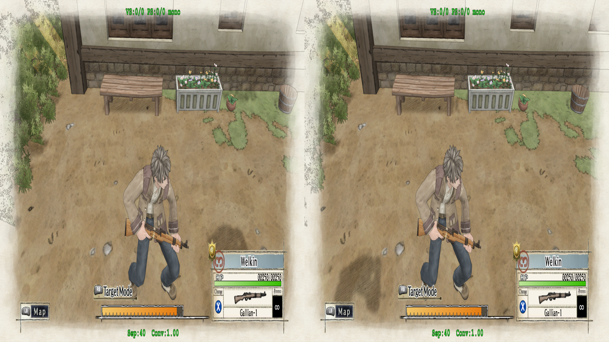
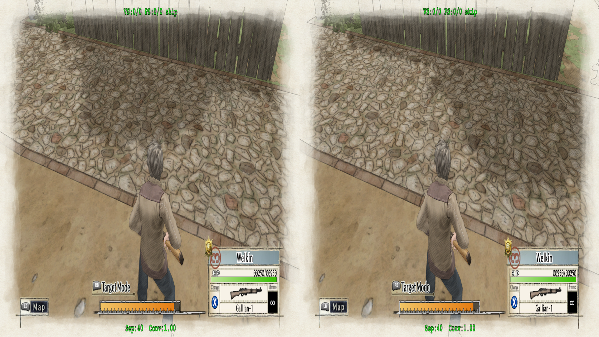
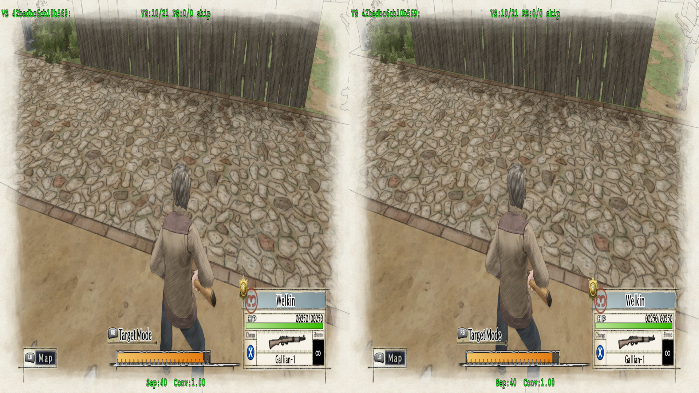
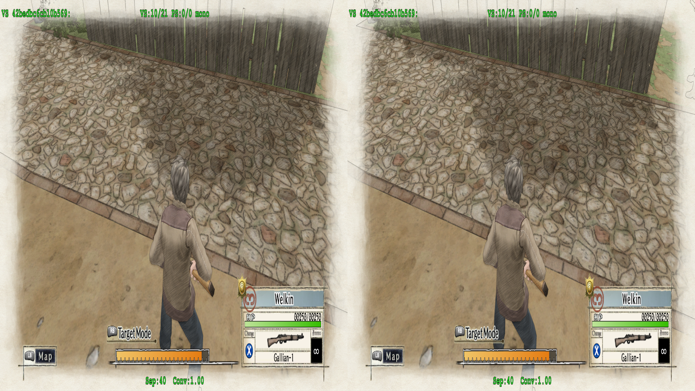
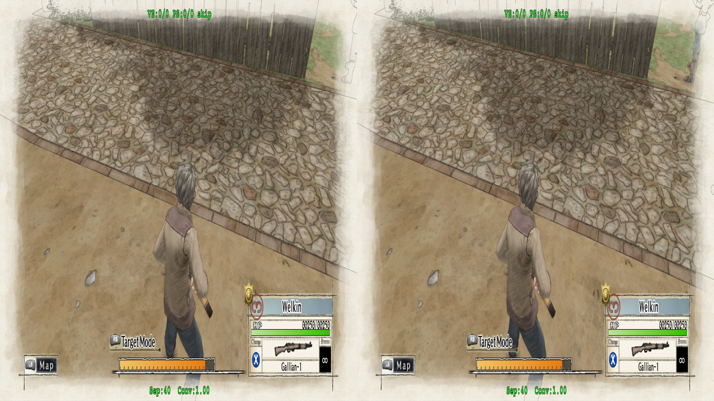
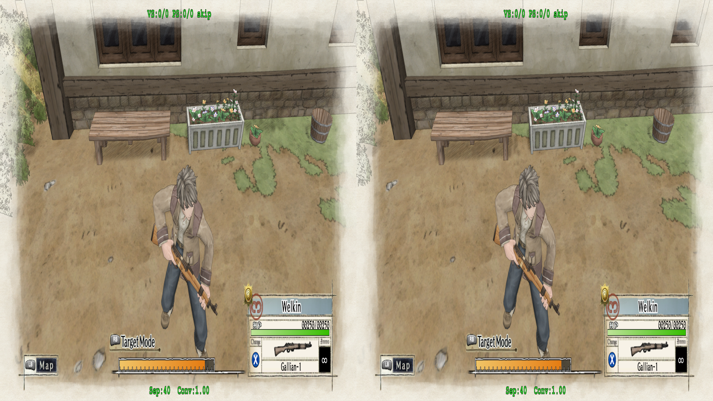
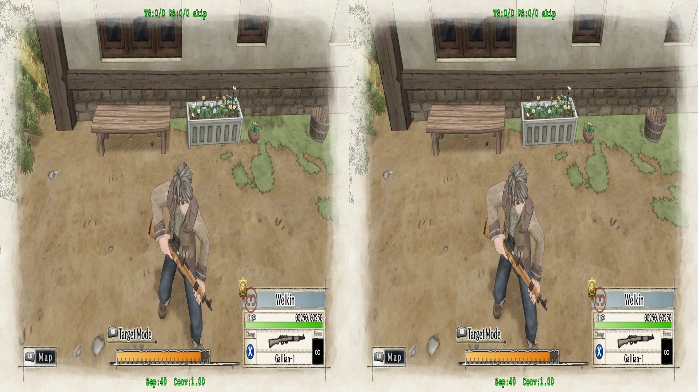
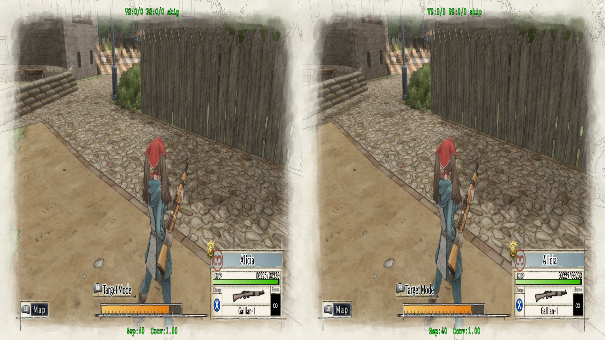
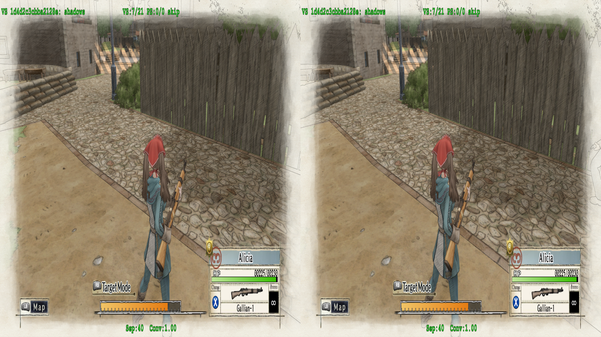
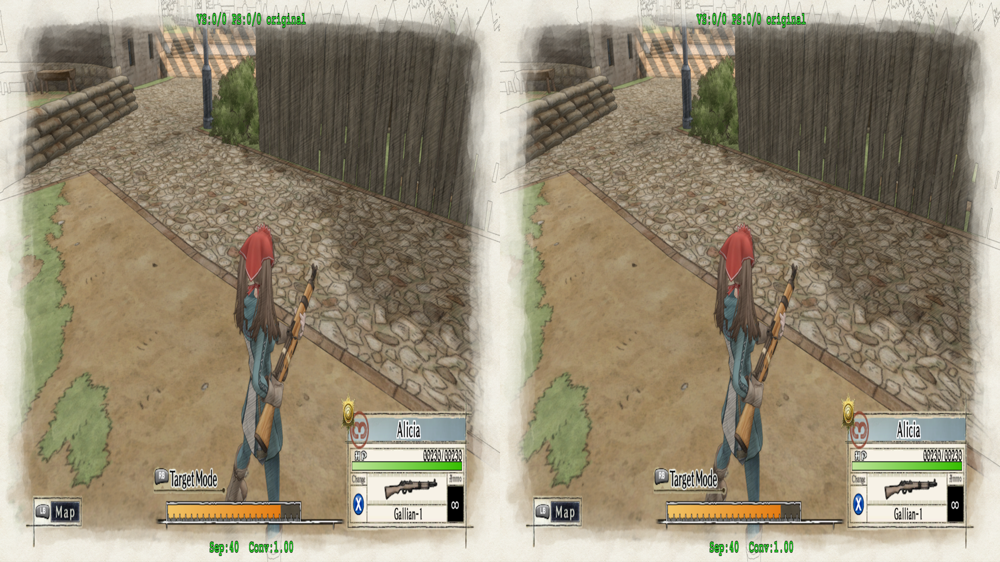

# Shadows

All of the shadows in the game do not seem to render correctly.  Increasing depth just causes them to split further and further away in each eye.

<p align="center">
    <a href="figuringscreens_shadows/fig_shadow_split1.png"></a>
    <p align="center"><i>Note the character's shadow is on completely opposite sides.  Keep in mind this screenshot is <a href="figuringscreens_shadows/orig/fig_shadow_split1.png">flip flopped</a> for cross eyed viewing</i></p>
</p>

The shader for the shadow beneath the characters is:

<details>
<summary>19dde9258f45d3fe-vs.txt</summary>

```asm
vs_5_0
dcl_globalFlags refactoringAllowed
dcl_constantbuffer CB3[47], immediateIndexed
dcl_constantbuffer CB4[276], dynamicIndexed
dcl_input v0.xyzw
dcl_input v1.xyz
dcl_input v2.xy
dcl_output_siv o0.xyzw, position
dcl_output o1.xyzw
dcl_output o2.xyzw
dcl_output o3.xyzw
dcl_output o4.xyzw
dcl_output o5.xyzw
dcl_output o6.xyzw
dcl_output o7.xyzw
dcl_output o8.xyzw
dcl_output o9.xyzw
dcl_output o10.xyzw
dcl_output o11.xyzw
dcl_output o12.xyzw
dcl_temps 8
utof r0.xyz, v1.xyzz
mov r2.xyzw, l(0,0,0,1.000000)
if_nz cb4[16].y
  mul r4.xyz, l(3.000000, 3.000000, 3.000000, 3.000000), r0.xyzz
  round_ne r3.xy, r4.xyzw
  ftoi r3.xy, r3.xyzw
  mul r5.xyzw, v2.yyyy, cb4[r3.y + 68].xyzw
  mul r6.xyzw, v2.yyyy, cb4[r3.y + 69].xyzw
  mul r7.xyzw, v2.yyyy, cb4[r3.y + 70].xyzw
  mad r5.xyzw, cb4[r3.x + 68].xyzw, v2.xxxx, r5.xyzw
  mad r6.xyzw, cb4[r3.x + 69].xyzw, v2.xxxx, r6.xyzw
  mad r7.xyzw, cb4[r3.x + 70].xyzw, v2.xxxx, r7.xyzw
  add r4.x, v2.yyyy, v2.xxxx
  add r4.x, -r4.xxxx, cb4[20].xxxx
  round_ne r3.x, r4.zzzz
  ftoi r3.x, r3.xyzw
  mad r5.xyzw, cb4[r3.x + 68].xyzw, r4.xxxx, r5.xyzw
  mad r6.xyzw, cb4[r3.x + 69].xyzw, r4.xxxx, r6.xyzw
  mad r4.xyzw, cb4[r3.x + 70].xyzw, r4.xxxx, r7.xyzw
else
  mov r5.xyzw, cb4[68].xyzw
  mov r6.xyzw, cb4[69].xyzw
  mov r4.xyzw, cb4[70].xyzw
endif
dp4 r5.x, v0.xyzw, r5.xyzw
dp4 r5.y, v0.xyzw, r6.xyzw
dp4 r5.z, v0.xyzw, r4.xyzw
mul r4.xyzw, r5.yyyy, cb4[53].xyzw
mad r4.xyzw, cb4[52].xyzw, r5.xxxx, r4.xyzw
mad r4.xyzw, cb4[54].xyzw, r5.zzzz, r4.xyzw
add r1.xyzw, r4.xyzw, cb4[55].xyzw
mov r2.w, cb4[20].xxxx
mov r2.xyz, r5.xyzw
mov o0.xyzw, r1.xyzw
mov o1.xyzw, r1.xyzw
mov o2.xyzw, l(1.000000,1.000000,1.000000,1.000000)
mov o3.xyzw, l(0,0,0,1.000000)
mov o4.xyzw, l(1.000000,0,0,0)
and r0.x, cb3[38].xxxx, l(8, 16, 32, 64)
movc o5.xyzw, r0.xxxx, l(0,0,0,1.000000), r2.xyzw
mov o6.xyzw, l(0,0,0,1.000000)
mov o7.xyzw, l(0,0,0,1.000000)
mov o8.xyzw, l(0,0,0,1.000000)
mov o9.xyzw, l(0,0,0,1.000000)
mov o10.xyzw, l(0,0,0,1.000000)
mov o11.xyzw, l(0,0,0,1.000000)
mov o12.xyzw, l(0,0,0,1.000000)
ret
```
</details>

However, fate is cruel, and we _do not_ get a HLSL dump to work with.

---

```hlsl
// The problematic HLSL code that matches the else part of the if in the original ASM
// geo-11 will still dump what it attempted to generate, even if it's broken
...
  r6.xyzw = cb4[r3.x+69].xyzw * r4.xxxx + r6.xyzw;
  r4.xyzw = cb4[r3.x+70].xyzw * r4.xxxx + r7.xyzw;
} else {
  // Why it applied r3 here, I'm not sure, as it's not in the original ASM
  r5.xyzw = cb4[r3.x+68].xyzw;
  r6.xyzw = cb4[r3.x+69].xyzw;
  r4.xyzw = cb4[r3.x+70].xyzw;
}
r5.x = dot(v0.xyzw, r5.xyzw);
r5.y = dot(v0.xyzw, r6.xyzw);
...
```
> [!NOTE]
> If you dump this shader with the same version of geo-11, it will complian that r3 failed to initialize
>
>Now, I have no idea what I'm doing at all, but I took the generated `*.bin` for this shader from `ShaderFixesDM` and placed that in `ShaderFixes`, and made a file `<shaderhash>-vs_replace.txt` that contains the broken HLSL shader, as this is the setup geo-11 expects to do HLSL replacement, from what I understand anyway.  With all that in place, removing `r3` from the index assignment produced different results than normal, and initializing `r3` in the same fashion as within the if also produced markedly different results
>
>So, I gave up on that idea.  We'll see this happen with more shaders, unfortunately

---

So, er, let's find another shader that does happen to dump in HLSL since I don't want to immediately dive into ASM at the moment:

<details>
<summary>42bedbc6cb10b569-vs_replace.txt</summary>

```hlsl
void main(
  float4 v0 : POSITION0,
  float4 v1 : TEXCOORD0,
  float4 v2 : TEXCOORD1,
  float4 v3 : TEXCOORD2,
  out float4 o0 : SV_POSITION0,
  out float4 o1 : TEXCOORD8,
  out float4 o2 : COLOR0,
  out float4 o3 : COLOR1,
  out float4 o4 : TEXCOORD9,
  out float4 o5 : TEXCOORD0,
  out float4 o6 : TEXCOORD1,
  out float4 o7 : TEXCOORD2,
  out float4 o8 : TEXCOORD3,
  out float4 o9 : TEXCOORD4,
  out float4 o10 : TEXCOORD5,
  out float4 o11 : TEXCOORD6,
  out float4 o12 : TEXCOORD7)
{
  float4 r0,r1,r2,r3,r4,r5,r6,r7;
  uint4 bitmask, uiDest;
  float4 fDest;

  r1.xyzw = float4(0,0,0,1);
  r2.xyzw = float4(0,0,0,1);
  r3.xyzw = float4(1,1,1,1);
  r5.w = frac(v2.x);
  r5.w = v2.x + -r5.w;
  r5.w = 4 * r5.w;
  r4.w = round(r5.w);
  r4.w = (int)r4.w;
  r5.x = dot(v0.xyzw, cb4[r4.w+204].xyzw);
  r5.y = dot(v0.xyzw, cb4[r4.w+205].xyzw);
  r5.z = dot(v0.xyzw, cb4[r4.w+206].xyzw);
  r5.w = dot(v0.xyzw, cb4[r4.w+207].xyzw);
  r6.xy = frac(v3.xz);
  r7.xyzw = -v0.xyzw + r5.xyzw;
  r5.xy = v3.xz + -r6.xy;
  r4.w = round(r5.x);
  r4.w = (int)r4.w;
  r6.w = 4 * r5.y;
  r5.xyzw = v3.yyyy * cb4[r4.w+156].xyzw;
  r4.w = round(r6.w);
  r4.w = (int)r4.w;
  r6.xyzw = v0.xyzw;
  r7.xyzw = v2.yyyy * r7.xyzw + r6.xyzw;
  r6.x = dot(r5.xyzw, cb4[r4.w+220].xyzw);
  r6.y = dot(r5.xyzw, cb4[r4.w+221].xyzw);
  r6.z = dot(r5.xyzw, cb4[r4.w+222].xyzw);
  r7.xyz = r6.xyz + r7.xyz;
  r5.x = dot(r7.xyzw, cb4[236].xyzw);
  r5.y = dot(r7.xyzw, cb4[237].xyzw);
  r5.z = dot(r7.xyzw, cb4[238].xyzw);
  r5.w = dot(r7.xyzw, cb4[239].xyzw);
  r0.x = dot(r5.xyzw, cb4[240].xyzw);
  r0.y = dot(r5.xyzw, cb4[241].xyzw);
  r0.z = dot(r5.xyzw, cb4[242].xyzw);
  r0.w = dot(r5.xyzw, cb4[243].xyzw); 
  r1.zw = r5.zw;
  r5.x = cb4[24].w;
  r3.w = cb4[151].x * r5.x;
  r1.xy = v1.xy;
  r2.x = cb4[20].z;
  r3.xyz = cb4[24].xyz;
  o1.xyzw = r0.xyzw;
  r0.xy = asint(cb3[38].xx) & int2(1,2);
  o2.xyzw = r0.xxxx ? float4(1,1,1,1) : r3.xyzw;
  o3.xyzw = r0.yyyy ? float4(0,0,0,1) : r2.xyzw;
  o4.xyzw = float4(1,0,0,0);
  r0.x = asint(cb3[38].x) & 8;
  o5.xyzw = r0.xxxx ? float4(0,0,0,1) : r1.xyzw;
  o6.xyzw = float4(0,0,0,1);
  o7.xyzw = float4(0,0,0,1);
  o8.xyzw = float4(0,0,0,1);
  o9.xyzw = float4(0,0,0,1);
  o10.xyzw = float4(0,0,0,1);
  o11.xyzw = float4(0,0,0,1);
  o12.xyzw = float4(0,0,0,1);
  return;
}
```
</details>

Well, there's certainly something going on here.  ugh.

This shadow is related to the tree next to the characters:

<p align="center">
    <a href="figuringscreens_shadows/fig_shadow_tree_split.png"></a>
</p>

<p align="center">
    <a href="figuringscreens_shadows/fig_shadow_tree_split_splithunt.png"></a>
    <p align="center"><i>Skipping the shader to confirm</i></p>
</p>

When I was trying to fix _D4: Dark Dreams Don't Die_, I was fooled by shadows actually being fixed by dealing with something else.  So, let's verify that the shadow is something that we can fix by narrowing it down in the other hunting methods.

> [!TIP]
>I have been surprised before by what I was actually in control of for a specific shader when trying different hunting modes (though, more often than not, I've found that `skip` tends to be the best.  But, don't ever be afraid to just do the other ones.  They're all there to help identify how parts of a game are working.  Especially since `skip` didn't help me with the below)

<p align="center">
    <a href="figuringscreens_shadows/fig_shadow_tree_split_monohunt.png"></a>
</p>

Well.  Huh, if we put geo-11's hunting mode into mono, the shadow actually ... looks right.  How exactly do I make something in mono?...

---
> [!WARNING]
> I'll be blunt: I tried the mono hunting method because I was out of ideas on what to try for actually fixing things.  Because, then ...
---

I searched around in a folder I have of existing fixes (again, thank you to everyone that has posted fixes!) to see what others did to make something mono.  And within masterotaku's fix for [BAKERU](https://helixmod.blogspot.com/2025/09/bakeru.html), there's a note about making the game over screen mono:

```
// 3538a3ea63a56f17-vs_replace.txt //
//Game over circle. To monoize.
```
And the formula used:

```hlsl
  if (o0.w!=1) {
    o0.x-=stereo.x*(o0.w-stereo.y);
  }
```

What's interesting with this (for someone that knows nothing), is that this formula is applied _after_ `o0` gets it's finalized value.  This is saying that if the item being stereoized is part of clip space, we should run the normal stereo formula on it's x coordinate.  I'm assuming we want to fix the end result, vs fix the data _leading to_ the end result that I normally have seen in fixes for ... reasons.

---
> [!NOTE]
> I'm attempting to understanding what "clip space" ultimately means, but from what I can gather, being in clip space (o0.w == 0) means we should manipulate it, as the object has the ability to adjust to the current perspective

> [!CAUTION]
> i have no idea what I'm talking about and you should do your own research
---

So, well, let's give that a try:

```hlsl
...
  r2.x = cb4[20].z;
  r3.xyz = cb4[24].xyz;

  o0.xyzw = r0.xyzw;
  // from 3538a3 in masterotaku's Bakeru fix
  float4 stereo = StereoParams.Load(0);
  if (o0.w != 1) {
    o0.x -= stereo.x * (o0.w - stereo.y);
  }

  o1.xyzw = r0.xyzw;
  r0.xy = asint(cb3[38].xx) & int2(1,2);
...
```

<p align="center">
    <a href="figuringscreens_shadows/fig_shadow_tree_corrected.png"></a>
    <p align="center"><i>Looking cool, Joker!</i></p>
</p>

Now, if we apply something similar to the shadow we identified below the character:

```asm
mov r2.w, cb4[20].xxxx
mov r2.xyz, r5.xyzw
mov o0.xyzw, r1.xyzw

ld_indexable(texture2d)(float,float,float,float) r8.xyzw, l(0, 0, 0, 0), t125.xyzw
ne r7.x, o0.w, l(1.000000)
// This mimics the HLSL code.  There's a breakdown of it further down
if_nz r7.x
  add r7.y, o0.w, -r8.y
  mul r7.y, r7.y, r8.x
  add o0.x, o0.x, -r7.y
endif

// we'll also come back to this later at the end

mov o1.xyzw, r1.xyzw
mov o2.xyzw, l(1.000000,1.000000,1.000000,1.000000)
mov o3.xyzw, l(0,0,0,1.000000)
```

oh wow it---

<p align="center">
    <a href="figuringscreens_shadows/fig_shadow_undercharacter1_disappeared.png"></a>
</p>

didn't work.  The shadow is just gone completely.  And while that's _technically_ a solution, it's not one that's `good`.  _We can do better_.

So, what we're doing here is trying to apply stereo correction with the belief we're making it `mono`.  But, maybe this was the wrong approach.  We should think back to:

_All we're doing is fixing something on the horizontal so both eyes see something at slightly different perspectives_

And, you know, one thing may not exactly work for another thing.  So, why don't we try something simpler, thinking back to the _Prime Directive_:

```
clipPos.x += EyeSign * Separation * ( clipPos.w – Convergence )
```

```asm
ld_indexable(texture2d)(float,float,float,float) r8.xyzw, l(0, 0, 0, 0), t125.xyzw
add r7.y, r1.w, -r8.y
mul r7.y, r7.y, r8.x
add r1.x, r1.x, -r7.y
```

This grabs our stereo params into the temp variable `r8`, and uses `r7` as a temp value to store stuff into before finally giving that value to `r1`.  For this specific shader, `r1` feeds its `x` coordinate to `o0`.

Line by line, this is:

```asm
// Get the stereo params from geo-11
ld_indexable(texture2d)(float,float,float,float) r8.xyzw, l(0, 0, 0, 0), t125.xyzw
// clipPos.w - convergence
add r7.y, r1.w, -r8.y
// separation * eye sign
mul r7.y, r7.y, r8.x
// r1.x - the final product
add r1.x, r1.x, -r7.y
```

Keep in mind with ASM, we can't exactly do everything in one line.  So the prime directive is broken up into chunks.  Generally speaking, if you find a fix with regex based fixes, you'll likely see a similar pattern to the above.  But, doing this, how does our shadow under the character look?

<p align="center">
    <a href="figuringscreens_shadows/fig_shadow_undercharacter1_corrected.png"></a>
    <p align="center"><i>Corrected</i></p>
</p>

If we dump another problematic shader, such as:

<p align="center">
    <a href="figuringscreens_shadows/fig_shadow_lamppostarea_split.png"></a>
    <p align="center"><i>Look at the shadow by the lamp post, towards the back</i></p>
</p>

<p align="center">
    <a href="figuringscreens_shadows/fig_shadow_lamppostarea_skiphunt.png"></a>
    <p align="center"><i>Skipping the shader to confirm</i></p>
</p>

<details>
<summary>1d4d2c3cbba2128e-vs.txt</summary>

```asm
vs_5_0
dcl_globalFlags refactoringAllowed
dcl_constantbuffer CB3[47], immediateIndexed
dcl_constantbuffer CB4[276], dynamicIndexed
dcl_input v0.xyzw
dcl_output_siv o0.xyzw, position
dcl_output o1.xyzw
dcl_output o2.xyzw
dcl_output o3.xyzw
dcl_output o4.xyzw
dcl_output o5.xyzw
dcl_output o6.xyzw
dcl_output o7.xyzw
dcl_output o8.xyzw
dcl_output o9.xyzw
dcl_output o10.xyzw
dcl_output o11.xyzw
dcl_output o12.xyzw
dcl_temps 9
mov r0.xyz, l(0,0,0,1.000000)
mov r1.xy, l(0,0,0,1.000000)
mov r3.xyzw, l(0,0,0,1.000000)
if_nz cb4[16].y
  mul r5.xyz, l(3.000000, 3.000000, 3.000000, 3.000000), r0.xyzz
  round_ne r4.xy, r5.xyzw
  ftoi r4.xy, r4.xyzw
  mul r6.xyzw, r1.yyyy, cb4[r4.y + 68].xyzw
  mul r7.xyzw, r1.yyyy, cb4[r4.y + 69].xyzw
  mul r8.xyzw, r1.yyyy, cb4[r4.y + 70].xyzw
  mad r6.xyzw, cb4[r4.x + 68].xyzw, r1.xxxx, r6.xyzw
  mad r7.xyzw, cb4[r4.x + 69].xyzw, r1.xxxx, r7.xyzw
  mad r8.xyzw, cb4[r4.x + 70].xyzw, r1.xxxx, r8.xyzw
  add r5.x, r1.yyyy, r1.xxxx
  add r5.x, -r5.xxxx, cb4[20].xxxx
  round_ne r4.x, r5.zzzz
  ftoi r4.x, r4.xyzw
  mad r6.xyzw, cb4[r4.x + 68].xyzw, r5.xxxx, r6.xyzw
  mad r7.xyzw, cb4[r4.x + 69].xyzw, r5.xxxx, r7.xyzw
  mad r5.xyzw, cb4[r4.x + 70].xyzw, r5.xxxx, r8.xyzw
else
  mov r6.xyzw, cb4[68].xyzw
  mov r7.xyzw, cb4[69].xyzw
  mov r5.xyzw, cb4[70].xyzw
endif
dp4 r6.x, v0.xyzw, r6.xyzw
dp4 r6.y, v0.xyzw, r7.xyzw
dp4 r6.z, v0.xyzw, r5.xyzw
mul r5.xyzw, r6.yyyy, cb4[53].xyzw
mad r5.xyzw, cb4[52].xyzw, r6.xxxx, r5.xyzw
mad r5.xyzw, cb4[54].xyzw, r6.zzzz, r5.xyzw
add r2.xyzw, r5.xyzw, cb4[55].xyzw
mov r3.w, cb4[20].xxxx
mov r3.xyz, r6.xyzw
mov o0.xyzw, r2.xyzw
mov o1.xyzw, r2.xyzw
mov o2.xyzw, l(1.000000,1.000000,1.000000,1.000000)
mov o3.xyzw, l(0,0,0,1.000000)
mov o4.xyzw, l(1.000000,0,0,0)
and r0.x, cb3[38].xxxx, l(8, 16, 32, 64)
movc o5.xyzw, r0.xxxx, l(0,0,0,1.000000), r3.xyzw
mov o6.xyzw, l(0,0,0,1.000000)
mov o7.xyzw, l(0,0,0,1.000000)
mov o8.xyzw, l(0,0,0,1.000000)
mov o9.xyzw, l(0,0,0,1.000000)
mov o10.xyzw, l(0,0,0,1.000000)
mov o11.xyzw, l(0,0,0,1.000000)
mov o12.xyzw, l(0,0,0,1.000000)
ret
```
</details>

_Hmmmm... this certainly looks familiar_

So, we can apply the same fix, hopefully?

<p align="center">
    <a href="figuringscreens_shadows/fig_shadow_lamppostarea_split.png"></a>
</p>

Well, it didn't change (yes, I'm using the same screenshot from earlier, but this is what it looks like).  But, for fun, if we try:

```asm
mov r3.w, cb4[20].xxxx
mov r3.xyz, r6.xyzw
mov o0.xyzw, r2.xyzw

ld_indexable(texture2d)(float,float,float,float) r8.xyzw, l(0, 0, 0, 0), t125.xyzw
add r7.y, r2.w, -r8.y
mul r7.y, r7.y, r8.x
add o0.x, r2.x, -r7.y

mov o1.xyzw, r2.xyzw
mov o2.xyzw, l(1.000000,1.000000,1.000000,1.000000)
mov o3.xyzw, l(0,0,0,1.000000)
```

Will that work?

<p align="center">
    <a href="figuringscreens_shadows/fig_shadow_lamppostarea_fixed.png"></a>
</p>

The lamp post's shadow is at least corrected, as are the other ones related to the bushes.

I guess there must be something different that I missed between the two _similar_ shaders.  Though, anyway, to summarize what we've gotten so far for fixing shadows:

The following shaders were fixed in HLSL:

- 9e2063758cd2b098-vs
- 42bedbc6cb10b569-vs

The following are ASM-only:

- 1d4d2c3cbba2128e-vs
- 83e630450d0ca593-vs
- 095676a1be4d975f-vs
- 19dde9258f45d3fe-vs
- - This one is slightly different from the others

---

> [!NOTE]
> Initially, we may want to immediately try to redo the HLSL code that were used to in ASM, like so:

```asm
ld_indexable(texture2d)(float,float,float,float) r8.xyzw, l(0, 0, 0, 0), t125.xyzw
ne r7.x, o0.w, l(1.000000)
if_nz r7.x
  add r7.y, o0.w, -r8.y
  mul r7.y, r7.y, r8.x
  add o0.x, o0.x, -r7.y
endif
```

_as this isn't totally what I had at one point, where it "worked"_

This replicates doing the clip space check (`o0.w != 1`), and does the corresponding operations using values from `o0`.  However, this is not a safe operation to perform, as within the ASM code, inputs are read only and outputs are write only (HLSL does some things for us, so we can directly reference the input/output values without really caring).  While we didn't exactly end up needing the clip space check for the ASM-only shaders, if we pretend that we did for a moment, our code should look more like this:

```asm
// at this stage, a different variable should be giving value to o0.  In 1d4d2c3cbba2128e-vs, the previous line is:
mov o0.xyzw, r2.xyzw
// so we should use r2 instead of o0 for our calculations, then feed r2's final x value to o0
ld_indexable(texture2d)(float,float,float,float) r8.xyzw, l(0, 0, 0, 0), t125.xyzw
ne r7.x, r2.w, l(1.000000)
if_nz r7.x
  add r7.y, r2.w, -r8.y
  mul r7.y, r7.y, r8.x
  add o0.x, r2.x, -r7.y
endif
```