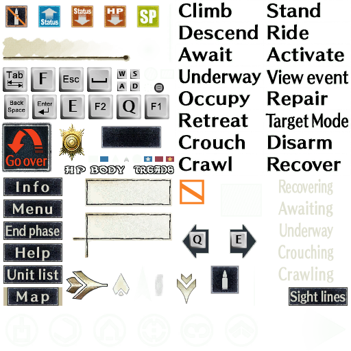
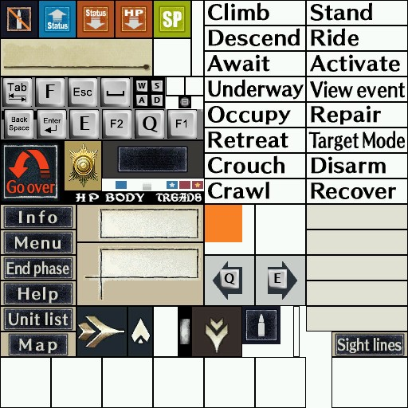
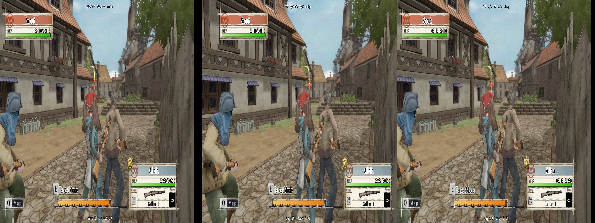
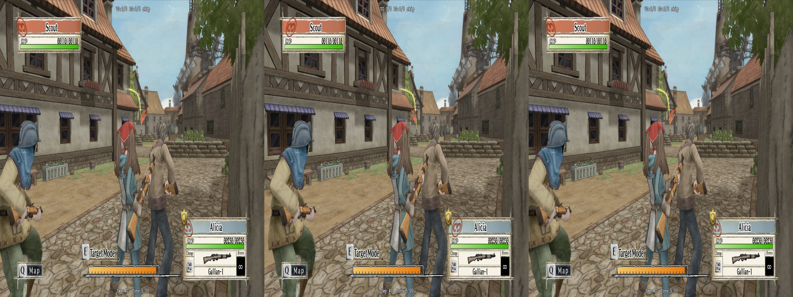
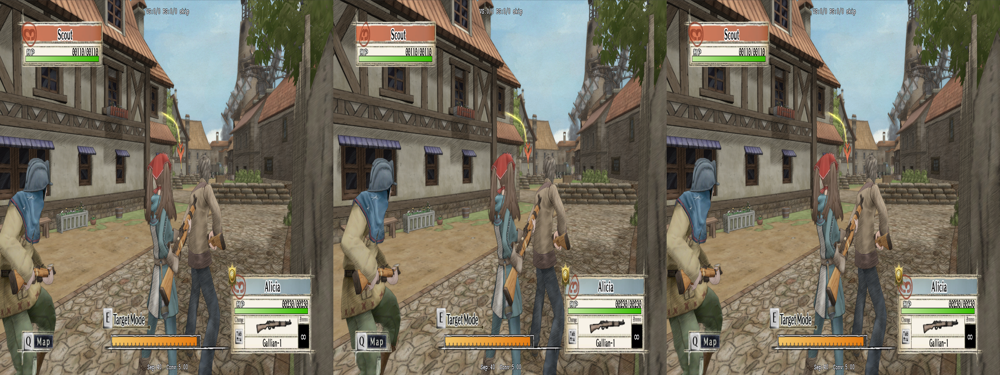
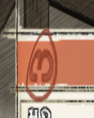
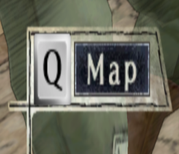

# Texture Atlas

Originally, I thought the best course of action for this game was going to be meeting parity with the original fix.  However, there's at least one thing we can definitely improve: the textures being at the wrong depth.  After a conversation with masterotaku, he pointed me what he did for his fix for [_Dragon Quest Builders 2_](https://helixmod.blogspot.com/2024/09/dragon-quest-builders-2.html).  This game's UI suffered a similar problem, and needed to be manually adjusted.  And, the worst part, that the textures were all part of one bigger texture that the game slices and dices to map on screen. For reference, this texture is the primary UI texture in _Valkyria Chronicles_:

<p align="center">
    <a href="figuringscreens_textureatlas/VALKYRIA.EXE_0x36FB0081.png"></a>
    <p align="center"><i>There's corresponding textures for the <a href="figuringscreens_textureatlas/VALKYRIA.EXE_0x53E019A7.png">Xbox</a> and <a href="figuringscreens_textureatlas/ps3.png">PS3</a> as well.  Though, with this approach, we may need to rethink how we can tackle the PS3 one given the hoops required to enable that in the first place</i></p>
</p>

If we open the _DQB2_ fix and look at `10d9ef35f5c9dee3-vs_replace.txt`, there's a couple major things right away:
- This is a vertex shader.  Vertex shaders have the abilty to have depth adjusted.  If we were to go at this from a pixel shader, we wouldn't have an actual reference for the depth
- `adjust_from_depth_buffer` is a function copied from one of the included files that's been carried around in most fixes.  We'll need to rely on this to really be able to adjust the depth of the texture to a value we want

But most importantly is the grueling work put in to map the UI (a small sampling):

```hlsl
float englishVignette = iniparams3.w==2 && (v2.x>=(5221.0/8192.0) && v2.x<(5943.0/8192.0) && v2.y>=(2.0/4096.0) && v2.y<(723.0/4096.0));
float englishCrosshair = v2.x>=(8156.0/8192.0) && v2.x<(8193.0/8192.0) && v2.y>=(1385.0/4096.0) && v2.y<(1419.0/4096.0);
float englishPhotoCrosshair = v2.x>=(5498.0/8192.0) && v2.x<(6620.0/8192.0) && v2.y>=(514.0/4096.0) && v2.y<(906.0/4096.0) && (o0.y>=-0.302);
float englishPhotoCrosshairAfter = v2.x>=(1678.0/8192.0) && v2.x<(1783.0/8192.0) && v2.y>=(2620.0/4096.0) && v2.y<(2725.0/4096.0);
```
_And this poor soul did it for every language!_

I do not own this game, but what we can presume based off this code (and what masterotaku let me in on) is that the above is mapping out each individual component on a larger texture.  The texture itself is `8192 x 4096`.  So taking the `englishCrosshair` from the sampling above, we can gather that it's a subtexture that exists within 8156 to 8193 on the horizontal and 1385 to 1419 on the vertical.  If we check for this a bit later in the file:

```hlsl
float englishConditions = iniparams3.w==2 && (englishCrosshair || englishPhotoCrosshairAfter);
```

We can see that _if_ an ini file parameter equals `2`, and the texture for this pass is `englishCrosshair` (or `englishPhotoCrosshairAfter`), we will get a boolean value. Going a bit further:

```hlsl
  if (iniparams11.x==0 && (spanishConditions || englishConditions || frenchConditions || italianConditions || germanConditions || japaneseConditions)) {
    correction = adjust_from_depth_buffer(coords.x,coords.y,400,10.0);
  } else if (iniparams11.x==0 && iniparams3.w!=10 && !vignetteConditions) {
    //o0.x+=stereo.x*0.5;
	correction = adjust_from_depth_buffer(0,-0.5,400,10.0);
  }
```

_If_ any of the conditionals for the various languages evaluates to `true` _and_ the ini parameter 11's `x` is `0`, we want to start correcting the texture's depth ourselves using the `adjust_from_depth_buffer`.  There is some massaging of what kind of values will be used to ultimately adjust (in this case, if the UI should remain in a specific spot or be adjusted with a hardcoded value).  So, in this case, we seemingly have a path forward to slice up the texture ourselves and manipulate it into a depth we want.  If this can be pulled off, we can improve on one spot the original fix didn't have (this is not to disparge the original fix! Stuff is hard, and sometimes the right tools don't come until much later).

## Slicing It Up

Using our PC texture as a guide, our texture's size is `512x512`.  The annoying thing, however, is that we don't exactly have an idea of how the game is segmenting the different textures.  The image posted up higher has the correct alpha channels (as it was extracted directly from the game) so we don't exactly know where a texture starts and ends.  Would could guess-timate it, but trial and error sucks.  Thankfully, when masterotaku was initially helping me, whether intentional or not, he was able to dump the same texture without the alpha channels enabled:

<p align="center">
    <a href="figuringscreens_textureatlas/000489-ps-t0e45926cf-vs3077d8f92f235b5a-psf3cc54c4ff1bd78e.jpg"></a>
</p>

With this, we have the definitive points that the game is actually partitioning each texture.  Our arrow that marks allies and enemies is located between 241 - 302 on the horizontal and 385 - 446 on the vertical.  Mirroring what was done with the _DQB2_ fix, we will create a known texture location as:

```hlsl
float markerForNPCs = v2.x>=(241.0/512.0) && v2.x<(302.0/512.0) && v2.y>=(385.0/512.0) && v2.y<(446.0/512.0);
```
_Keep in mind we need to find the corresponding shader, and then see what input `v#` texture corresponds to the HUD_

We'll see if we need to play around with the texture actually starting in the black areas around the texture, but we at least have a solid start.  However, the next part is going to be the worst part: the game crashes before we can find out _which_ vertex shader is actually loading the texture itself.  masterotaku's dump, however, gives us a clue that it's likely `3077d8f92f235b5a`, as that is listed as the vertex shader in the filename of his dumped instance of the UI.  However, when testing I initially only got that texture to be hot replaced once (meaning it was detected properly by the game) when trying to do a replacement dynamically to remove it ([but ultimately gave up](./figuringthingsout_textures.md)). So another way to try and do this is the needle in the haystack method of dumping `ShaderUsage.txt`.

## ShaderUsage Usage

Within our `d3dx.ini`, we need to turn ShaderUsage on with:

```ini
dump_usage=1
```

Then, any time we save a shader, a report will be filled out that will really just dump everything that's on screen at the time.  And, we'll defintely have the texture hash, but we need to isolate it first by trying practically all of them in the shader we likely think owns it.  So, we need to be limited and careful with how we mark shaders (though, geo-11 should auto clear out ShaderUsage.txt, but it's better to just grab what we need initially and not risk polluting the results).

If we pretend for a moment we didn't luck out and get the texture's hash, we would only know two things: 
- The texture is 512x512
- The entire display goes blank on a `skip` check if we target the vertex shader `3077d8f92f235b5a`

Marking `3077d8f92f235b5a`, we can look in the ShaderUsage and search for a texture that matches the width and height of `512x512`:

```xml
<RenderTarget orig_hash=e45926cf type=Texture2D width=512 height=512 mips=1 array=1 format="R8G8B8A8_TYPELESS" msaa=1 msaa_quality=0 usage="DEFAULT" bind_flags="shader_resource render_target" cpu_access_flags=0 misc_flags=0></RenderTarget>
<Register orig_hash=3f5dd3c0 type=Texture2D width=512 height=512 mips=6 array=1 format="BC3_TYPELESS" msaa=1 msaa_quality=0 usage="DEFAULT" bind_flags="shader_resource" cpu_access_flags=0 misc_flags=0 hash_contaminated=true>
<Register orig_hash=6b022816 type=Texture2D width=512 height=512 mips=1 array=1 format="R32_TYPELESS" msaa=1 msaa_quality=0 usage="DEFAULT" bind_flags="shader_resource render_target" cpu_access_flags=0 misc_flags=0 hash_contaminated=true>
<Register orig_hash=6be69621 type=Texture2D width=512 height=512 mips=10 array=1 format="BC3_TYPELESS" msaa=1 msaa_quality=0 usage="DEFAULT" bind_flags="shader_resource" cpu_access_flags=0 misc_flags=0 hash_contaminated=true>
<Register orig_hash=a43af1f4 type=Texture2D width=512 height=512 mips=1 array=1 format="BC3_TYPELESS" msaa=1 msaa_quality=0 usage="DEFAULT" bind_flags="shader_resource" cpu_access_flags=0 misc_flags=0 hash_contaminated=true>
<Register orig_hash=e45926cf type=Texture2D width=512 height=512 mips=1 array=1 format="R8G8B8A8_TYPELESS" msaa=1 msaa_quality=0 usage="DEFAULT" bind_flags="shader_resource render_target" cpu_access_flags=0 misc_flags=0></Register>
<Register orig_hash=e70c65f8 type=Texture2D width=512 height=512 mips=1 array=1 format="BC1_TYPELESS" msaa=1 msaa_quality=0 usage="DEFAULT" bind_flags="shader_resource" cpu_access_flags=0 misc_flags=0 hash_contaminated=true>
```

> [!NOTE]
> I need to revisit this section to understand what the different XML tags mean, as clearly we have `RenderTarget` in addition to `Register`, and the two of those are completely different

We thankfully know the hash of the texture from the one provided by masterotaku, which is `e45926cf`.  So that is our texture (we also know that the game uses the format `R8G8B8A8` for its DDS files, so that's another clue we could use to narrow it down).  We also know, from that same dump, that the vertex shader it came from is `3077d8f92f235b5a`.

Thus, one of the inputs to `3077d8f92f235b5a` should be our texture.  However, what sucks is that HLSL format fails to dump properly for this shader, so we must use the typical asm syntax.

Looking at the shader's inputs:

```asm
dcl_input v0.xyzw
dcl_input v1.xyzw
dcl_input v2.xy
```

_one of these things is not like the other_

Our UI lacks depth information, which would correspond to `v2` only having an `x` and `y`.  So, we can _hopefully_ steal most of the setup done to stereoize the UI how we want.  We just, unfortunately, need to convert it to be more ASM friendly.

_or be an idiot and use AI to fix the broken shader since I don't understand this language and what it's doing, if that hasn't been made extremely apparent_

## "Fixing" the HLSL

_I'll be an idiot_

<details>
<summary>problematic HLSL dump</summary>

```hlsl
// void main(
//   float4 v0 : POSITION0,
//   float4 v1 : COLOR0,
//   float4 v2 : TEXCOORD0,
//   out float4 o0 : SV_POSITION0,
//   out float4 o1 : TEXCOORD8,
//   out float4 o2 : COLOR0,
//   out float4 o3 : COLOR1,
//   out float4 o4 : TEXCOORD9,
//   out float4 o5 : TEXCOORD0,
//   out float4 o6 : TEXCOORD1,
//   out float4 o7 : TEXCOORD2,
//   out float4 o8 : TEXCOORD3,
//   out float4 o9 : TEXCOORD4,
//   out float4 o10 : TEXCOORD5,
//   out float4 o11 : TEXCOORD6,
//   out float4 o12 : TEXCOORD7)
// {
//   float4 r0,r1,r2,r3,r4,r5,r6,r7;
//   uint4 bitmask, uiDest;
//   float4 fDest;
//
//   r1.xyzw = float4(0,0,0,1);
//   r2.xyzw = float4(0,0,0,1);
//   r3.xyzw = float4(0,0,0,1);
//   r4.xyzw = float4(1,1,1,1);
//   r5.x = dot(v0.xyzw, cb4[68].xyzw);
//   r5.y = dot(v0.xyzw, cb4[69].xyzw);
//   r5.z = dot(v0.xyzw, cb4[70].xyzw);
//   r6.xyzw = cb4[53].xyzw * r5.yyyy;
//   r6.xyzw = cb4[52].xyzw * r5.xxxx + r6.xyzw;
//   r6.xyzw = cb4[54].xyzw * r5.zzzz + r6.xyzw;
//   r0.xyzw = cb4[55].xyzw + r6.xyzw;
//   if (cb4[16].x != 0) {
//     r5.w = cb4[20].x;
//     r5.x = dot(r5.xyzw, r5.xyzw);
//     r7.y = rsqrt(abs(r5.x));
//     r7.x = cmp((int)r7.y == 0x7f800000);
//     r5.x = r7.x ?  : ;
//     r7.y = rcp(r5.x);
//     r7.x = (int)r7.y & 0x7fffffff;
//     r7.x = cmp((int)r7.x == 0x7f800000);
//     r5.x = r7.x ?  : ;
//     r5.x = r5.x * cb4[22].x + cb4[22].y;
//     r5.x = min(cb4[22].z, r5.x);
//     r5.x = max(cb4[22].w, r5.x);
//   } else {
//     r5.x = cb4[20].x;
//   }
//   r4.xyzw = v1.xyzw * cb4[24].xyzw;
//   r1.xy = v2.xy;
//   r2.x = cb4[121].w;
//   r5.yzw = cb4[120].xyz;
//   r3.xyzw = r5.yzwx;
//   o0.xyzw = r0.xyzw;
//   o1.xyzw = r0.xyzw;
//   r0.x = asint(cb3[38].x) & 1;
//   o2.xyzw = r0.xxxx ? float4(1,1,1,1) : r4.xyzw;
//   o3.xyzw = float4(0,0,0,1);
//   o4.xyzw = float4(1,0,0,0);
//   r0.xyz = asint(cb3[38].xxx) & int3(8,16,32);
//   o5.xyzw = r0.xxxx ? float4(0,0,0,1) : r1.xyzw;
//   o6.xyzw = r0.yyyy ? float4(0,0,0,1) : r2.xyzw;
//   o7.xyzw = r0.zzzz ? float4(0,0,0,1) : r3.xyzw;
//   o8.xyzw = float4(0,0,0,1);
//   o9.xyzw = float4(0,0,0,1);
//   o10.xyzw = float4(0,0,0,1);
//   o11.xyzw = float4(0,0,0,1);
//   o12.xyzw = float4(0,0,0,1);
//   return;
// }
//////////////////////////////// HLSL Errors ////////////////////////////////
// I:\Games\SteamLibrary\steamapps\common\Valkyria Chronicles\ShaderFixes\3077d8f92f235b5a-vs_replace.txt(58,16-38): warning X3203: signed/unsigned mismatch, unsigned assumed
// I:\Games\SteamLibrary\steamapps\common\Valkyria Chronicles\ShaderFixes\3077d8f92f235b5a-vs_replace.txt(59,20): error X3000: syntax error: unexpected token ':'
// I:\Games\SteamLibrary\steamapps\common\Valkyria Chronicles\ShaderFixes\3077d8f92f235b5a-vs_replace.txt(62,16-38): warning X3203: signed/unsigned mismatch, unsigned assumed
// I:\Games\SteamLibrary\steamapps\common\Valkyria Chronicles\ShaderFixes\3077d8f92f235b5a-vs_replace.txt(63,20): error X3000: syntax error: unexpected token ':'
/////////////////////////////////////////////////////////////////////////////
```

</details>

The issue is the right-hand side of the expressions featuring `r7.x ? : ;`, since it's assigning the left-hand side nothing. The rest of those operations leading up to that, I'm not entirely sure what the intent is of checking `r7.x`'s value in relation to assigning it to `r5.x`. AI has fixed this with:

<details>
<summary>AI "fixed" shader</summary>

```hlsl
// ui
cbuffer cb4 : register(b4)
{
  float4 cb4[276];
}

cbuffer cb3 : register(b3)
{
  float4 cb3[47];
}

// 3Dmigoto declarations
#define cmp -
Texture1D<float4> IniParams : register(t120);
Texture2D<float4> StereoParams : register(t125);

void main(
  float4 v0 : POSITION0,
  float4 v1 : COLOR0,
  float4 v2 : TEXCOORD0,
  out float4 o0 : SV_POSITION0,
  out float4 o1 : TEXCOORD8,
  out float4 o2 : COLOR0,
  out float4 o3 : COLOR1,
  out float4 o4 : TEXCOORD9,
  out float4 o5 : TEXCOORD0,
  out float4 o6 : TEXCOORD1,
  out float4 o7 : TEXCOORD2,
  out float4 o8 : TEXCOORD3,
  out float4 o9 : TEXCOORD4,
  out float4 o10 : TEXCOORD5,
  out float4 o11 : TEXCOORD6,
  out float4 o12 : TEXCOORD7)
{
  float4 r0,r1,r2,r3,r4,r5,r6,r7;
  uint4 bitmask, uiDest;
  float4 fDest;

  r1 = float4(0,0,0,1);
  r2 = float4(0,0,0,1);
  r3 = float4(0,0,0,1);
  r4 = float4(1,1,1,1);

  r5.x = dot(v0, cb4[68]);
  r5.y = dot(v0, cb4[69]);
  r5.z = dot(v0, cb4[70]);

  r6 = cb4[53] * r5.yyyy;
  r6 = cb4[52] * r5.xxxx + r6;
  r6 = cb4[54] * r5.zzzz + r6;
  r0 = cb4[55] + r6;

  if (cb4[16].x != 0)
  {
    // AI CODE START
    // Original decompile tried to do rsqrt/rcp + INF/NaN guards.
    // Simplify to a sane, well‑defined version.
    r5.w = cb4[20].x;
    r5.x = dot(r5, r5);              // length^2
    r5.x = rsqrt(abs(r5.x));         // 1 / length
    // AI CODE END
    r5.x = r5.x * cb4[22].x + cb4[22].y;
    r5.x = min(cb4[22].z, r5.x);
    r5.x = max(cb4[22].w, r5.x);
  }
  else
  {
    r5.x = cb4[20].x;
  }

  r4.xyzw = v1.xyzw * cb4[24].xyzw;
  r1.xy = v2.xy;
  r2.x = cb4[121].w;
  r5.yzw = cb4[120].xyz;
  r3.xyzw = r5.yzwx;
  o0.xyzw = r0.xyzw;
  o1.xyzw = r0.xyzw;
  r0.x = asint(cb3[38].x) & 1;
  o2.xyzw = r0.xxxx ? float4(1,1,1,1) : r4.xyzw;
  o3.xyzw = float4(0,0,0,1);
  o4.xyzw = float4(1,0,0,0);
  r0.xyz = asint(cb3[38].xxx) & int3(8,16,32);
  o5.xyzw = r0.xxxx ? float4(0,0,0,1) : r1.xyzw;
  o6.xyzw = r0.yyyy ? float4(0,0,0,1) : r2.xyzw;
  o7.xyzw = r0.zzzz ? float4(0,0,0,1) : r3.xyzw;
  o8.xyzw = float4(0,0,0,1);
  o9.xyzw = float4(0,0,0,1);
  o10.xyzw = float4(0,0,0,1);
  o11.xyzw = float4(0,0,0,1);
  o12.xyzw = float4(0,0,0,1);
}
```

</details>

This is apparently good enough to the point that the game doesn't exhibit anything weird during gameplay. The `adjust_from_depth_buffer` function seemingly can't easily be adapted to ASM, so, unfortunately, this is the best we got here. The changes done:

```hlsl
    // AI CODE START
    // Original decompile tried to do rsqrt/rcp + INF/NaN guards.
    // Simplify to a sane, well‑defined version.
    r5.w = cb4[20].x;
    r5.x = dot(r5, r5);              // length^2
    r5.x = rsqrt(abs(r5.x));         // 1 / length
    // AI CODE END
    r5.x = r5.x * cb4[22].x + cb4[22].y;
    r5.x = min(cb4[22].z, r5.x);
    r5.x = max(cb4[22].w, r5.x);
```

Take the value of `cb4[20].x`, and creates a [dot product](https://learn.microsoft.com/en-us/windows/win32/direct3dhlsl/dx-graphics-hlsl-dot) of it, and then gets the [reciprocal square root](https://learn.microsoft.com/en-us/windows/win32/direct3dhlsl/dx-graphics-hlsl-rsqrt) of the absolute value of that. What's in `cb4[20]`? I have no idea what that represents. But we if we look at the original HLSL dump:

```hlsl
    r5.w = cb4[20].x;
    r5.x = dot(r5.xyzw, r5.xyzw);
    r7.y = rsqrt(abs(r5.x));
    r7.x = cmp((int)r7.y == 0x7f800000);
    r5.x = r7.x ?  : ;
    r7.y = rcp(r5.x);
    r7.x = (int)r7.y & 0x7fffffff;
    r7.x = cmp((int)r7.x == 0x7f800000);
    r5.x = r7.x ?  : ;
    r5.x = min(cb4[22].z, r5.x);
    r5.x = max(cb4[22].w, r5.x);
```

It gets the same dot product (`xyzw` is the entire set of elements on the object), and gets the same reciporical square root. However then it does an operation to get the non-zero value (defaulting to the [`magic number`](https://en.wikipedia.org/wiki/Magic_number_(programming)) defined there). And then, if `r7.x` is defined, it should be assigning something back to `r5.x`, but fails since I'm guessing something with the shader dumping logic messed up? It then sort of does it again with the reciprocal of the found value from before, but fails again. So, I don't know what was going on here. It seems that the AI tried to salvage it, but I don't know enough about shaders to give a definitive "Yes, the AI was smart," and I'm just riding off that the game didn't break apart when applying this. _This is a common pitfall of trusting code you don't completely understand_. It's been awhile since I've done math like this, but I have the extra problem of not knowing what on Earth the intended output is.  If we look at the original ASM shader:

```asm
if_nz cb4[16].x
  // copy cb4[20]
  mov r5.w, cb4[20].xxxx
  // dot product of itself
  dp4 r5.x, r5.xyzw, r5.xyzw
  // get the reciprocal square root
  rsq r7.y, |r5.xxxx|
  // get the if r7.yyyy is zero, default it to the constant defined
  ieq r7.x, r7.yyyy, l(0x7f800000)
  // copy something awful
  movc r5.x, r7.xxxx, l(9999999933815812510711506376257961984.000000,9999999933815812510711506376257961984.000000,9999999933815812510711506376257961984.000000,9999999933815812510711506376257961984.000000), r7.yyyy
  // get the reciprocal of r5.xxxx
  rcp r7.y, r5.xxxx
  and r7.x, r7.yyyy, l(0x7fffffff)
  ieq r7.x, r7.xxxx, l(0x7f800000)
  movc r5.x, r7.xxxx, l(9999999933815812510711506376257961984.000000,9999999933815812510711506376257961984.000000,9999999933815812510711506376257961984.000000,9999999933815812510711506376257961984.000000), r7.yyyy
  mad r5.x, r5.xxxx, cb4[22].xxxx, cb4[22].yyyy
  min r5.x, r5.xxxx, cb4[22].zzzz
  max r5.x, r5.xxxx, cb4[22].wwww
```

Something went wrong with the translation of `movc` there, seemingly, with a couple constants thrown in there that _may_ have some meaning to someone that is more familiar with graphics pipelines? Or maybe the shader, wrapped in dgvoodoo, just has something wrong with it? But, well, I tried to understand, sorta kinda ehhhhhhhhhhhhhhhhhhhhh. It works, and we can tell, at least, that this is some kind of protection so that `r5.x` isn't left being empty, since it's required for later calculations. The AI code _assumes_ that `r5.x` won't naturally be zero at any point (and if we're already getting the reciporical based on the original operations, then then code would have errored out there anyway if `r5.x` ended up being zero [assuming I'm understanding the chain of events here, anyway]). So by simplifying it to _assume_ that our value can't be zero anyway, then the AI provided code _should_ be fine.

I mean, the game doesn't crash, so that has to mean something.

Now, however, we can apply the `adjust_from_depth_buffer`:

<details>
<summary>3077d8f92f235b5a-vs_replace - initial usage for depth</summary>

```hlsl
// ui
cbuffer cb4 : register(b4)
{
  float4 cb4[276];
}

cbuffer cb3 : register(b3)
{
  float4 cb3[47];
}

// 3Dmigoto declarations
#define cmp -
Texture1D<float4> IniParams : register(t120);
Texture2D<float4> StereoParams : register(t125);
Texture2D<float> DepthBuffer : register(t110);

static const float near = 0.00001;
static const float far = 1;

float world_z_from_depth_buffer(float x, float y)
{
    uint width, height;
    float z;

    DepthBuffer.GetDimensions(width, height);

    x = min(max((x / 2 + 0.5) * width, 0), width - 1);
    y = min(max((-y / 2 + 0.5) * height, 0), height - 1);
    z = DepthBuffer.Load(int3(x, y, 0)).x;
    if (z == 1)
        return 0;

  return (far*near/((1-z)*near) + (far*z));
}

float adjust_from_depth_buffer(float x, float y, float numsamples)
{
    float4 stereo = StereoParams.Load(0);
    // if separation is not present (depth is 0), abort
    if (stereo.x==0) {return 0;}
    float separation = stereo.x;
    float convergence = stereo.y;
    float old_offset, offset, w, sampled_w, distance;
    uint i;

    offset = (near - convergence) * separation; // Z = X offset from center
    distance = separation - offset;         // Total distance to cover (separation - starting X offset)

    old_offset = offset;
    for (i = 0; i < numsamples; i++) {
        offset += distance / numsamples;

        // Calculate depth for this point on the line:
        w = (separation * convergence * 0.1) / (separation - offset);

        sampled_w = world_z_from_depth_buffer(x + offset, y);
        if (sampled_w == 0)
            return separation;

        // If the sampled depth is closer than the calculated depth,
        // we have found something that intersects the line, so exit
        // the loop and return the last point that was not intersected:
        if (w > sampled_w)
            break;

        old_offset = offset;
    }

    return old_offset;
}

void main(
  float4 v0 : POSITION0,
  float4 v1 : COLOR0,
  float4 v2 : TEXCOORD0,
  out float4 o0 : SV_POSITION0,
  out float4 o1 : TEXCOORD8,
  out float4 o2 : COLOR0,
  out float4 o3 : COLOR1,
  out float4 o4 : TEXCOORD9,
  out float4 o5 : TEXCOORD0,
  out float4 o6 : TEXCOORD1,
  out float4 o7 : TEXCOORD2,
  out float4 o8 : TEXCOORD3,
  out float4 o9 : TEXCOORD4,
  out float4 o10 : TEXCOORD5,
  out float4 o11 : TEXCOORD6,
  out float4 o12 : TEXCOORD7)
{
  float4 r0,r1,r2,r3,r4,r5,r6,r7;
  uint4 bitmask, uiDest;
  float4 fDest;

  r1 = float4(0,0,0,1);
  r2 = float4(0,0,0,1);
  r3 = float4(0,0,0,1);
  r4 = float4(1,1,1,1);

  r5.x = dot(v0, cb4[68]);
  r5.y = dot(v0, cb4[69]);
  r5.z = dot(v0, cb4[70]);

  r6 = cb4[53] * r5.yyyy;
  r6 = cb4[52] * r5.xxxx + r6;
  r6 = cb4[54] * r5.zzzz + r6;
  r0 = cb4[55] + r6;

  if (cb4[16].x != 0)
  {
    // Original decompile tried to do rsqrt/rcp + INF/NaN guards.
    // Simplify to a sane, well‑defined version.
    r5.w = cb4[20].x;
    r5.x = dot(r5, r5);              // length^2
    r5.x = rsqrt(abs(r5.x));         // 1 / length
    r5.x = r5.x * cb4[22].x + cb4[22].y;
    r5.x = min(cb4[22].z, r5.x);
    r5.x = max(cb4[22].w, r5.x);
  }
  else
  {
    r5.x = cb4[20].x;
  }

  r4.xyzw = v1.xyzw * cb4[24].xyzw;
  r1.xy = v2.xy;
  r2.x = cb4[121].w;
  r5.yzw = cb4[120].xyz;
  r3.xyzw = r5.yzwx;
  o0.xyzw = r0.xyzw;

  // ADJUST HERE
  o0.x += adjust_from_depth_buffer(0,0,255);

  o1.xyzw = r0.xyzw;
  r0.x = asint(cb3[38].x) & 1;
  o2.xyzw = r0.xxxx ? float4(1,1,1,1) : r4.xyzw;
  o3.xyzw = float4(0,0,0,1);
  o4.xyzw = float4(1,0,0,0);
  r0.xyz = asint(cb3[38].xxx) & int3(8,16,32);
  o5.xyzw = r0.xxxx ? float4(0,0,0,1) : r1.xyzw;
  o6.xyzw = r0.yyyy ? float4(0,0,0,1) : r2.xyzw;
  o7.xyzw = r0.zzzz ? float4(0,0,0,1) : r3.xyzw;
  o8.xyzw = float4(0,0,0,1);
  o9.xyzw = float4(0,0,0,1);
  o10.xyzw = float4(0,0,0,1);
  o11.xyzw = float4(0,0,0,1);
  o12.xyzw = float4(0,0,0,1);
}
```

</details>

_And how does that look?_

<p align="center">
    <a href="figuringscreens_textureatlas/fig_textatlas_everythingpushed.png"></a>
    <p align="center"><i>Terrible</i></p>
</p>

This is the same problem we experienced with [_Studio System_](../studio-system/figuringthingsout_crosshair.md) when applying the crosshair fix for that. Everything's being pushed in, but we just want to target the texture(s) we care about. We're laser focused on that marker for the NPCs, so let's see how our guess-timate worked out:

```hlsl
  float markerForNPCs = v2.x>=(241.0/512.0) && v2.x<(302.0/512.0) && v2.y>=(385.0/512.0) && v2.y<(446.0/512.0);

...

  if (markerForNPCs) {
    o0.x += adjust_from_depth_buffer(0, 0, 255);
  }
```

<p align="center">
    <a href="figuringscreens_textureatlas/fig_textatlas_warpedmarker.png"></a>
    <p align="center"><i>Terrible</i></p>
</p>

The arrow is warped all over, and doesn't look right.

## Filtering for the Right Texture

Something else to make us feel smarter is that we can apply this depth adjustment based on a filter for the texture. From the texture dump from earlier, we know that the texture starts in register 0:

`000489-ps-t0e45926cf-vs3077d8f92f235b5a-psf3cc54c4ff1bd78e`

`ps-t0`

If it was `ps-t9`, the register would be `9`.

_Someone please correct me if I'm wrong_

In our `d3dx.ini`:

```ini
[ShaderOverride_Marker]
Hash=3077d8f92f235b5a
x10 = ps-t0
ResourceDepthBuffer = oD unless_null
vs-t110 = ResourceDepthBuffer
```

We could assign this filter to any variable, but I'm just doing `x10` since I know it likely won't be used by something else as the fix progresses.

In our shader:

```hlsl
  float4 texFilter = IniParams.Load(int2(10,0));

  ...

  if (texFilter.x == 0 && markerForNPCs) {
```

If `x10` equals register `0` (and the marker coordinates are hit), then our if statement is `true` and we do the depth logic.

## Isolating the Marker For Real This Time

At the recommendation of cicicleta, they suggested narrowing down the texture instead of trying to instantly get the coordinates right. So that began the laborious process of iterating over:

```hlsl
  float markerForNPCs = v2.x >= (0.0/512.0) 
                     && v2.x <= (512.0/512.0)
                     && v2.y >= (0.0/512.0) 
                     && v2.y <= (512.0/512.0);
```

We don't actually need to start _that high_, rather we just should start in the general area of the texture we want, and narrow down the values until _just_ the texture we want is pushed in, and nothing else.

<p align="center">
    <a href="figuringscreens_textureatlas/fig_textatlas_paritiallythere.png"></a>
</p>

```hlsl
  float markerForNPCs = v2.x >= (200.0/512.0) 
                     && v2.x <= (500.0/512.0)
                     && v2.y >= (390.0/512.0) 
                     && v2.y <= (450.0/512.0);
```

Now we can see that a few things in the UI are pushed in (including our favorite NPC marker), but we're still not quite there.

```hlsl
  float markerForNPCs = v2.x >= (240.0/512.0) 
                     && v2.x <= (304.0/512.0)
                     && v2.y >= (384.0/512.0) 
                     && v2.y <= (448.0/512.0);
```

<p align="center">
    <a href="figuringscreens_textureatlas/fig_textatlas_ascloseasitllget.png"></a>
</p>

The marker is pushed in!---

<p align="center">
    <a href="figuringscreens_textureatlas/fig_textatlas_warpedclass.png"></a> <a href="figuringscreens_textureatlas/fig_textatlas_warpedwindow.png"></a>
</p>

And, unfortunately, this is where this approach ends. We have isolated the marker in the texture, but after talking this over with a few people, this is not an uncommon sight in game engines. The empty space between textures can bleed into each other, and unfortunately, we're affecting the textures near the marker. If we make our range for the coordinates smaller, the marker will once again be warped. If we make it larger, more adjacent textures will be affected.

So we have to come up with a better solution, one that may not, unfortunately, be as clean.

## The Crosshair

After going through all that, even if we got it to work, the next issue would be the crosshair. This thing can overlay on the marker, and just screw everything up. This isn't ideal, and I'm not entirely sure how to handle it.

Thus, for better _and_ worse, we have to settle for the best of my abilities, which is [drawing a pretend box](./figuringthingsout_abox.md).