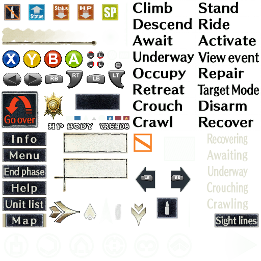

_This section was originally written before I understood how to [apply the depth buffer](https://github.com/bo3b/3Dmigoto/wiki/Auto-Crosshair) to shaders it didn't exist in before. The initial assumption that they couldn't be pushed in is incorrect. Please keep that in mind while reading through here_

# Textures

_If you're here to customize textures, skip to [here](#editing-textures)_

> [!TIP]
> A general overview on dumping textures with 3DMigoto (geo-11) is provided [here](https://leotorrez.github.io/modding/guides/textures-101).  Their guide helped me understand how things were working, and found it very helpful!

The UI textures in this game are not pushed into the screen at all, and I originally thought there was no hope for that.  In the [original fix](https://helixmod.blogspot.com/2016/03/valkyria-chronicles.html), there was an optional download/modification to effectively disable most of the UI.  To reach parity with the original fix using this sort of approach, we'd want to do the same.  However, there's a bit of a problem.

Typically, with modifying games and wanting to disable their textures, we need to make a dump of the game using geo-11's built in ability.  Generally mapped to `F8`, and defined in the `d3dx.ini`:

```ini
; Dumps out a flight log of DirectX state changes and the contents of each
; render target after every immediate draw call for the next frame. Takes up a
; large amount of space, so disabled by default.
analyse_frame = no_modifiers VK_F8
```

Then various options can be assigned to dump the state of the game.  But, _Valkyria Chronicles_ doesn't want to play fair, and will crash immediately when doing _any_ sort of dump.  However, in an ideal world, the steps to do what we want would be:
* Get to the in-game section
* Make a dump of the game, ensuring to include a dump of the textures in DDS
  * Possibly dump at least two times to get both the keyboard and Xbox textures
* Find the texture in the dump
* Edit out the problematic UI elements
  * Namely the marker for the enemies
* Create folders for the corresponding control types
  * Bonus points for PS3
* Similar to [the toggle for the frame border](figuringthingsout_toggles.md), create a toggle for the texture that iterates over the original and the edited one
* Be happy

However, we can't do that.  All is not lost, however, we can look to the past to see how some previous modders fixed the game to show Playstation glyphs.  Using this methodology, we can still replace the textures with our modified ones.  _But_, there's of course a catch: the tool to stop the hotswapping of the keyboard and mouse/Xbox textures is geared towards replacing _all_ textures.  We need to stop it from doing that, or do it ourselves.  There is no toggle, so instead we need a few pieces to do this correctly:
* Source code for FluffyQuack's `VCPS3Buttons`
* The texture id of the in-game UI
  * This can be found in the `<path-to-game>\data\texture_replace` folder.  The in-game UI is `3358280212318419906.dds`

If we look at the source code for `VCPS3Buttons`, there's a section where they specifically skip certain textures:

```cpp
if(!( (unsigned long long &) data[pos] == 4121779029669587293 //These are textures for "exit game", should still be replaced
    || (unsigned long long &) data[pos] == 7682352040093519435 
    || (unsigned long long &) data[pos] == 15293619919312322294 //These are HQ backgrounds, should still be replaced
    || (unsigned long long &) data[pos] == 14424422347982842161
    || (unsigned long long &) data[pos] == 12812042920565827770
    || (unsigned long long &) data[pos] == 6979617774316825669
    || (unsigned long long &) data[pos] == 17234129099337211102
    || (unsigned long long &) data[pos] == 1126660568197716564
    || (unsigned long long &) data[pos] == 6329309893307687112
    || (unsigned long long &) data[pos] == 15040148626767517281 //Dialogue portrait borders, also should be replaced
    ))
```

I'm not very good when it comes to C++, let alone editing compiled files directly in a manner like this, but we can see that those items in the list correspond to the filenames listed in the `data\texture_replace` directory.  Since we don't want _everything_ to be replaced here, we can simply modify the `if` statement to read:

```cpp
if(( (unsigned long long &) data[pos] == 3358280212318419906))
```
(My changes are [here](../../Fixes/geo-11/Valkyria-Chronicles/VCGlyphOverwrite/main.cpp).  I didn't see an explicit license on FluffyQuack's code, however)

And when we output the newly minted exe, we'll see that the in-game UI now retains the Playstation glyphs, yet the rest of the UI remains the typical KB&M/Xbox.  While this isn't _truly_ ideal for an enduser, it's the best we got, and probably the best way to reach parity with the original HelixMod fix.  The only outright negative is that the enduser will not have the ability to switch control methods on the fly; they're going to be stuck with KB&M, Xbox, _or_ Playstation for the entire game if they decide that the UI elements are distracting.

## Editing Textures

For editing textures, you're going to want the following tools:

- [Paint.NET](getpaint.net)
- [VCTool](https://steamcommunity.com/sharedfiles/filedetails/?id=343016567)

This game leverages the DDS file format, specifically textures encoded with `DXT5`.  Textures in the game for the KB&M and Xbox are contained within the game's executable, and aren't in the normal file system. If you trace through the executable in a hex editor, you can eventually find `DDS |` file headers, denoating the aformentioned format.  Extracting these one by one will reveal all the non-Playstation textures.  But, we don't have a need for that, since we can take some shortcuts.  Provided in this [folder](../../Fixes/geo-11/Valkyria-Chronicles/TextureOverrides/), I've already extracted an original version of the DDS files the correspond to each control method.  We just need to remove that marker that appears over practically everything on the battlefield if we want to get anything done:

<p align="center">
    <a href="../../Fixes/geo-11/Valkyria-Chronicles/TextureOverrides/xbox/original/VALKYRIA.EXE_0x53E019A7.png"></a>
</p>

The texture is located towards the bottom, in the middle.  Using paint.net, we can simply delete it.

Then, we save using the lone `DXT5` option (saving as anything else will likely screw up the game, causing infinite loading or crashing).  Then, we need to use VCTool to properly replace the texture within the original archive.  While I'm not one to write decent software where I work for _anyone_, I did find how this tool worked initially confusing.  But, here's what needs to be done:

1. Have a separate folder somewhere with nothing in
2. Place `VCTool.exe` and the two `*.bat` files in there
3. Copy `DLC_0002_val_in_action.htx` into this folder
4. Extract that file by dragging and dropping it on the `extract.bat`
5. Take the modified DDS file that was created earlier, and save it in the newly extracted folder
    - We want to replace `00.dds`, so overwrite that file
    - We should now have three files in here: `00.dds` (our new file), `01.dds`, and `02.dds`
    - Windows 10's Explorer offers a preview of DXT5 files (at least on my end), so if you're seeing a thumbnail preview, you've done it correctly
6. Take `DLC_0002_val_in_action.htx` and drag it on top of the `replace.bat`

We now have a newly created `DLC_0002_val_in_action.htx` that has our texture replacement in it.  The application references a folder with the same name as the archive to repopulate it, which is how it knows to grab our modified texture.

Optionally, for extra verification, you can rename the file to something else (`DLC_0002_val_in_action_new.htx`, for example), and drop it on the `extract.bat` again.  You should see the edited texture from before.

Now, replace the archive back where it came from, and it should load up correctly when the game is started.  If you get infinite loading or crashing, your texture is likely in the wrong format.

(The same process can be applied for any texture)