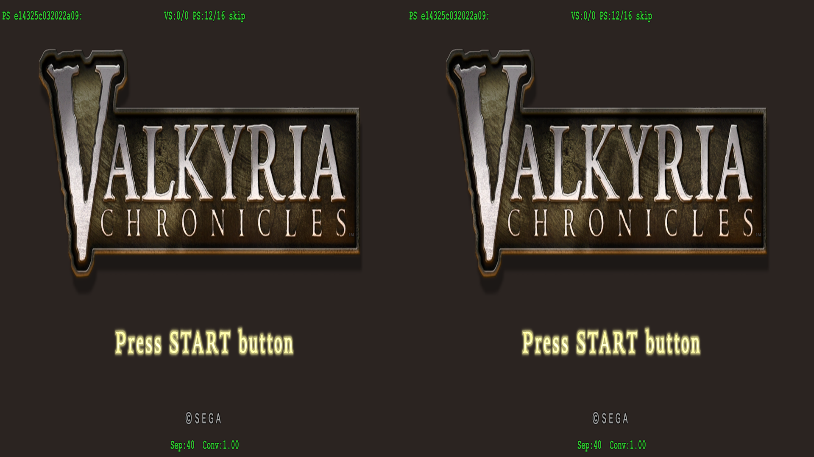
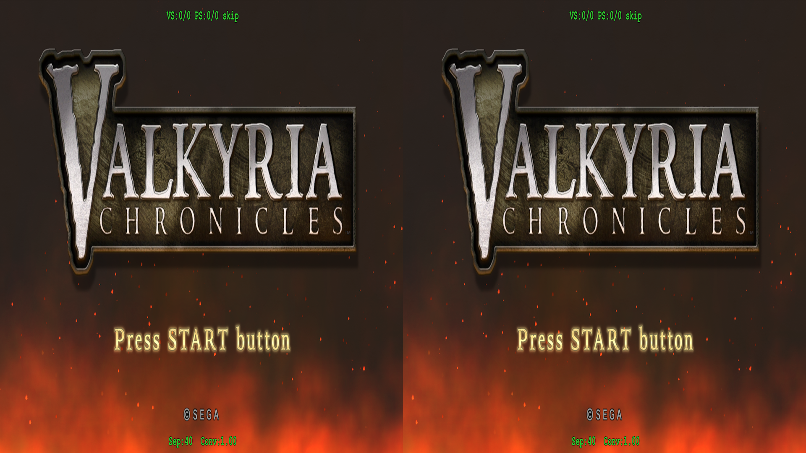
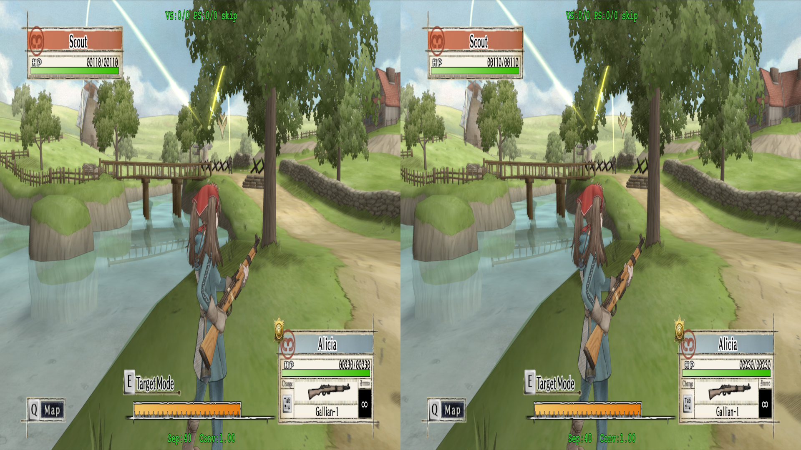

# Toggles

Probably when looking at the screenshots elsewhere in this, there's been something likely taking more of a hold on your vision (even when the shadows and whatnot are perfect).  And that has likely been the window border.

I generally run games at a depth value of `40`, as that tends to be the sweet spot to me, else everything looks _too_ strong.  Maybe I'm weak, I'm not sure, but if there's one thing I've noticed when double checking all the images being added here, it's that the cross-eye view seems to not really show off the geometry 3D all that well.  In all the screenshots I've taken, I've noticed consistently that the border that's drawn around the game tends to take a lot of the focus, making the depth for the actual gameplay look somewhat bare.

To fix this, we need to isolate the shader that's responsible for holding the border.  And that shader is:

<details>
<summary>e14325c032022a09-ps</summary>

```
ps_5_0
dcl_globalFlags refactoringAllowed
dcl_constantbuffer CB3[77], immediateIndexed
dcl_constantbuffer CB4[236], immediateIndexed
dcl_sampler s0, mode_default
dcl_sampler s1, mode_default
dcl_sampler s2, mode_default
dcl_sampler s3, mode_default
dcl_resource_texture2d (float,float,float,float) t0
dcl_resource_texture2d (float,float,float,float) t1
dcl_resource_texture2d (float,float,float,float) t2
dcl_resource_texture2d (float,float,float,float) t3
dcl_input_ps linear centroid v2.xyz
dcl_input_ps linear v5.xy
dcl_output o0.xyzw
dcl_temps 4
mul r0.xyzw, v5.yyyy, cb4[164].xyzw
mad r0.xyzw, v5.xxxx, cb4[163].xyzw, r0.xyzw
add r0.xyzw, r0.xyzw, cb4[165].xyzw
add r0.xyzw, r0.xyzw, cb4[166].xyzw
div r2.xyzw, r0.xyzw, r0.wwww
sample r1.xyzw, r2.xyxx, t2.xyzw, s2
and r1.xyzw, r1.xyzw, cb3[48].xyzw
or r1.xyzw, r1.xyzw, cb3[49].xyzw
sample r0.xyzw, v5.xyxx, t3.xyzw, s3
and r0.xyzw, r0.xyzw, cb3[50].xyzw
or r0.xyzw, r0.xyzw, cb3[51].xyzw
add r2.w, r0.yyyy, -r0.xxxx
mad r1.w, cb4[184].xxxx, r2.wwww, r0.xxxx
add r3.w, r0.zzzz, -r1.wwww
mad r2.w, cb4[184].yyyy, r3.wwww, r1.wwww
add r3.w, r0.wwww, -r2.wwww
mad r1.w, cb4[184].zzzz, r3.wwww, r2.wwww
add r3.w, r0.xxxx, -r1.wwww
mad r2.w, cb4[184].wwww, r3.wwww, r1.wwww
mov r0.w, l(1.000000,1.000000,1.000000,1.000000)
mad r1.w, r2.wwww, -cb4[183].xxxx, r0.wwww
mad r0.xy, v5.xyzw, cb4[180].xyzw, cb4[180].zwzw
sample r2.xyzw, r0.xyxx, t0.xyzw, s0
and r2.xyzw, r2.xyzw, cb3[44].xyzw
or r2.xyzw, r2.xyzw, cb3[45].xyzw
sample r0.xyzw, r0.xyxx, t1.xyzw, s1
and r0.xyzw, r0.xyzw, cb3[46].xyzw
or r0.xyzw, r0.xyzw, cb3[47].xyzw
add r4.xyz, r2.xyzw, -r1.xyzw
mad r3.xyz, r1.wwww, r4.xyzx, r1.xyzw
add r2.w, -r1.wwww, l(1.000000, 1.000000, 1.000000, 1.000000)
mul r0.w, r0.wwww, cb4[182].wwww
mad r0.xyz, r0.zzzz, cb4[182].xyzw, -r3.xyzw
mul r0.w, r2.wwww, r0.wwww
mad r0.xyz, r0.wwww, r0.xyzw, r3.xyzw
mul o0.xyz, r0.xyzw, v2.xyzw
mov o0.w, l(1.000000,1.000000,1.000000,1.000000)
ret
// Approximately 0 instruction slots used
```

</details>

If we skip this pixel shader, the border disappears.  Thankfully, this shader is used on the title screen, so we can easily test changes with it.  If we skip the whole shader, we do notice a problem:

<p align="center">
    <a href="figuringscreens_toggles/fig_toggles_border_skip.png"></a>
</p>

The fire effect is gone from the title screen (though, if we go in-game, there doesn't actually seem to be anything really missing).  The border is gone though.  While we could cheap out and just skip this shader, that wouldn't be ideal; there may be something gamebreaking later that we're unaware of.  So, the best case would be finding what part of the shader draws the border, and getting rid of it.  As admittedly, it can be distracting compared to the main gameplay at points.

Once again, masterotaku found the specific spot after trying some locations:

```asm
...
or r1.xyzw, r1.xyzw, cb3[49].xyzw
sample r0.xyzw, v5.xyxx, t3.xyzw, s3

and r0.xyzw, r0.xyzw, cb3[50].xyzw

or r0.xyzw, r0.xyzw, cb3[51].xyzw
add r2.w, r0.yyyy, -r0.xxxx
...
```

We can likely assume that `t3` is the texture for the border, and this is the only time it's actually used for any sort of sampling in the pixel shader.

Right after the sample call, the value given to `r0` will determine the fate of the border.

If we adjust `r0` to be empty there, like so:

```asm
or r1.xyzw, r1.xyzw, cb3[49].xyzw
sample r0.xyzw, v5.xyxx, t3.xyzw, s3

and r0.xyzw, l(0.0), cb3[50].xyzw

or r0.xyzw, r0.xyzw, cb3[51].xyzw
add r2.w, r0.yyyy, -r0.xxxx
```

<p align="center">
    <a href="figuringscreens_toggles/fig_toggles_border_zeroed.png"></a>
</p>

The fire effect is back!  And if we take a look in-game:

<p align="center">
    <a href="figuringscreens_toggles/fig_toggles_border_zeroed_ingame.png"></a>
    <p align="center"><i>Well, the UI still really stands out in a cross-eye view.  You'll just have to trust me, or boot up the game, that the 3D is really there</i></p>
</p>

However, being able to toggle something like this would really be the ideal route, as the border may be distracting to some, but others may prefer it.  I personally like the border there during gameplay most of the time (and by gameplay, I mean reloading the first mission for hours on end).  So, as per suggestion from masterotaku, we should make this a toggle-able effect.  That means setting up a hotkey that can be referenced by a user to turn it on or off.

After looking through some other fixes about how this works, this is a checklist of what we need to do:

- Within the d3dx.ini
  - declare a variable that we can reference about the current state of the user's preference (is the effect on or off?)
  - tie that variable to a key
- Within the shader
  - load that variable
  - make an `if` check to determine if we zero out the value or not

To start in `d3dx.ini`, we need to go to the `[Constants]` section and declare a variable:

```ini
[Constants]
;Window Border toggle. 0=disabled, 1=enabled
z1=0
```

We can make this variable be anything we want.  I went with `z` since another fix I was looking at happened to use `z` to define attributes with the HUD (which our border here could be considered part of).  Then, we make a binding:

```ini
[KeyWindowBorderToggle]
; The key to press, in this case `1` on the number row
Key = 1
; Different types are possible, but we only need to cycle between specific values
type = cycle
; The acceptable values for our variable are `0` for disabling the border, and `1` for enabling
z1 = 0, 1
```

We can name this section whatever we want.  If we had more possible values, we could have added a `back`, assigned it a key binding, and let the user easily go backwards through our array of options.  But, since we only have two, that's not really needed.  We can also assign a button for the controller for toggling this.  There's a bunch of examples in the commentted sections in the `d3dx.ini`.

The `d3dx.ini` should now be setup with everything we need, so now we need to move to the shader.  One of the fixes I had downloaded had an example of loading and parsing an `IniParam` in ASM.  So for a complete reference:

```asm
// Declare and load the IniParams. They're always referenced by `t120`
dcl_resource_texture1d (float,float,float,float) t120
// For this case, since our variable is `z1`, we need to load the first index
// Had we called it `z2`, we would have `l(2, 0, 0, 0) instead
ld_indexable(texture2d)(float,float,float,float) r26.xyzw, l(1, 0, 0, 0), t120.xyzw

...

or r1.xyzw, r1.xyzw, cb3[49].xyzw
sample r0.xyzw, v5.xyxx, t3.xyzw, s3

// check if our variable is a non-zero value
if_nz r26.z
  // if it is (which would be a value of `1`, based on our key binding setup), we draw the border
  and r0.xyzw, r0.xyzw, cb3[50].xyzw
else
  // else, zero out r0 and kill the border's visbility
  and r0.xyzw, l(0.0), cb3[50].xyzw
endif

or r0.xyzw, r0.xyzw, cb3[51].xyzw
add r2.w, r0.yyyy, -r0.xxxx

```

Now, hitting `1` on the keyboard will toggle the border around the screen!

> [!TIP]
> When the fix is finalized, the README should make explicit note of any/all hotkeys.  A normal user likely isn't going to look through the `d3dx.ini` and see what options exist.  _We_ might, but documentation still helps out everyone.

---

For comparison's sake, if we pretend we're in a `hlsl` shader, loading `IniParams` should resemble this:


```hlsl
// defined likely already for us at the top of a dumped shader
Texture1D<float4> IniParams : register(t120);

// load any param declared with a `1`
float4 iniparams1 = IniParams.Load(int2(1,0));

// check if our variable is a non-zero value
if (iniparams1.z !=1) {
  and r0.xyzw, r0.xyzw, cb3[50].xyzw
}
else {
  and r0.xyzw, l(0.0), cb3[50].xyzw
}
```