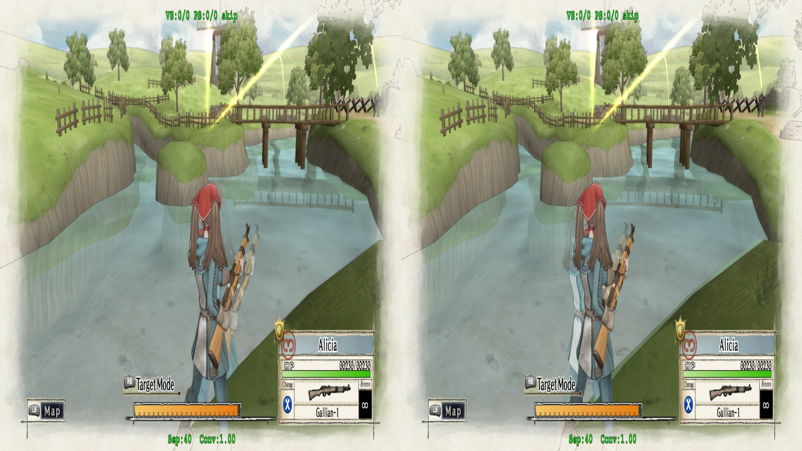
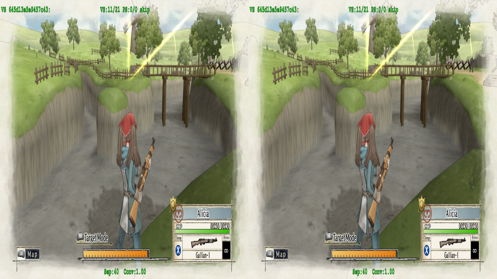
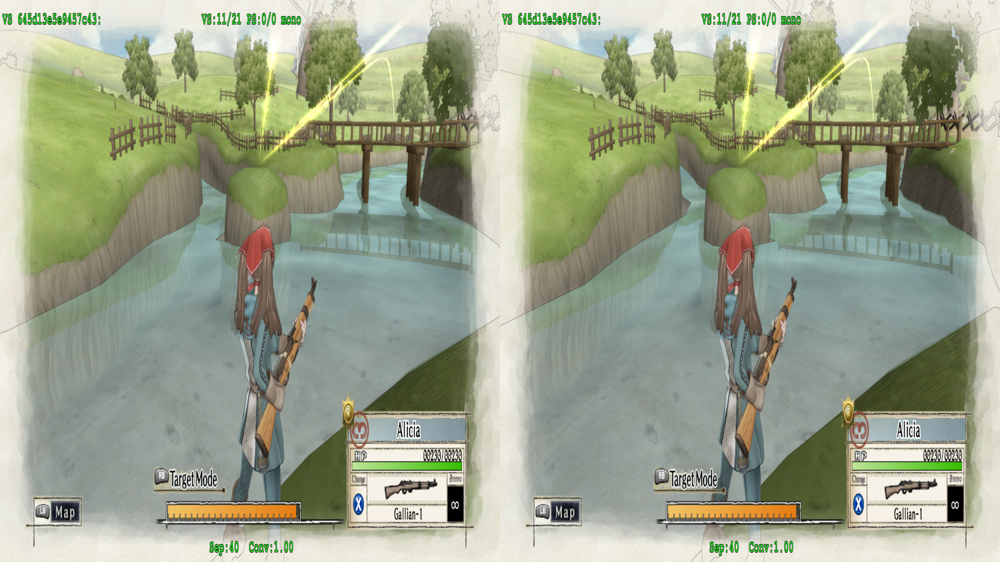
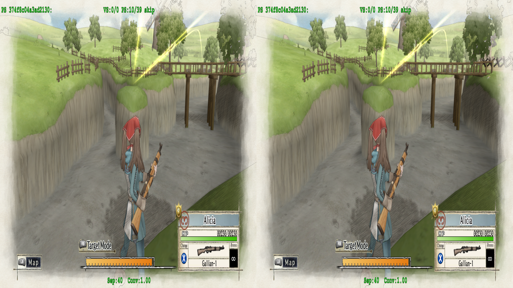
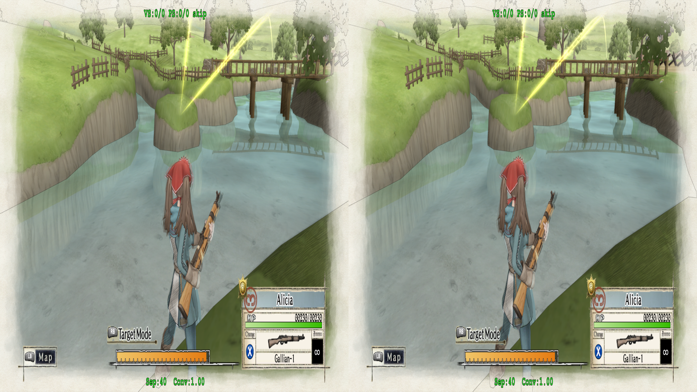
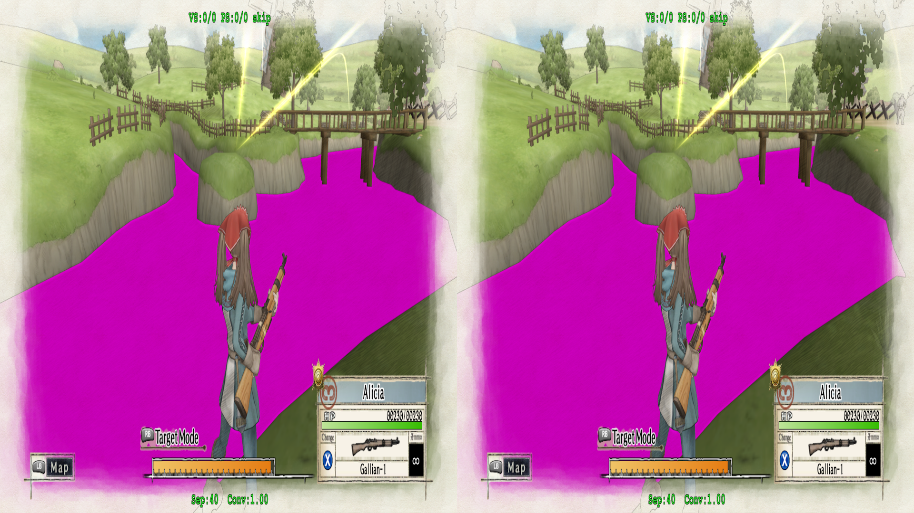
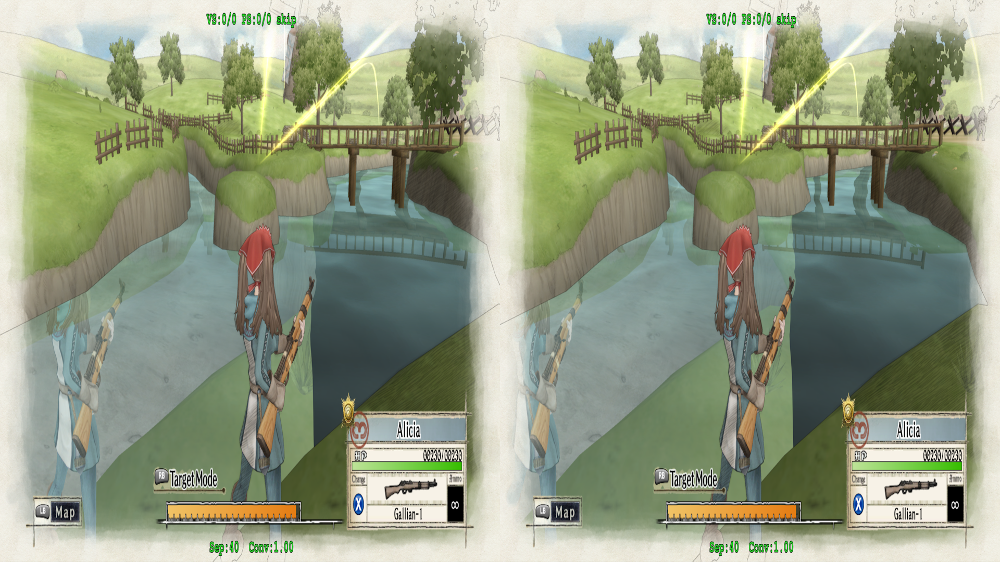
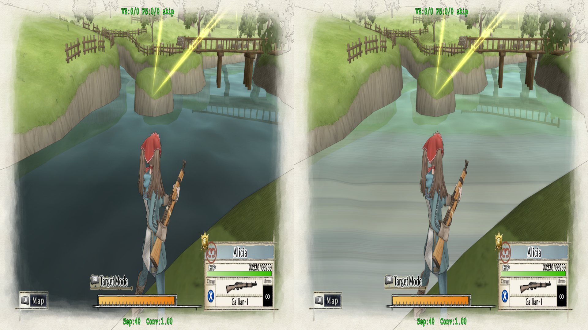
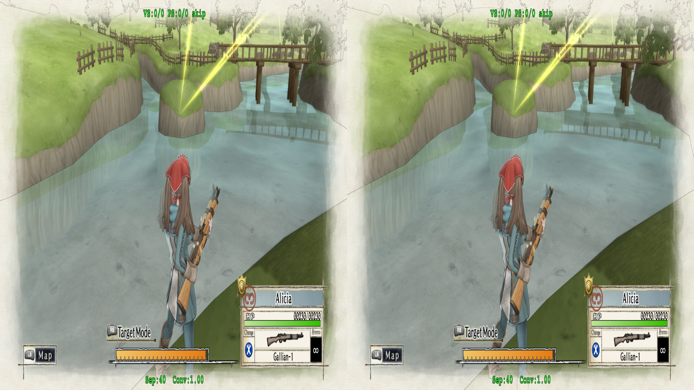

# Water

The water in the first level does not have the correct reflection.  Everything is extremely distorted:

<p align="center">
    <a href="figuringscreens_water/fig_water_bad.png"></a>
</p>

If we skip around, we can find the shader for it in the vertex shaders, `645d13e5e9457c43-vs`

<p align="center">
    <a href="figuringscreens_water/fig_water_vs_skip.png"></a>
</p>

So like usual, we can try and set things to mono.  But, being that I have the benefit of trying this out and failing for awhile, we can instead look at geo11's mono to shortcut if this will actually work:

<p align="center">
    <a href="figuringscreens_water/fig_water_vs_mono_bad.png"></a>
</p>

However, while the image just looks terrible anyway, the other important note is that there's some geometry getting pulled in places that it shouldn't.  Namely, if you look at the rock in the water, it sorta has "wings" on either side.  While I did play around with this for quite some time, ultimately this is a sign that we want to start poking at the pixel shader that corresponds to this vertex shader.  As, no matter what is done, geometry gets pulled out from places it doesn't need to.  If you restart the mission with this shader in mono, the map gets in a really dreadful looking state.

> [!NOTE]
> Running the below pixel shader in mono also produces the same effect as the vertex shader, which is disorienting, but is not what we'll actually see when attempting to adjust this shader

Anyway, if we skip pixel shaders:

<details>
<summary>374f8c04a3ad2130-ps</summary>

```
//
// Generated by Microsoft (R) D3D Shader Disassembler
//
//   using 3Dmigoto v0.6.198 on Mon Feb 23 17:50:49 2026
//
//
// Input signature:
//
// Name                 Index   Mask Register SysValue  Format   Used
// -------------------- ----- ------ -------- -------- ------- ------
// SV_POSITION              0   xyzw        0      POS   float
// TEXCOORD                 8   xyzw        1     NONE   float
// COLOR                    0   xyzw        2     NONE   float   xy w
// COLOR                    1   xyzw        3     NONE   float   xyz
// TEXCOORD                 9   xyzw        4     NONE   float
// TEXCOORD                 0   xyzw        5     NONE   float   xyzw
// TEXCOORD                 1   xyzw        6     NONE   float   xyzw
// TEXCOORD                 2   xyzw        7     NONE   float   xy w
// TEXCOORD                 3   xyzw        8     NONE   float   xyzw
// TEXCOORD                 4   xyzw        9     NONE   float   xy
// TEXCOORD                 5   xyzw       10     NONE   float   xyzw
// TEXCOORD                 6   xyzw       11     NONE   float   xyzw
// TEXCOORD                 7   xyzw       12     NONE   float   xy w
//
//
// Output signature:
//
// Name                 Index   Mask Register SysValue  Format   Used
// -------------------- ----- ------ -------- -------- ------- ------
// SV_TARGET                0   xyzw        0   TARGET   float   xyzw
// SV_TARGET                1   xyzw        1   TARGET   float   xyzw
//
ps_5_0
dcl_globalFlags refactoringAllowed
dcl_constantbuffer CB3[77], immediateIndexed
dcl_constantbuffer CB4[236], immediateIndexed
dcl_sampler s0, mode_default
dcl_sampler s1, mode_default
dcl_sampler s12, mode_default
dcl_sampler s13, mode_default
dcl_resource_texture2d (float,float,float,float) t0
dcl_resource_texture2d (float,float,float,float) t1
dcl_resource_texture2d (float,float,float,float) t12
dcl_resource_texture2d (float,float,float,float) t13
dcl_input_ps linear centroid v2.xyw
dcl_input_ps linear centroid v3.xyz
dcl_input_ps linear v5.xyzw
dcl_input_ps linear v6.xyzw
dcl_input_ps linear v7.xyw
dcl_input_ps linear v8.xyzw
dcl_input_ps linear v9.xy
dcl_input_ps linear v10.xyzw
dcl_input_ps linear v11.xyzw
dcl_input_ps linear v12.xyw
dcl_output o0.xyzw
dcl_output o1.xyzw
dcl_temps 7
mul r0.xy, v7.xyzw, cb4[146].wwww
sample r0.xyzw, r0.xyxx, t1.xyzw, s1
and r0.xyzw, r0.xyzw, cb3[46].xyzw
or r0.xyzw, r0.xyzw, cb3[47].xyzw
mul r1.xy, v8.xyzw, cb4[146].wwww
sample r1.xyzw, r1.xyxx, t1.xyzw, s1
and r1.xyzw, r1.xyzw, cb3[46].xyzw
or r1.xyzw, r1.xyzw, cb3[47].xyzw
add r1.xyz, r0.xyzw, r1.xyzw
mul r0.xy, v8.zwzw, cb4[146].wwww
sample r0.xyzw, r0.xyxx, t1.xyzw, s1
and r0.xyzw, r0.xyzw, cb3[46].xyzw
or r0.xyzw, r0.xyzw, cb3[47].xyzw
add r1.xyz, r1.xyzw, r0.xyzw
mul r0.xy, v9.xyzw, cb4[146].wwww
sample r0.xyzw, r0.xyxx, t1.xyzw, s1
and r0.xyzw, r0.xyzw, cb3[46].xyzw
or r0.xyzw, r0.xyzw, cb3[47].xyzw
add r0.xyz, r1.xyzw, r0.xyzw
mad r0.xyz, l(2.000000, 2.000000, 2.000000, 2.000000), r0.xyzw, l(-4.000000, -4.000000, -4.000000, -4.000000)
dp3 r0.w, r0.xyzw, r0.xyzw
rsq r2.y, |r0.wwww|
ieq r2.x, r2.yyyy, l(0x7f800000)
movc r0.w, r2.xxxx, l(9999999933815812510711506376257961984.000000), r2.yyyy
mul r0.xy, r0.xyzw, r0.wwww
mul r2.xy, r0.xyzw, l(0.020000, 0.020000, 0.020000, 0.020000)
lt r3.y, l(0.000000, 0.000000, 0.000000, 0.000000), |v2.wwww|
rcp r3.x, v2.wwww
movc r0.z, r3.yyyy, r3.xxxx, l(9999999933815812510711506376257961984.000000,9999999933815812510711506376257961984.000000,9999999933815812510711506376257961984.000000,9999999933815812510711506376257961984.000000)
lt r3.y, l(0.000000, 0.000000, 0.000000, 0.000000), |v7.wwww|
rcp r3.x, v7.wwww
movc r0.w, r3.yyyy, r3.xxxx, l(9999999933815812510711506376257961984.000000,9999999933815812510711506376257961984.000000,9999999933815812510711506376257961984.000000,9999999933815812510711506376257961984.000000)
mul r1.xy, r0.zzzz, v2.xyzw
mul_sat r3.w, r0.wwww, cb4[147].wwww
mad r2.xy, r2.xyzw, r3.wwww, r1.xyzw
sample r1.xyzw, r1.xyxx, t12.xyzw, s12
and r1.xyzw, r1.xyzw, cb3[68].xyzw
or r1.xyzw, r1.xyzw, cb3[69].xyzw
mad r0.xy, r0.xyzw, l(0.020000, 0.020000, 0.020000, 0.020000), r2.xyzw
sample r0.xyzw, r0.xyxx, t12.xyzw, s12
and r0.xyzw, r0.xyzw, cb3[68].xyzw
or r0.xyzw, r0.xyzw, cb3[69].xyzw
mul r2.xy, v7.xyzw, cb4[147].zzzz
sample r2.xyzw, r2.xyxx, t1.xyzw, s1
and r2.xyzw, r2.xyzw, cb3[46].xyzw
or r2.xyzw, r2.xyzw, cb3[47].xyzw
mul r4.xy, v8.xyzw, cb4[147].zzzz
sample r4.xyzw, r4.xyxx, t1.xyzw, s1
and r4.xyzw, r4.xyzw, cb3[46].xyzw
or r4.xyzw, r4.xyzw, cb3[47].xyzw
add r4.xyz, r2.xyzw, r4.xyzw
mul r2.xy, v8.zwzw, cb4[147].zzzz
sample r2.xyzw, r2.xyxx, t1.xyzw, s1
and r2.xyzw, r2.xyzw, cb3[46].xyzw
or r2.xyzw, r2.xyzw, cb3[47].xyzw
add r4.xyz, r4.xyzw, r2.xyzw
mul r2.xy, v9.xyzw, cb4[147].zzzz
sample r2.xyzw, r2.xyxx, t1.xyzw, s1
and r2.xyzw, r2.xyzw, cb3[46].xyzw
or r2.xyzw, r2.xyzw, cb3[47].xyzw
add r2.xyz, r4.xyzw, r2.xyzw
mad r2.xyz, l(2.000000, 2.000000, 2.000000, 2.000000), r2.xyzw, l(-4.000000, -4.000000, -4.000000, -4.000000)
add r0.w, r0.wwww, l(-1.000000, -1.000000, -1.000000, -1.000000)
dp3 r2.w, r2.xyzw, r2.xyzw
ge r5.w, r0.wwww, l(0.000000)
movc r0.w, r5.wwww, l(0,0,0,0), l(1.000000,1.000000,1.000000,1.000000)
rsq r5.y, |r2.wwww|
ieq r5.x, r5.yyyy, l(0x7f800000)
movc r2.z, r5.xxxx, l(9999999933815812510711506376257961984.000000), r5.yyyy
ge r5.w, -r1.wwww, l(0.000000)
movc r2.w, r5.wwww, l(0,0,0,0), l(1.000000,1.000000,1.000000,1.000000)
mul r2.xy, r2.xyzw, r2.zzzz
mul r4.xy, r2.xyzw, l(0.020000, 0.020000, 0.020000, 0.020000)
mul r2.xyz, v12.xwyw, l(0.500000, 0.500000, -0.500000, -0.000000)
add r2.xy, r2.yyyy, r2.xzzw
lt r5.y, l(0.000000, 0.000000, 0.000000, 0.000000), |v12.wwww|
rcp r5.x, v12.wwww
movc r1.w, r5.yyyy, r5.xxxx, l(9999999933815812510711506376257961984.000000,9999999933815812510711506376257961984.000000,9999999933815812510711506376257961984.000000,9999999933815812510711506376257961984.000000)
mul r0.w, r0.wwww, r2.wwww
mad r4.xy, r2.xyzw, r1.wwww, r4.xyzw
ge r5.xyz, -r0.wwww, l(0.000000, 0.000000, 0.000000, 0.000000)
movc r2.xyz, r5.xyzx, r0.xyzw, r1.xyzw
mul r4.z, r4.xxxx, l(0.500000, 0.500000, 0.500000, 0.500000)
sample r0.xyzw, r4.zyzz, t13.xyzw, s13
and r0.xyzw, r0.xyzw, cb3[70].xyzw
or r0.xyzw, r0.xyzw, cb3[71].xyzw
sample r1.xyzw, v5.xyxx, t0.xyzw, s0
and r1.xyzw, r1.xyzw, cb3[44].xyzw
or r1.xyzw, r1.xyzw, cb3[45].xyzw
dp3 r6.x, v10.xyzw, v10.xyzw
rsq r6.x, r6.xxxx
ine r6.y, r6.xxxx, l(0x7f800000)
and r6.x, r6.xxxx, r6.yyyy
mul r5.xyz, r6.xxxx, v10.xyzw
dp3 r6.x, v11.xyzw, v11.xyzw
rsq r6.x, r6.xxxx
ine r6.y, r6.xxxx, l(0x7f800000)
and r6.x, r6.xxxx, r6.yyyy
mul r3.xyz, r6.xxxx, v11.xyzw
add r6.xyz, r1.xyzw, -v3.xyzw
mad r4.xyz, cb4[146].yyyy, r6.xyzx, v3.xyzw
dp3 r1.w, r5.xyzw, r3.xyzw
add r6.xyz, r0.xyzw, -r4.xyzw
mad r5.xyz, r3.wwww, r6.xyzx, r4.xyzw
max r0.w, r1.wwww, l(-0.000000, -0.000000, -0.000000, -0.000000)
add r2.w, -r0.wwww, l(1.000000, 1.000000, 1.000000, 1.000000)
mul r0.xy, v7.xyzw, cb4[147].xxxx
sample r0.xyzw, r0.xyxx, t1.xyzw, s1
and r0.xyzw, r0.xyzw, cb3[46].xyzw
or r0.xyzw, r0.xyzw, cb3[47].xyzw
mul r1.xy, v8.xyzw, cb4[147].xxxx
sample r1.xyzw, r1.xyxx, t1.xyzw, s1
and r1.xyzw, r1.xyzw, cb3[46].xyzw
or r1.xyzw, r1.xyzw, cb3[47].xyzw
add r1.xyz, r0.xyzw, r1.xyzw
mul r0.xy, v8.zwzw, cb4[147].xxxx
sample r0.xyzw, r0.xyxx, t1.xyzw, s1
and r0.xyzw, r0.xyzw, cb3[46].xyzw
or r0.xyzw, r0.xyzw, cb3[47].xyzw
add r1.xyz, r1.xyzw, r0.xyzw
mul r0.xy, v9.xyzw, cb4[147].xxxx
sample r0.xyzw, r0.xyxx, t1.xyzw, s1
and r0.xyzw, r0.xyzw, cb3[46].xyzw
or r0.xyzw, r0.xyzw, cb3[47].xyzw
add r0.xyz, r1.xyzw, r0.xyzw
mov r0.w, l(-1.000000,-1.000000,-1.000000,-1.000000)
mad r0.w, r2.wwww, -cb4[146].xxxx, -r0.wwww
mad r1.xyz, l(2.000000, 2.000000, 2.000000, 2.000000), r0.xyzw, l(-4.000000, -4.000000, -4.000000, -4.000000)
mul r0.xyz, r5.xyzw, r0.wwww
dp3 r0.w, r1.xyzw, r1.xyzw
mul r1.w, r2.wwww, cb4[146].xxxx
rsq r6.y, |r0.wwww|
ieq r6.x, r6.yyyy, l(0x7f800000)
movc r0.w, r6.xxxx, l(9999999933815812510711506376257961984.000000), r6.yyyy
mad r0.xyz, r4.xyzw, r1.wwww, r0.xyzw
mul r1.xy, r1.xyzw, r0.wwww
mul r1.w, r2.wwww, r2.wwww
mul r1.xy, r1.xyzw, l(0.100000, 0.100000, 0.100000, 0.100000)
mul r1.w, r1.wwww, r1.wwww
add r1.y, r1.yyyy, r1.xxxx
mul r1.w, r2.wwww, r1.wwww
mad r0.w, r1.zzzz, r0.wwww, r1.yyyy
mad r2.w, r1.wwww, l(0.800000, 0.800000, 0.800000, 0.800000), l(0.200000, 0.200000, 0.200000, 0.200000)
mul r0.w, r0.wwww, l(0.833333, 0.833333, 0.833333, 0.833333)
max r1.w, r2.wwww, l(-0.000000, -0.000000, -0.000000, -0.000000)
mul r1.z, r0.wwww, r0.wwww
mul r1.w, r1.wwww, cb4[146].zzzz
mul r0.w, r0.wwww, r1.zzzz
mad r0.xyz, r2.xyzw, r1.wwww, r0.xyzw
mul r0.w, r0.wwww, v10.wwww
mad r0.xyz, r0.wwww, cb4[147].yyyy, r0.xyzw
add r0.xyz, r0.xyzw, -v6.xyzw
mad o0.xyz, v6.wwww, r0.xyzw, v6.xyzw
add r0.w, v5.zzzz, -cb4[136].xxxx
lt r6.y, l(0.000000, 0.000000, 0.000000, 0.000000), |cb4[136].yyyy|
rcp r6.x, cb4[136].yyyy
movc r0.z, r6.yyyy, r6.xxxx, l(9999999933815812510711506376257961984.000000,9999999933815812510711506376257961984.000000,9999999933815812510711506376257961984.000000,9999999933815812510711506376257961984.000000)
mul_sat o1.x, r0.wwww, r0.zzzz
mov o0.w, l(1.000000,1.000000,1.000000,1.000000)
mul o1.yw, v5.wwww, l(-0.500000, 1.000000, 1.000000, 0.000000)
mov o1.z, v11.wwww
ret
// Approximately 0 instruction slots used
```

</details>

<p align="center">
    <a href="figuringscreens_water/fig_water_ps_skip.png"></a>
</p>

---

> [!CAUTION]
> Masterotaku was gracious enough to spend some time looking at this game with me.  One of the pointers he gave was that games converted with dgvoodoo typically have corrupt pixel shaders if they're dumped in `hlsl` (if they dump at all).  So it's best to turn off the `hlsl` dumping option when working with dgvoodoo converted games. As an example of this, though, I did leave the `hlsl` dumping option on while trying some things, which included dumping a pixel shader. The game was fine, but on a reboot, various graphics were now corrupted, and it took me awhile to realize that it was the pixel shader I had dumped with the HLSL option (no changes were done to it)

---

So, once again, I have the benefit of being from the future while writing this, and masterotaku went ahead and fixed this shader by identifying a common pattern he'd seen with them in the past, fixing other dgvoodoo-wrapped games:

<p align="center">
    <a href="figuringscreens_water/fig_water_ps_masterfix.png"></a>
</p>


However, it may still be worth just to jot down some of the attempts I had made trying to fix this, since while I did hit a wall, I also made _some_ progress.

---

> [!NOTE]
> Everything below is the result of trial and error, and ultimately didn't lead to something workable.  But, it's important to remember what to try, and some ideas that can be used for debugging/troubleshooting later on

---

To start, we know that we need to manipulate the pixel shader _and_ that changing the pixel shader will _not_ result in geometry moving around.  It's practically in the name: ***pixel*** shader adjusts pixels on the screen, ***vertex*** shaders adjust vertexes on the screen.

So, I have no idea what I'm looking at in that shader code.  Throwing into what will eventually destroy my home's property value, Co-Pilot suggested we look at some of the `sample` points, namely:

```
...
mul_sat r3.w, r0.wwww, cb4[147].wwww
mad r2.xy, r2.xyzw, r3.wwww, r1.xyzw


sample r1.xyzw, r1.xyxx, t12.xyzw, s12


and r1.xyzw, r1.xyzw, cb3[68].xyzw
or r1.xyzw, r1.xyzw, cb3[69].xyzw
...
movc r2.xyz, r5.xyzx, r0.xyzw, r1.xyzw
mul r4.z, r4.xxxx, l(0.500000, 0.500000, 0.500000, 0.500000)

sample r0.xyzw, r4.zyzz, t13.xyzw, s13

and r0.xyzw, r0.xyzw, cb3[70].xyzw
or r0.xyzw, r0.xyzw, cb3[71].xyzw
```

_Apparently_, `t12` and `t13` contains UV related information.  How exactly it was able to determine that, I'm not sure, as they're just `texture2d` types.  Maybe this is something that can be figured out with experience, or if I knew anything about shaders.

Either way, the other thing I was initially confused about was why we were targetting `r#`, and not `o0`.  While other shader fixes target specific variables that may/may not be `o0`, we've been running a mono algorithm on `o0` for all the other fixes.  This is due to that the `o0` register is the final color output of the entire scene; everything's already built up at that point.  So we need to adjust the reflections that go into that final output by changing the `r#` values.

(I think I understood that correctly)

I tried a couple of times to run things before the sample calls, but ultimately got nowhere.  For once, I do think stupid Co-Pilot was somewhat helpful in giving me debugging options that I'm sure it stole from somewhere.

The first one was ensuring that we were manipulating the correct shader.  While we should be safe to assume with geo-11's skip/mono/pink hunting methods, it never hurts to be extra sure.  Thus, applying:

```asm
mov o0.xyzw, l(1.0, 0.0, 1.0, 1.0)
mov o1.xyzw, l(1.0, 0.0, 1.0, 1.0)
```

Right at the end:

```asm
mov o0.w, l(1.000000,1.000000,1.000000,1.000000)
mul o1.yw, v5.wwww, l(-0.500000, 1.000000, 1.000000, 0.000000)
mov o1.z, v11.wwww

mov o0.xyzw, l(1.0, 0.0, 1.0, 1.0)
mov o1.xyzw, l(1.0, 0.0, 1.0, 1.0)

ret
// Approximately 0 instruction slots used
```

Results in the shader becoming pink:

<p align="center">
    <a href="figuringscreens_water/fig_water_ps_debug_pink.png"></a>
    <p align="center"><i>The pink hunting method is not being used here</i></p>
</p>

The next step was determining which `sample` operations really mattered.  The suggestion was to simple force the image to be _really_ obviously wrong.

For the `t12` sample section, we're going to adjust the x coordinate by `.2`, which should be a large jump:

```asm
add r1.x, r1.x, l(0.2)
sample r1.xyzw, r1.xyxx, t12.xyzw, s12
```

And, reloading the game, nothing changes.

But if we do the same to `t13`:

```asm
add r4.z, r4.z, l(0.2)
sample r0.xyzw, r4.zyzz, t13.xyzw, s13
```

<p align="center">
    <a href="figuringscreens_water/fig_water_ps_debug_t13_shift.png"></a>
</p>

We can see the reflection is heavily distorted.  So we know we're at least trying to adjust _one_ of the correct things (as, if you're paying attention, only a subset of the reflection actually changed).

Playing around with the normal mono formula, the reflection still doesn't line up correctly:

```asm
dcl_resource_texture2d (float,float,float,float) t125
ld_indexable(texture2d)(float,float,float,float) r7.xyzw, l(0,0,0,0), t125.xyzw
add r7.w, v2.w, -r7.y
mul r7.w, r7.w, r7.x
mul r7.w, r7.w, l(0.500000)

add r4.z, r4.z, r7.w

sample r0.xyzw, r4.zyzz, t13.xyzw, s13
```

<p align="center">
    <a href="figuringscreens_water/fig_water_ps_mono_invalid.png"></a>
    <p align="center"><i>I think at this point I've clocked in 3 hours in the first mission</i></p>
</p>

But if we revert to just trying to scale the reflection:

```asm
ld_indexable(texture2d)(float,float,float,float) r8.xyzw, l(0, 0, 0, 0), t125.xyzw
mul r7.z, l(0.25), r8.x
add r4.z, r4.z, r7.z

sample r0.xyzw, r4.zyzz, t13.xyzw, s13
```

<p align="center">
    <a href="figuringscreens_water/fig_water_ps_partial_fix.png"></a>
    <p align="center"><i>Alicia's reflection looks good, but nothing else does</i></p>
</p>

_TODO: See if we can arrive at the same conclusion as the fixed shader following the above logic, or perhaps it'd give us a clue_